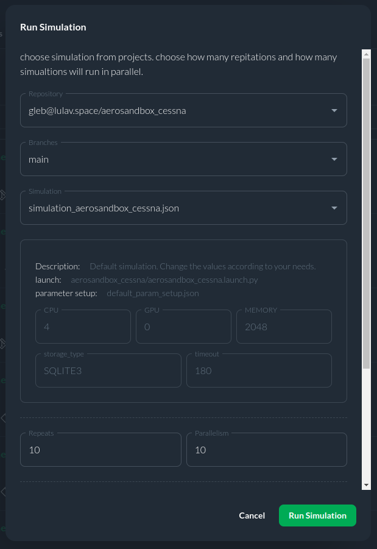
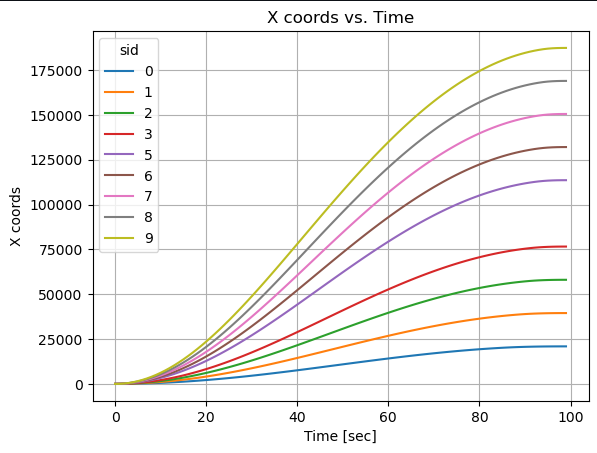
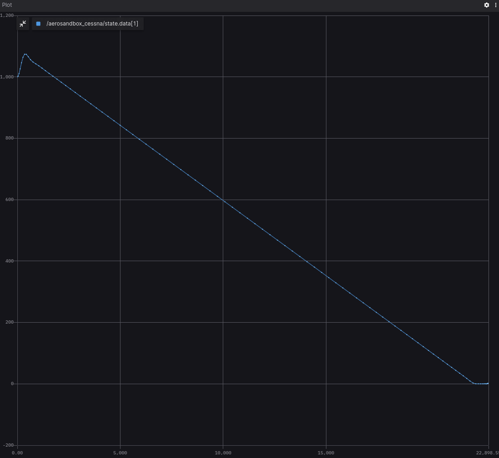
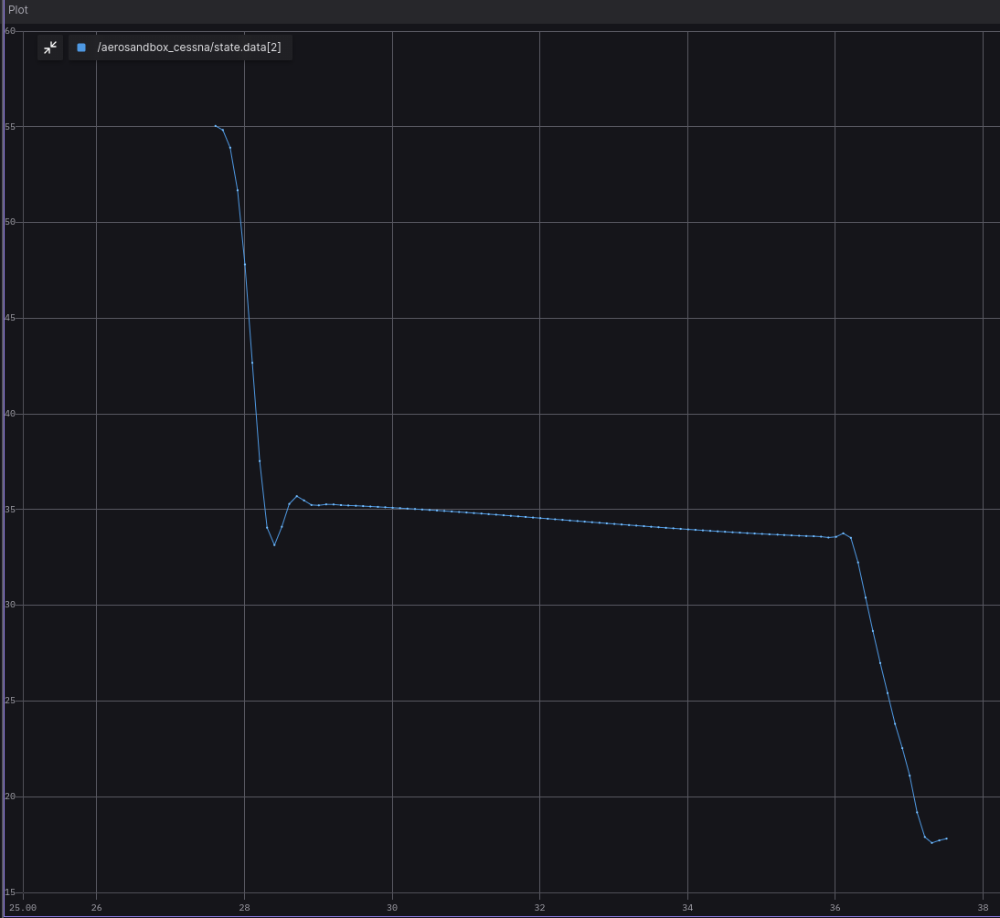

## Aerosandbox

The project is a simulation tool developed using ROS (Robot Operating System) nodes and leverages the Aerosandbox Python library for aerodynamic calculations. Its primary objective is to simulate gliding flight scenarios for a Cessna 152 aircraft in the event of engine failure.

The user provides flight parameters as input parameters to configure the simulation. These parameters are essential for defining the initial conditions of the simulated flight.

Once the simulation is initiated, the ROS nodes orchestrate the execution. The simulation takes into account various flight dynamics and aerodynamic factors to model the gliding behavior of the Cessna 152. The maximum gliding distance depends on plane's aerodynamic parameters, initial altitude and initial velocity. To find it this code uses iPOPT optimal problem solver under the hood (iPOPT included into AeroSandbox).

The output of the simulation comprises critical flight data, such as altitude, velocity, and other relevant parameters, recorded over time intervals. These results are published via ROS topics, allowing for real-time data visualization, analysis, and integration with other ROS-based systems.

You can find more information about this useful aerodynamics library on [Aerosandbox official website](https://github.com/peterdsharpe/AeroSandbox). All project installation, code overview and usage details are also available on the project's [GitHub page](https://github.com/citros-garden/aerosandbox_cessna).

.jpg")

## Table of Contents

1. [CITROS Usage](#citros-usage)
    1. [CITROS Installation](#citros-installation)
    2. [Configuring The Project](#configuring-the-project)
    3. [Running Locally](#running-locally)
    4. [Syncing Project's Setup](#syncing-projects-setup)
    5. [Uploading Docker Image to CITROS Cloud](#uploading-docker-image-to-citros-cloud)
    6. [Running in The Cloud](#running-in-the-cloud)
    7. [CITROS Web Usage](#citros-web-usage)
2. [Extras](#extras)
    1. [Foxglove Examples](#foxglove-examples)

## CITROS Usage
Although you can get simulation results using FoxGlove, the best way to work with such simulations and process the results is CITROS! With its power, it is possible to create complex data processing scenarios, including the construction of more complex graphs, mathematical analysis and other high-level processing methods.

### CITROS Installation

First of all, to use all the powerful CITROS features the CLI installation is required: follow the instructions on the CITROS CLI [documentation page](https://citros.io/doc/docs_cli).

### Configuring The Project
After all the prerequisites are met, we can start configuring our project. The starting point is the Poliastro devcontainer loaded and running, CITROS CLI is installed and ready.
1. Initialize CITROS:
```bash 
>>> citros init
Checking internet connection...
Checking ssh...
Updating Citros...
Waiting for repo to be ready...
Citros repo successfully cloned from remote.
Creating new citros branch `master`.
Creating an initial commit.
Default branch of remote 'origin' set to: master
Citros successfully synched with local project.
You may review your changes via `citros status` and commit them via `citros commit`.
Initialized Citros repository.
```
Now you can see ```.citros``` folder in the explorer.

2. Configuring the setup. We need to set up the maximum performance available: timeout, CPU, GPU and Memory. To perform it, we need to define them in ```.citros/simulations/simulation_aerosandbox_cessna.json```. The recommended setup is minimum 180 seconds timeout, 2 CPU, 2 GPU and 1024 MB of Memory. Don't forget to save the file!

3. Configuring the params setup. You can find the default setup in ```.citros/parameter_setups/default_param_setup.json```. [CITROS CLI](https://citros.io/doc/docs_cli) provides an opportunity to use basic NumPy functions (such as distributions) and even user-defined functions, but let's keep it default for now. The Aerosandbox simulation has the following ROS parameters:

    |Parameter	|Package	|Description
    |--|--|--
    h_0	|aerosandbox_cessna	|Initial altitude (m)	
    v_0	|aerosandbox_cessna	|Initial velocity (knots)
    publish_freq	|aerosandbox_cessna	|Frequency of publishing


Don't forget to save the file!
4. Launch files. This project contains only one launch file ```aerosandbox_cessna.launch.py```. This file will be used for CITROS launch. 

    |Launch File	|Package	|Description
    |--|--|--
    aerosandbox_cessna.launch.py	|aerosandbox_cessna	|Aerosandbox simulation launch file 


:::tip

CITROS CLI, in addition to other benefits, also provides an automatic ROS bag recording option, which allows user to use saved simulation results and export them! :)

:::

### Running Locally
Since all the preparations done, we can launch it locally (your project should be built and sourced before that):
```bash 
>>> citros run -n 'aerosandbox_cessna' -m 'local test run'
? Please choose the simulation you wish to run:
❯ aerosandbox_cessna
```
Select the launch file (should be the only one here) by pressing ```Enter``` button and wait for the output in the terminal. To plot the local run results you can use FoxGlove.

```bash
created new batch_id: <your-batch-id-here>. Running locally.
+ running batch [<your-batch-id-here>], description: local test run, repeating simulations: [1]
+ + running simulation [0]
...
```


### Syncing Project's Setup
CITROS account is required for cloud usage. Follow the instructions on [CITROS Website](https://citros.io/auth/login) to register a new one, or check the [CLI documentation](https://citros.io/doc/docs_cli) for logging in. To complete the following steps, it is assumed that the user is registered, logged in and has met all requirements for Web Usage.
Now we can synchronize our project settings with CITROS server:
```bash 
>>> citros commit
>>> citros push
```

### Uploading Docker Image to CITROS Cloud
We need to build and push a Docker container image to the CITROS server:
```bash 
>>> citros docker-build-push
Logging in to docker...
...
```

### Running in The Cloud
Finally, we can run it in the cloud! Simply add ```-r``` to the terminal command: 
```bash 
citros run -n 'aerosandbox_cessna' -m 'cloud test run' -r
? Please choose the simulation you wish to run:
❯ aerosandbox_cessna
```

Select the launch file (should be the only one here) by pressing ```Enter``` button. Now the simulation is running in the CITROS server, and the results will be automatically uploaded to the CITROS database.

```bash
created new batch_id: <your-batch-id-here>. Running on Citros cluster. See https://citros.io/batch/<your-batch-id-here>.
```

### CITROS Web Usage
#### Launching Project via CITROS Web
The best way to use all the innovative capabilities of CITROS is through it's Web interface. Follow [this manual](https://citros.io/doc/docs/simulations/sim_overview) to easily launch a simulation on CITROS Web platform.


#### Working with Integrated Jupiter Notebooks and Data Analysis
CITROS Web provides a powerful data analysis package, which is a comprehensive solution for data query, analysis and visualization. With its extensive features, you can quickly and easily extract valuable insights from your data. To use it, Jupiter Notebook support is built-in. 
Navigate to our ```Code``` project page, open the Notebooks folder and click on the notebook file. Here you can see the usual Jupiter editor interface: you can add blocks of code or built-in Markdown engine, run and save notebook and control the Python kernel.

You can find all the data analysis package guides and API reference [here](https://citros.io/doc/docs_data_analysis).


Let's quickly go through the key points of using a Jupiter Notebook and fetching data from a database. But to try some brief examples of data analysis using the built-in package, we need to launch a batch with several simulations and a distribution for one of the ROS parameters (initial altitude, in our case). This parameter will be different for each simulation:

```json
"h_0": {
    "function": "my_func.py:func_with_context",
    "args": [1000.0]
},
```

All necessary things are already configured (we used a NumPy distribution function, you can read more about its usage in the [CITROS CLI](https://citros.io/doc/docs_cli) manual), so you can start the simulation from [CLI](#citros-usage-🛸) with the ```-c 10``` flag: 

```
citros run -n 'aerosandbox_cessna' -m 'cloud test run' -r -c 10
? Please choose the simulation you wish to run:
❯ aerosandbox_cessna
```

Or from [Web](#running-in-the-cloud-🛰️):



Run the ```aerosandbox_cessna``` simulation and copy your batch id (we will need it later).

Let's return to our Notebook and check the code: to start with, we need to import all the necessary modules:

```python
import numpy as np
import matplotlib.pyplot as plt
from citros_data_analysis import data_access as da
from prettytable import PrettyTable, ALL
import json
from platform import python_version
```

Now we can connect to the simulation database:
```python
batch_id = '<your-batch-id-here>'
citros = da.CitrosDB(batch = batch_id)
citros.info().print()
```

The last command returns general batch info:
```python
{
 'size': '261 kB',
 'sid_count': 10,
 'sid_list': [0, 1, 2, 3, 4, 5, 6, 7, 8, 9],
 'topic_count': 2,
 'topic_list': ['/aerosandbox_cessna/state', '/config'],
 'message_count': 1010
}
```
As you can see in the output above, we've got some information about our simulation run (batch): data size, sid information and a list of topics. 

Now we are ready to do some simple research and draw some plots. All MatPlotLib capabilities available here, but the [CITROS Data Analysis](https://citros.io/doc/docs_data_analysis) package provides it's own powerful plotting functions (also based on MatPlotLib):

```python
fig1, ax1 = plt.subplots()
citros.time_plot(ax1, 
                 topic_name = '/aerosandbox_cessna/state', 
                 var_name = 'data.data[0]', 
                 time_step = 1, 
                 sids = [0], 
                 y_label = 'X coords', title_text = 'X coords vs. Time')
```
As you can see, the gliding duration varies for different sids:



Let's go further:
```python
# Defining the list of altitudes

h_0 = [i for i in range(1000,11000, 1000)]


# Setting Dataframe

df = citros.topic('/aerosandbox_cessna/state').set_order({'sid':'asc'}).data('data.data[0]')
sid_list = list(set(df['sid']))
data0_list = []
for s in sid_list:
    id_max = df[df['sid'] == s]['rid'].idxmax()
    data0_list.append(df['data.data[0]'].loc[id_max])

fig, ax = plt.subplots()

#Adjusting colors
c = np.random.choice(50, 10, replace=False)
scatter = ax.scatter(h_0, data0_list,c=c)
6
# Create legend entries for each point
legend_labels = [str(i) for i in range(10)]

# Initialize a list to store legend handles
legend_handles = []

# Loop through the points and create legend entries with matching colors
for i, label in enumerate(legend_labels):
    color = scatter.to_rgba(c[i])  # Get the color of the corresponding point
    legend_handles.append(plt.Line2D([0], [0], marker='o', color='w', label=label, markerfacecolor=color, markersize=10))

# Add the legend with custom handles
legend1 = ax.legend(handles=legend_handles, loc="upper left", title="sid")
ax.add_artist(legend1)
ax.grid()
# plt.scatter(h_0, data0_list, cmap='plasma')
# # plt.plot(h_0, data0_list)
ax.set_ylabel('Gliding distance, m')
ax.set_xlabel('Initial altitude, m')
ax.set_title('Maximum gliding distance vs Initial altitude')
# plt.legend()

```
This graph shows us Maximum gliding distance depending of Initial altitude:  


## Extras
### Foxglove Examples



