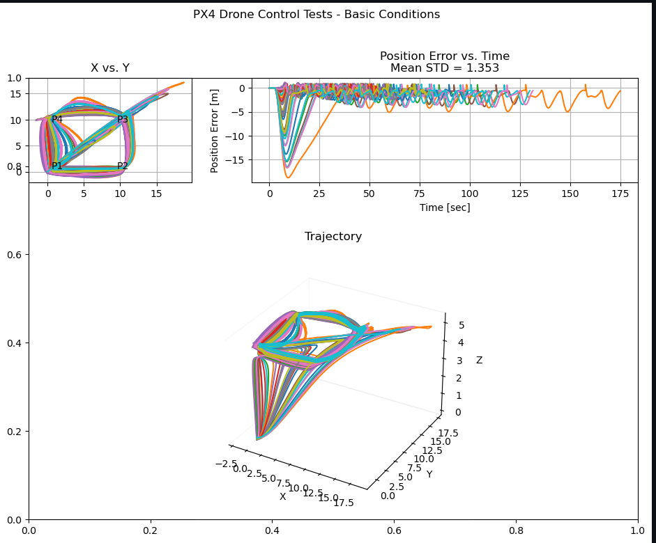
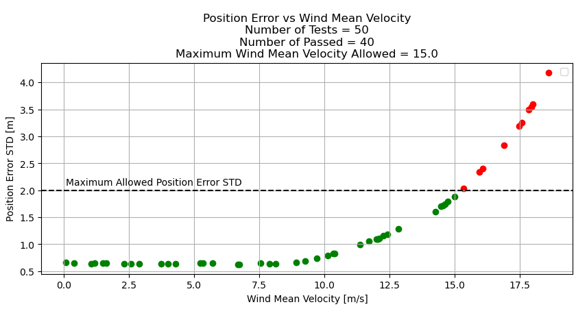

# Drone Tutorial

This repository contains an example of a ROS 2 node which communicate with a drone using PX4 and ROS 2.
Communication via uXRCE-DDS (PX4 version `1.14.0`).  
The repository contains launch file which launch:
1. Gazebo simulation (headless / gui options available).
2. A PX4 instance which control the simulated drone.
3. DDS agent for ROS 2 - PX4 communication.
4. An Offboard node which sends setpoints for the control system.


## Table Of Contents

1. [CITROS Usage](#citros-usage)
    1. [Configuring The Project](#configuring-the-project)
    2. [CITROS Installation](#citros-installation)
    3. [Parameters](#parameters)  
2. [CITROS Web Usage](#citros-web-usage)  
    1. [The Scenario](#the-scenario)  
    2. [Run a Test Simulation](#run-a-test-simulation)


## CITROS Usage

### Configuring The Project

Clone the repository from Github:
```sh
git clone git@github.com:citros-garden/drone.git
```
Then open the repository in VSCode's `devcontainer` with `reopen in container option`.  
The Dockerfile contains all the necessary dependencies for the project, and the install script will clone PX4-Autopilot and build the firmware, along with building ROS 2 workspace.

### CITROS Installation 
To use all the powerful CITROS features usage requires CITROS installation:  

**First, reopen the folder locally** and then follow the instructions:  

Install CITROS:
```sh
pip install citros
```

Then login:
```sh
citros login 
```

### Configuring The Project 

After all the prerequisites done, we can start configuring our project. 

1. Initialize CITROS:
```sh
citros init
```

Now you can see `.citros` folder in the explorer.  

2. Configuring the params setup.  

You can find the default setup in `.citros/parameter_setups/default_param_setup.json`.  
[citros_cli](docs_cli/configuration/config_params.md) provides more information about how to change the parameters by the user.

### Parameters 	
This is a list of all the ROS 2 parameters that can be control by the user wish:

|     Variable     | Description | package |
| -------- |    ------- |  ------- | 
| MC_PITCHRATE_D | Pitch rate d | px4_config |
| MC_PITCHRATE_I | Pitch rate i |  px4_config |
| MC_PITCHRATE_K | Pitch rate k |  px4_config |
| MC_PITCHRATE_P | Pitch rate p |  px4_config |
| MC_PITCH_P | Pitch p |  px4_config |
| MC_ROLLRATE_D | Roll rate d |  px4_config |
| MC_ROLLRATE_I | Roll rate i |  px4_config |
| MC_ROLLRATE_K | Roll rate k |  px4_config |
| MC_ROLLRATE_P | Roll rate p |  px4_config |
| MC_ROLL_P | Roll p |  px4_config |
| p1_x, p1_y, p1_z | Position [m] of point 1, NED|  px4_offboard |
| p2_x, p2_y, p2_z | Position [m] of point 2, NED|  px4_offboard |
| p3_x, p3_y, p3_z | Position [m] of point 3, NED|  px4_offboard |
| p4_x, p4_y, p4_z | Position [m] of point 4, NED|  px4_offboard |
| repeats | Number of repeats|  px4_offboard |
| tolerance | Tolerance to destination|  px4_offboard |
| timer_period | [sec] Offboard timer |  px4_offboard |
| ixx | Inertia moment at x direction [kg*m^2] |  rigid_body |
| iyy | Inertia moment at y direction [kg*m^2] |  rigid_body |
| izz | Inertia moment at z direction [kg*m^2] |  rigid_body |
| ixy | Inertia moment at xy direction [kg*m^2] |  rigid_body |
| ixz | Inertia moment at xz direction [kg*m^2] |  rigid_body |
| iyz | Inertia moment at yz direction [kg*m^2] |  rigid_body |
| mass | Total mass of the drone [kg] |  rigid_body |
| gyroscopeNoiseDensity | Gyroscope noise density (two-sided spectrum) [rad/s/sqrt(Hz)] |  sensors |
| gyroscopeRandomWalk | Gyroscope bias random walk [rad/s/s/sqrt(Hz)] |  sensors |
| gyroscopeBiasCorrelationTime |Gyroscope bias correlation time constant [s] |  sensors |
| gyroscopeTurnOnBiasSigma |Gyroscope turn on bias standard deviation [rad/s] |  sensors |
| accelerometerNoiseDensity |Accelerometer noise density (two-sided spectrum) [m/s^2/sqrt(Hz)] |  sensors |
| accelerometerRandomWalk |Accelerometer bias random walk [m/s^2/s/sqrt(Hz)] |  sensors |
| accelerometerBiasCorrelationTime |Accelerometer bias correlation time constant [s] |  sensors |
| accelerometerTurnOnBiasSigma |Accelerometer turn on bias standard deviation [m/s^2] |  sensors |
| windVelocityMean | The mean velocity of the wind |  world |
| windVelocityMax | The max velocity of the wind |  world |
| windVelocityVariance | The velocity variance of the wind |  world |
| windDirectionMean | The mean direction of the wind |  world |
| windDirectionVariance |The direction variance of the wind |  world |
| windGustStart | When the wind gust start|  world |
| windGustDuration | How long the wind gust lasts |  world |
| windGustVelocityMean | The mean velocity of the wind gust |  world |
| windGustVelocityMax | The max velocity of the wind gust |  world |
| windGustVelocityVariance | The velocity variance of the gust wind |  world |
| windGustDirectionMean | The mean direction of the gust wind|  world |
| windGustDirectionVariance | The direction variance of the wind gust|  world |


After setting the preferred parameters, save the file and verify the settings using the CLI command: 
```sh
citros status
```
Now we can run a simulation.

## CITROS Web Usage 
### The Scenario 
We assign four points: `p1`, `p2`, `p3`, and `p4` to the drone. The drone starts hovering at each point in order of 1-2-3-4. When it reaches point 4, it goes back to point 1 and repeats the process as many times as the value of the `repeats` parameter that we have provided.
To make it more challenging for the drone, we want to create a wind effect on it. To test the impact of wind on the drone's performance, we will use CITROS to simulate many times the same run with the same parameters file, but with different velocity means.
You can see the parameters file for that simulation [here](https://citros.io/drone/blob/main/parameter_setups/wind.json).

### Run a Test Simulation

After completing the configuration of the parameters file, we proceeded to execute it with CITROS.

- First, we save our work and upload it to CITROS server:
```bash 
citros commit
citros push
```

- Then, we need to build and push Docker container image to the CITROS server:
```bash 
citros docker-build-push
```

- Finally, we run the simulation at the web:
1. Go to the `Repositories` page clicking on the tab on the top.
2. Find the drone project and open it.
3. Navigate to the `Runs` tab.
4. Click on the `Run Simulation` button on the right.

For our example, we will run the [scenario](#the-scenario) 50 times. Once the simulations are complete, we can create a notebook file located [here](https://citros.io/drone/blob/main/notebooks/wind_analysis.ipynb).  

The results were:  

  

Additionally, by utilizing CITROS, we can conduct an error analysis.


