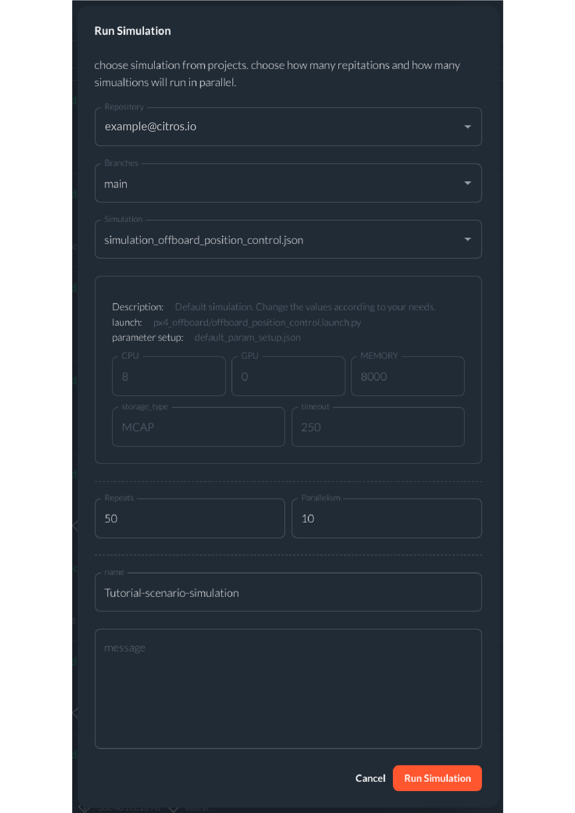

# Drone

## Overview


This repository contains an example of a ROS 2 node which communicate with a drone using PX4 and ROS 2.
Communication via uXRCE-DDS (PX4 version `1.14.0`).  
The repository contains launch file which launch:
1. Gazebo simulation (headless / gui options available).
2. A PX4 instance which control the simulated drone.
3. DDS agent for ROS 2 - PX4 communication.
4. An offboard node which sends setpoints for the control system.


## Prerequisites

1. Please make sure you have all the [necessary softwares](../getting_started/getting_started.md#softwares-to-work-with-citros) to work with CITROS installed on your computer.
2. Install [Visual Studio code](https://code.visualstudio.com/download).
3. We strongly recommend that you work with [dockers](..//dockerfile_overview/dockerfile_overview.md). However, if you wish to work without dockers, please refer to the [.devcontainer](https://github.com/citros-garden/drone/tree/main/.devcontainer) directory in project's repo, the dependencies you need are in the `Dockerfile` and `install.sh` files.


## Table of Contents
1. [Installation](#installation)
2. [Workspace Overview](#workspace-overview)
3. [CITROS Initialization](#citros-initialization)
4. [Scenario](#scenario)
5. [Running the Scenario Using CITROS](#running-the-scenario-using-citros)
6. [Results](#results)


## Installation
1. Clone the repository from Github:
 ```sh
 git clone git@github.com:citros-garden/drone.git
 ```

2. Open the repository in the [VScode Dev Container](../getting_started/getting_started.md#open-project-in-vscode-dev-container).

The Dockerfile contains all the necessary dependencies for the project, and the install script will clone PX4-Autopilot and build the firmware, along with building ROS 2 workspace.

## Workspace Overview

After installation the project, we can start configuring it.
The Workspace contains the PX4-Autopilot repository (v1.14), which few modifications to the DDS setup, and a ROS 2 workspace containing the required DDS packages for the communication, along with drone-related packages for setting up different parameters and an offboard node.

### Parameters 	
[citros_cli](/docs_cli/configuration/config_params) provides more information about how to change the parameters by the user.
This is a list of all the ROS 2 parameters that can be control by the user wish:

|     Parameter     | Description | Package |
| -------- |    ------- |  ------- | 
| MC_PITCHRATE_D | Pitch rate d | px4_config |
| MC_PITCHRATE_I | Pitch rate i |  px4_config |
| MC_PITCHRATE_K | Pitch rate k |  px4_config |
| MC_PITCHRATE_P | Pitch rate p |  px4_config |
| MC_PITCH_P | Pitch p |  px4_config |
| MC_ROLLRATE_D | Roll rate d |  px4_config |
| MC_ROLLRATE_I | Roll rate i |  px4_config |
| MC_ROLLRATE_K | Roll rate k |  px4_config |
| MC_ROLLRATE_P | Roll rate p |  px4_config |
| MC_ROLL_P | Roll p |  px4_config |
| p1_x, p1_y, p1_z | Position [m] of point 1, NED|  px4_offboard |
| p2_x, p2_y, p2_z | Position [m] of point 2, NED|  px4_offboard |
| p3_x, p3_y, p3_z | Position [m] of point 3, NED|  px4_offboard |
| p4_x, p4_y, p4_z | Position [m] of point 4, NED|  px4_offboard |
| repeats | Number of repeats|  px4_offboard |
| tolerance | Tolerance to destination|  px4_offboard |
| timer_period | [sec] Offboard timer |  px4_offboard |
| ixx | Inertia moment at x direction [kg*m^2] |  rigid_body |
| iyy | Inertia moment at y direction [kg*m^2] |  rigid_body |
| izz | Inertia moment at z direction [kg*m^2] |  rigid_body |
| ixy | Inertia moment at xy direction [kg*m^2] |  rigid_body |
| ixz | Inertia moment at xz direction [kg*m^2] |  rigid_body |
| iyz | Inertia moment at yz direction [kg*m^2] |  rigid_body |
| mass | Total mass of the drone [kg] |  rigid_body |
| gyroscopeNoiseDensity | Gyroscope noise density (two-sided spectrum) [rad/s/sqrt(Hz)] |  sensors |
| gyroscopeRandomWalk | Gyroscope bias random walk [rad/s/s/sqrt(Hz)] |  sensors |
| gyroscopeBiasCorrelationTime |Gyroscope bias correlation time constant [s] |  sensors |
| gyroscopeTurnOnBiasSigma |Gyroscope turn on bias standard deviation [rad/s] |  sensors |
| accelerometerNoiseDensity |Accelerometer noise density (two-sided spectrum) [m/s^2/sqrt(Hz)] |  sensors |
| accelerometerRandomWalk |Accelerometer bias random walk [m/s^2/s/sqrt(Hz)] |  sensors |
| accelerometerBiasCorrelationTime |Accelerometer bias correlation time constant [s] |  sensors |
| accelerometerTurnOnBiasSigma |Accelerometer turn on bias standard deviation [m/s^2] |  sensors |
| windVelocityMean | The mean velocity of the wind |  world |
| windVelocityMax | The max velocity of the wind |  world |
| windVelocityVariance | The velocity variance of the wind |  world |
| windDirectionMean | The mean direction of the wind |  world |
| windDirectionVariance |The direction variance of the wind |  world |
| windGustStart | When the wind gust start|  world |
| windGustDuration | How long the wind gust lasts |  world |
| windGustVelocityMean | The mean velocity of the wind gust |  world |
| windGustVelocityMax | The max velocity of the wind gust |  world |
| windGustVelocityVariance | The velocity variance of the gust wind |  world |
| windGustDirectionMean | The mean direction of the gust wind|  world |
| windGustDirectionVariance | The direction variance of the wind gust|  world |

## CITROS Initialization
1. [Install CITROS](../getting_started/getting_started.md#installation).
2. Follow [these steps](/docs_tutorials/getting_started/getting_started.md#initialization) to Initialize CITROS.

## Scenario
We assign four points: `p1`, `p2`, `p3`, and `p4` to the drone. The drone starts hovering at each point in order of 1-2-3-4. When it reaches point 4, it goes back to point 1 and repeats the process as many times as the value of the `repeats` parameter that we have provided.
To make it more challenging for the drone, we want to create a wind effect on it. To test the impact of wind on the drone's performance, we will use CITROS to simulate many times the same run with the same parameters file, but with different velocity means.
You can see the parameters file for that simulation under the code section inside the Drone project.

## Running the Scenario Using CITROS

After completing the configuration of the parameters file, we proceeded to execute it with CITROS.

1. First ensure that the project has been [built and sourced](../getting_started/getting_started.md#build-the-project)
2. [Upload project to CITROS Server](../getting_started/getting_started.md#upload-to-citros-server)
3. Open the [drone](https://citros.io/drone) project.
4. Navigate to the [`Runs` tab](https://citros.io/drone/batch).
5. Click on the `Run simulation` button on the right.
6. Configure your simulation. In this example we will run the [scenario](#scenario) 50 times:
    1. Simulation: simulation_offboard_position_control.json
    2. Repeats: 50
    3. Parallelism: 10
    4. name: Tutorial-scenario-simulation
7. Press red `Run Simulation` button.

  

Once the simulations are complete, we can execute the [notebook](https://citros.io/drone/blob/main/notebooks/wind_analysis.ipynb).  

## Results

These are part of the results you will receive in the notebook:

  

Additionally, by utilizing CITROS, we can conduct an error analysis.


