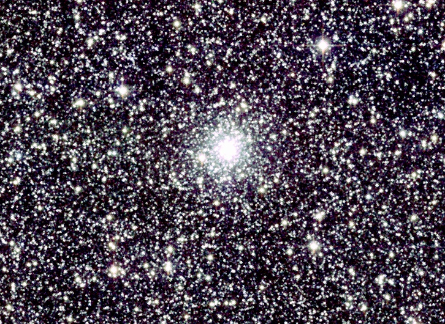
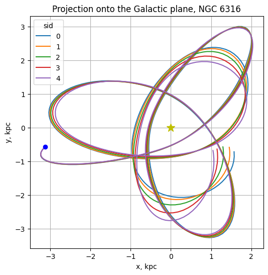
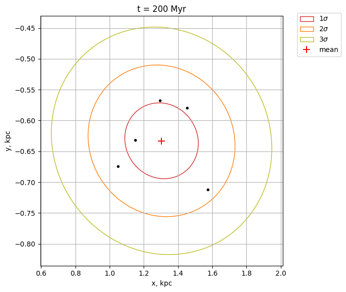
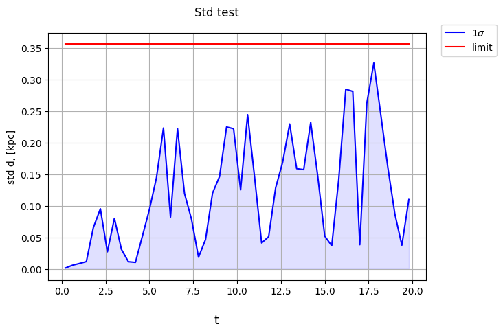

# Galactic Orbits

## Overview

CITROS offers multiple advantages that can streamline your workflow:

- Seamless pipeline from setting parameters and running simulations to analyzing output results with the [**citros_data_analysis**](https://citros.io/doc/docs_data_analysis/) package, and generating the final report;
- Opportunity to run multiple simulations simultaneously;
- Convenient and well-organized data storage system: you can store all your simulation data in the cloud, track their status via the CITROS website, and access this data from different devices;
- Two options for organizing your work: manage and run simulations through a [web interface](https://citros.io/doc/docs/) or use the [command line](https://citros.io/doc/docs_cli).

All these features make CITROS exceptionally useful and user-friendly for projects involving large data sets, diverse simulation scenarios, and complex analyses, which are common in various scientific research fields.

The current project is dedicated to calculations of orbits of the globular star cluster for five different values of the Galactic disk mass: 95, 97.5, 100, 102.5 and 105 billions of the Sun masses.

Globular star clusters are gravitationally bound, dense and rich aggregations of stars, that can be found nearly in every galaxy, including our own Milky Way. In comparison with another type of star clusters, the open clusters, globular clusters are populated with older stars and can have up to millions of members. Another notable difference is that they are not part of the disk component but belong to the halo. This means they can be located far from both the thin and thick disks of the Galaxy, which have thicknesses of about 300 pc and 2.6 kpc, respectively.



*globular star cluster NGC 6316, Atlas Image [or Atlas Image mosaic] obtained as part of the Two Micron All Sky Survey (2MASS), a joint project of the University of Massachusetts and the Infrared Processing and Analysis Center/California Institute of Technology, funded by the National Aeronautics and Space Administration and the National Science Foundation*.

## Prerequisites
To calculate orbits the Python package [GalOrb](https://github.com/ChemelAA/GalOrb-Package) was adopted. It is automatically installed when the docker development container of the project is build. The orbits are calculated in a non-axisymmetric gravitational potential, using an adopted model of the Galaxy with four components: disk, spheroid, dark-matter halo, and a bar. Details on this package, as well as parameters required for simulations, can be found in the article [Globular Clusters: Absolute Proper Motions and Galactic Orbits](https://link.springer.com/article/10.1134/S1990341318020049), [arXiv](https://arxiv.org/pdf/1804.07086.pdf).

1. Please make sure you have all the [necessary softwares](../getting_started/getting_started.md#softwares-to-work-with-citros) to work with CITROS installed on your computer.

2. We strongly recommend that you work with [dockers](..//dockerfile_overview/dockerfile_overview.md). However, If you are working without docker please check other dependencies in Dockerfile in [.devcontainer](https://github.com/citros-garden/gal_orbits/tree/main/.devcontainer) folder.

## Table of Contents
1. [Installation](#installation)
2. [Workspace Overview](#workspace-overview)
    1. [Input Parameters](#input-parameters)
    2. [Source Code and Launch File](#source-code-and-launch-file)
    3. [Output of the Simulation](#output-of-the-simulation)
3. [CITROS Initialization](#citros-initialization)
4. [Scenario](#scenario)
    1. [Parameter Setup](#parameter-setup)
    2. [Simulation Setup](#simulation-setup)
5. [Running the Scenario Using CITROS](#running-the-scenario-using-citros)
6. [Results](#results)

## Installation

Clone the repository:

 ```bash
 git clone git@github.com:citros-garden/gal_orbits.git
 ```
If you are working with devcontainer, make sure you installed [Visual Studio code](https://code.visualstudio.com/download) and then open the repository in the [VScode Dev Container](../getting_started/getting_started.md#open-project-in-vscode-dev-container).

## Workspace Overview
### Input Parameters

Parameters of the simulation with their default values are listed in `src/gal_orbits/config/params.yaml` file:

Parameter | Default | Description
|--|--|--
publish_freq | 10| frequency of publishing
rh | 0| heliocentric distance of the object (in kpc)
lon | 0| galactic longitude of the object (in degrees)
lat | 0| galactic latitude of the object (in degrees)
vr | 0| heliocentric radial velocity of the object (in 100 km/s)
pmra | 0| proper motion in right ascension (in mas/year)
pmde | 0| proper motion in declination
t0 | 0| starting time of calculation (in units of 10^7 years)
tf | 10| final time of calculation (in units of 10^7 years)
M_disc | 100| mass of the disc, in Msun * 10^9, by default, 10^11 Msun
M_sph | 300| mass of the spherical component of the Galaxy, in Msun * 10^9, by default, 3 * 10^10 Msun
reverse | 'False'| if 'True', set backward direction of time, by default, direction is forward
rtol | 1e-9| relative value of the error of the numerical integration scheme, affects the output number of messages
atol | 1e-9| absolute value  of the error of the numerical integration scheme, affects the output number of messages

The table with the parameters for the 115 globular clusters may be found in article, mentioned above: [Globular Clusters: Absolute Proper Motions and Galactic Orbits](https://link.springer.com/article/10.1134/S1990341318020049), [arXiv](https://arxiv.org/pdf/1804.07086.pdf).

### Source Code and Launch File
The source code is located in `src/gal_orbits/gal_orbits/`: `gal_orbits.py` - written in Python script that calculates orbits of the globular clusters and `__init__.py` file.

The launch file is located in `src/gal_orbits/launch/gal_orbits.launch.py`.

### Output of the Simulation

The simulated data is published to a topic '/gal_orbits'. Each message is an [`Float64MultiArray`](https://docs.ros2.org/galactic/api/std_msgs/msg/Float64MultiArray.html) containing 11 variables:

- t - time coordinate (in units of 10^7 years),
- R - distance from the galactic axis (in kpc),
- Vr - dR/dt, radial component of the velocity (in 100 km/s),
- fi - the position angle relative to Sun direction, counting clockwise if seen from North Galactic Pole (in radians),
- Vfi - R*d(fi)/dt, tangential velocity (in 100 km/s),
- z - vertical distance from the galactic plane (in kpc),
- Vz - dz/dt, vertical velocity (in 100 km/s),
- E - total energy (in (100 km/s)^2),
- C - angular momentum (in 100 kpc*km/s),
- xg - R*cos(fi), X galactocentric coordinates (in kpc),
- yg - R*sin(fi), Y galactocentric coordinates (in kpc)

## CITROS Initialization

To start working with CITROS you need to install CITROS CLI package, log in, set ssh key and initialize the `.citros` repository. To do this please follow:
1. [Install CITROS](../getting_started/getting_started.md#installation)
2. [Initialize CITROS](/docs_tutorials/getting_started/getting_started.md#initialization)

## Scenario

Let's check how the mass of the Galactic disk affects the orbit of the globular clusters. For this purpose we can run several simulations with different values of `M_disc` parameter.

### Parameter Setup

Parameters are listed in file `.citros/parameter_setups/default_param_setup.json`. For example, to set simulation parameters for cluster **NGC 6316** and calculate its orbits with 5 slightly different masses of the Galaxy disk (95, 97.5, 100, 102.5 and 105 billions of the Sun masses), the following setup may be used:

```js
{
    "packages": {
        "gal_orbits": {
            "gal_orbits": {
                "ros__parameters": {
                    "publish_freq": 10.0,
                    "rh": 11.5,
                    "lon": 357.18,
                    "lat": 5.76,
                    "vr": 0.715,
                    "pmra": -4.52,
                    "pmde": -3.70,
                    "t0": 0.0,
                    "tf": 20.0,
                    "M_disc": {
                        "function": "my_func.py:return_next_value",
                        "args": [[95.0, 97.5, 100.0, 102.5, 105.0]]
                    },
                    "M_sph": 30.0,
                    "reverse": "False",
                    "rtol": 1e-8,
                    "atol": 1e-8
                }
            }
        }
    }
}
```
The parameters are taken from the article [Globular Clusters: Absolute Proper Motions and Galactic Orbits](https://link.springer.com/article/10.1134/S1990341318020049), [arXiv](https://arxiv.org/pdf/1804.07086.pdf).

Function *my_func.py:return_next_value* returns the next listed in `args` value for each subsequent simulation. Function should be written in file `.citros/parameter_setups/functions/my_func.py`:

```python
def return_next_value(arr, citros_context):
    return arr[citros_context['run_id']]
```
Learn more about parameter setup and defining custom functions in [Directory parameter_setups](https://citros.io/doc/docs_cli/structure/citros_structure/#directory-parameter_setups) and [Adding Functions to Parameter Setup](https://citros.io/doc/docs_cli/configuration/config_params) pages.

### Simulation Setup

In `.citros/simulations/simulation_gal_orbits.json` you can define parameter setup files, launch files, memory to use and so on, please look in [Directory simulations page](https://citros.io/doc/docs_cli/structure/citros_structure#directory-simulations) for more information.

## Running the Scenario Using CITROS

After adjusting [parameter](#parameter-setup) and [simulation](#simulation-setup) setups, you need to [Upload project to CITROS Server](../getting_started/getting_started.md#upload-to-citros-server)

<!-- commit and push your changes and also build and push a docker image. To do this please follow the [Getting Started tutorial](https://citros.io/doc/docs_tutorials/getting_started/). -->

And now it's time to run the simulation in the cloud! Do the following command to run simulation 5 times in the cloud and assign the results to a "galactic orbits" batch:

```bash
citros run -n "galactic orbits" -m "first run" -c 5 -r
```

## Results

Now when your simulation is complete, you're ready to check the results! Explore the notebooks in [`notebooks`](https://citros.io/gal_orbits/tree/main/notebooks). There, you'll find examples prepared using the [citros_data_analysis package](https://citros.io/doc/docs_data_analysis) on how to query, analyze and present results. Feel free to use them or create your own!

Let's take a look on the results of the following [notebook](https://citros.io/gal_orbits/blob/main/notebooks/Disk%20mass%20variation.ipynb).
We made [simulations](#scenario) of the orbits of the globular cluster NGC 6316 for 5 different masses of the Galactic disk `M_disk`. To get some qualitative idea on how the mass of the Galactic disk affect the orbits, let's first display the projections of the simulated orbits onto the Galactic disk:

```python
from citros_data_analysis import data_access as da
citros = da.CitrosDB()

# query data using citros_data_analysis package, get pandas.DataFrame
F = citros.batch('galactic orbits').topic('/gal_orbits').data(['data.data[9]', 'data.data[10]'])

# change, calculate, explore your data - take full advantage of working with pandas python package
F.rename({'data.data[9]': 'xg', 'data.data[10]': 'yg'}, axis = 1, inplace = True)

# plot with citros_data_analysis
fig, ax = citros.plot_graph(F, 'xg', 'yg', '-', set_x_label='x, kpc', set_y_label='y, kpc', 
                            title='Projection onto the Galactic plane, NGC 6316')

# add additional information on the graph: position of the Sun and start of the simulation
ax.plot(0, 0, 'y*', markersize = 12)
ax.plot(F['xg'][F['sid']==0].iloc[0], F['yg'][F['sid']==0].iloc[0], 'bo')
```



*Projection of the globular Galactic cluster NGC 6316's orbits onto the Galactic plane over the next 200 million years. Galactocentric coordinates 'xg' and 'yg' were derived from orbit simulations in a non-axisymmetric gravitational potential, considering five scenarios with slightly varying Galaxy disk masses (95, 97.5, 100, 102.5 and 105 billion solar masses). The yellow star represents the Sun, located at coordinates (0, 0). The simulation starts at the point marked by a blue circle.*

Let's visualize the scatter of coordinates at the end of the simulation. The final point of each simulation run corresponds to t = 200 Myr. Using `pandas`, we can easily select coordinates corresponding to the maximum time value. Then, using `citros_data_analysis`, we can display these coordinates along with the mean and standard deviation ellipses:
```python
# for each simulation run select the last point (it corresponds to the maximum t)
f = F.loc[F.groupby('sid')['t'].idxmax()]

fig, ax = citros.plot_sigma_ellipse(f, 'xg', 'yg', n_std = [1,2,3], plot_origin=False, 
                                    set_x_label= 'x, kpc', set_y_label= 'y, kpc', title = 't = 200 Myr')
```



We can also obtain a quantitative understanding of the extent to which the mass of the Galactic disk influences the cluster's orbits. For example, we can check whether the standard deviation of the distance `d` from the Galactic center calculated across different simulations does not exceed 15 percent of the overall average distance `d_mean`. The distance `d` from the Galactic center to the cluster can be calculated as the square root of the sum of the squared values in the 'R' ('data.data[1]') and 'z' ('data.data[5]') columns.

```python
# query data
F = citros.batch('galactic orbits_1').topic('/gal_orbits').data(['data.data[0]', 'data.data[1]', 'data.data[5]'])
F.rename({'data.data[0]': 't', 'data.data[1]': 'R', 'data.data[5]': 'z'}, axis = 1, inplace = True)

import numpy as np
# calculate galactocentric distance
F['d'] = np.sqrt(F['R']**2 + F['z']**2)
```

To calculate the average distance from the Galactic center to the cluster, a simple mean of all data points from all simulations is insufficient due to unequal time intervals between points. Instead, we should first calculate the mean distance for each time point across simulations on an equidistant time scale, and then compute the overall mean distance.

Although the time range for all simulations is the same (0-20 Myr), the number of points and their corresponding time moments vary. Therefore, we need to establish a correspondence between the different simulations. This can be achieved using the `citros_data_analysis.error_analysis package`. To align the data from different simulations, we can divide the time into a certain number of intervals and assign indexes to these intervals. For each interval, we then calculate the mean distance for each simulation. This approach yields a common set of time values for all simulations, along with a corresponding set of distance values determined for these time points.

```python
from citros_data_analysis import error_analysis as analysis

dataset = analysis.CitrosData(F, data_label=['d'], units = 'kpc')
db = dataset.bin_data(n_bins = 50, param_label = 't')

# calculate statistics among different simulations
stat = db.get_statistics(return_format='citrosStat')

# get the average distance
d_mean = stat.mean.mean()
```

Using the `citros_data_analysis.validation` package, we can check whether the standard deviation is not very significant and is less than 15 percent of the average distance from the Galactic center:

```python
from citros_data_analysis import validation as va

V = va.Validation(F, data_label = 'd', param_label = 't', method = 'bin', num = 50, units = 'kpc')
log, table, fig = V.std_test(limits = d_mean*0.15, n_std = 1, nan_passed = True, 
                             std_area = True, std_color = 'b')
```



As we can see, the 1 $\sigma$ standard deviation of the distance from the Galactic center to the cluster, occurring due to varying masses of the Galactic disk, is less than 15 percent of the cluster's average distance.