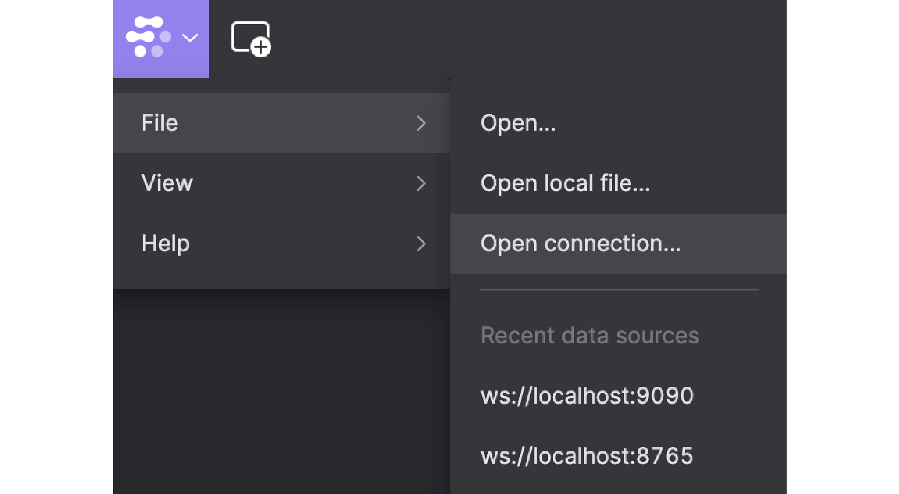

<!-- 
```mdx-code-block
import DocCardList from '@theme/DocCardList';

<DocCardList />
``` -->

# Introduction to CITROS

This tutorial will guide you through the CITROS CLI interface, using a simple ROS 2 example project to demonstrate the usage, while providing useful recommendations and best practices. While this is not a comprehensive guide to all CITROS CLI commands, it should get you up and running using your own projects with CITROS in no time. For further details and an exhaustive guide to the CITROS CLI, refer to the [CLI Documentation](https://citros.io/doc/docs_cli).


## Table of Contents

1. [The Cannon Example Project](#the-cannon-example-project)
    1. [Prerequisites](#prerequisites)
    2. [Installation](#installation)
    3. [Build](#build)
    4. [Implementation Overview](#implementation-overview)
    5. [Running the Solutions](#running-the-solutions)
    7. [Visualization with Foxglove](#visualization-with-foxglove)
2. [Working with CITROS](#working-with-citros-cli---offline)
    1. [Prerequisites](#prerequisites-1)
    2. [Running a Simulation](#running-a-simulation)
    3. [Configuring a Simulation](#configuring-a-simulation)
    4. [Data analysis](#data-analysis-online-only)


## The Cannon Example Project

This project is a ROS 2 implementation of the [cannonball simulation](https://nasa.github.io/trick/tutorial/ATutASimpleSim) provided by NASA Johnson Space Center as part of the tutorial for the 
[Trick Simulation Environment](https://nasa.github.io/trick/).

It determines the trajectory and time of impact of a cannon ball that is fired with an initial speed and initial angle, assuming a constant acceleration of gravity (g), and no aerodynamic forces.


Two versions of the simulation are provided: an analytic solution and a numeric integration solution.

### Prerequisites

- Install [Visual Studio code](https://code.visualstudio.com/download)
- Install and Run [Docker](https://docs.docker.com/get-docker/)
- Install [Foxglove](https://foxglove.dev/download) (optional)

### Installation

Open cmd on your desktop

1. Clone the project:

```bash
$ git clone git@github.com:citros-garden/cannon.git
```

2. Change to Cannon project directory:

```bash
$ cd ~/cannon
```

3. Open Cannon project in VScode:

```bash
$ code .
```
5. Re-open in Dev Container

    1. press on the bottom left corner icon.
     
     

    2. Choose **Reopen in Container**
     
     

6. Open VScode terminal and make sure you are in the right location
    
    ros@docker-desktop:/workspaces/cannon$ 

:::note
From this point, all the actions should be typed in VScode terminal.
:::

### Build 
```bash
$ colcon build
$ source install/local_setup.bash
```
### Implementation Overview
The project is made out of three ROS nodes - `cannon_analytic`, `cannon_numeric` and `scheduler`. The scheduler node is responsible for driving the simulation by publishing a `scheduler` topic at a given rate (say, 100Hz). The cannon nodes subscribe to this topic, and upon receiving it perform a single calculation step. The rate (`dt`) is a ROS parameter for the scheduler node, which means you may change its value in the `config/params.yaml` file, without the need to recompile. The two cannon nodes also have `params.yaml` files of their own, in which you can set the initial speed and angle, and also the time/integration delta (`dt`).

Additionally, the `scheduler` node subscribes to a `debug` topic, which, together with the provided Foxglove layout, facilitates a play/pause/step/resume functionality.

The output of the simulation, i.e. the topic containing the calculated results, is called `cannon/state` (in both analytic and numeric versions). It is a list of `float` of size 4, the layout being:
        
    [position_x, position_y, velocity_x, velocity_y]

The simulation will halt when `position_y` reaches zero (i.e. impact).

### Running the Solutions

The cannon project contains two launch files, one for each solution

1. To Run the analytic solution

 ```bash
 $ ros2 launch scheduler cannon_analytic.launch.py
 ```

2. To run the numeric integration solution

 ```bash
 $ ros2 launch scheduler cannon_numeric.launch.py
 ```

:::note
Running either of the two simulations will result in the logger output being written to the console.
:::


### Visualization with Foxglove
To view a graphical representation of the simulation:
1. Open [Foxglove](https://foxglove.dev/) 
2. Press on Foxglove icon at the top right
3. Click View
4. Click "Import layout from file"

 

5. Choose `CITROS_Cannon.json` from the cannon project directory

6. Open a new Connection

 

7. Choose Rosbridge and press the 'Open' button
 
 

8. You now have a working connection to your simulation.

9. If your simulation has stopped running in the terminal, run one of the [solutions](#running-the-solutions) again.

<!-- :::tip
It is optional to start the simulation in a paused state, and then, once your foxglove layout is ready, resume it via the Play/Pause button. 

To do that, in the `__init__` member function of the `scheduler` node (in `scheduler.py`), change the line

    self.debug_mode = False

to

    self.debug_mode = True

You will need to build (and source) again.
::: -->


Output example:


## Working with CITROS

Working with the CITROS CLI is pretty straight forward, since there are only two things you need to do - initialize your CITROS repository, and run your project. Additionally, you may configure your CITROS repository to fit your simulation needs, but if all you want to do is to run your project via CITROS with the default configuration, than only two commands are necessary.

### Prerequisites
But first, let's make sure all the prerequisites for running CITROS have been met:
- Open the project (in this case Cannon) inside a VS Code dev-container.
- Build and source your project by running:
    ```bash
    $ colcon build
    $ source install/local_setup.bash
    ```
- in the dev-container's terminal, run
    ```bash
    $ pip install citros
    ```

    You can verify that the installation succeeded by running 
    ```bash
    $ citros -V
    1.2.3
    ```

    to get the CITROS CLI version installed.

### Running a Simulation


<Tabs>
<TabItem value="web" label="Working Offline">

### Initialization
Alrighty then! You're now ready to run the first command - `init`, which will initialize your local CITROS repository:
```bash
$ citros init
User is not logged in. Initializing Citros locally.
Creating new citros branch `main`.
Creating an initial commit.
Checking out new citros branch `main`.
Initialized Citros repository.
```

This command creates a folder named `.citros` under your project directory, and initializes it as a git repository. The current git branch of the `.citros` repository should always be named as the current branch in your ROS project (i.e. `main` in the example above). In case they are different, CITROS will create and/or checkout the branch for you, as can be seen in the output above.

The `.citros` directory contains several files and folders that capture the state of your project and allow you to configure your simulations according to your needs. We will discuss some of them briefly later on. For a full and detailed description of the contents of the `.citros`  directory, refer to the [CLI Documentation](https://citros.io/doc/docs_cli).

### Run the Simulation

After your `.citros` repository has been initialized, you're ready to run a CITROS simulation, albeit with all the default configurations, by using the `run` command:

```bash
$ citros run -n "my_first_batch" -m "my first Citros simulation!"
? Please choose the simulation you wish to run: 
❯ simulation_cannon_analytic
  simulation_cannon_numeric
```

:::note

This command will run the simulation on your machine, and save all the results under `.citros/runs/[simulation_name]` folder. The content of the [folder](docs_cli/structure/citros_structure#directory-runs) will contain 
- recorded bags
- logs from the simulation and citros itself
- metadata about the run
- metrics and information about the system it was running 
- and more.

:::

</TabItem>

<TabItem value="cli" label="Working Online">


### Prerequisites
In addition to the prerequisites for working with the CITROS CLI offline, make sure:

- You have a working internet connection.
- You have signed up to [CITROS](https://citros.io) and have your login password.


Using the CITROS CLI online is very similar, from the user's standpoint, to using it offline. We still use the `init` and `run` commands, albeit with slight alterations or different consequences. In addition, there are a few more commands necessary to interact with the CITROS cloud.

### logging in

First and foremost, we need to log in:
```bash
$ citros login
email: example@lulav.space
Password: 
User logged in.
```

### ssh

Before we continue to initialize our project, there is one more prerequisite we need to check off that was not yet mentioned: setting up ssh communication with CITROS. Since this process only needs to be performed once per computer, and can be performed using the CITROS website, we will not delve into it here, except to mention that it can be performed via the CLI using the command:
```bash
$ citros setup-ssh
```
for further details, see the [CLI Documentation](https://citros.io/doc/docs_cli)


### Initialization

#### Before Running `init citros`

First and foremost, the `.citros` directory can only be **initialized once**. 
If the `.citros` directory exists in your local project and the project [**already exists on the remote server**](https://citros.io/cannon), you have to delete the `.citros` directory from your project before 
running `init citros` command.

#### Running `init citros`

```bash
$ citros init
Checking internet connection...
Checking ssh...
Updating Citros...
Waiting for repo to be ready...
Citros repo successfully cloned from remote.
Creating and checking out a new local branch `main` that will track the remote branch.
Default branch of remote 'origin' set to: main
Citros successfully synched with local project.
You may review your changes via `citros status` and commit them via `citros commit`.
Initialized Citros repository.
```
As you can see, a lot more is happening when you initialize your repository while being logged in. We will not delve into all the details behind the scenes, but as always, feel free to roam through the [CLI Documentation](https://citros.io/doc/docs_cli) for further details.

:::caution Warning

 If you try to run `init` while a `.citros` directory already exists in your project, you will get a response similar to this:
```bash
$ citros init
The directory /workspaces/cannon has already been initialized.
working remotely with [git@citros.io:lulav/cannon.git].
```

 1. If you want to reinitialize your CITROS repository, you'll have to first delete the current `.citros` directory.

2. If you initialized the CITROS repository offline, and it [**doesn't exist** on the remote server yet](https://citros.io/cannon) (i.e. it has not been initialized online by you or anyone else) - then rather than deleting the `.citros` directory, you can run:
 ```bash
 citros add-remote
 ```

 which will add the CITROS server as a remote for your CITROS repo on your behalf, and take care of a few other details that are handled when initializing while being logged in.
 
 At this point it is recommended you commit and push your changes to the remote by running:
 ```bash
 citros commit
 citros push
 ``` 
:::

### Building and Pushing a Docker Image

Now that our CITROS repository is initialized and synched with the CITROS remote, we have one more important thing we need to do before we can run our simulation on the cloud - we need to build a docker image of our ROS project, tag it with the current commit hash for the project, and upload it to CITROS. Sounds complicated? Not to worry - all this is accomplished by running a single command:
```bash
citros docker-build-push
``` 
:::note

As a prerequisite for this command, the working directory of your ROS project must be clean. If it isn't, simply commit your changes first.
 ```bash
 citros commit
 citros push
 ``` 

:::

#### Running on The Cloud

After running the previous command, CITROS has a docker image of your ROS project, so we can finally run the simulation on the cloud (notice the `-r` flag):
```bash
citros run -n "cloud_test" -m "running in the cloud!" -c 3 -r
? Please choose the simulation you wish to run: simulation_cannon_analytic
created new batch_id: zzzzzzzz-xxxx-cccc-vvvv-bbbbbbbbbbbb. Running on Citros cluster. See https://citros.io/cannon/batch/zzzzzzzz-xxxx-cccc-vvvv-bbbbbbbbbbbb.
```

The above command will run the `cannon_analytic` simulation 3 times on the CITROS cloud.
By clicking the provided link shown in the terminal, you can directly navigate to the *`runs`* tab on the CITROS website, and see your runs in action.

#### Configuring a `runner`

The runner is the actual machine that will run your image, this machine can be configured and optimized for your simulation. 

:::note

keep in mind that this resources is not free of charge and will be charged accordingly. pleasee refer to the [pricing](https://citros.io/doc/pricing) for further details.

:::

When working online, there are several more ways with which you can configure your runner. Specifically, you can directly set the hardware resources that will be used on the cloud. Simply open the `.citros/simulations/simulation_cannon_analytic.json` file (for example), set the values according to your needs:

    "GPU": 0,
    "CPU": 2,
    "MEM": 265,

:::note

the `MEM` field denotes the amount of RAM your simulation requires when running on the cloud in *Megabytes*.

the `CPU` field denotes the amount of CPU cores needed by your simulation when running on the cloud.

:::

In addition there are several more useful fields, which are also relevant when working offline:

    "launch": {
        "file": "cannon_analytic.launch.py",
        "package": "scheduler"
    },
    "timeout": 64,

The `launch` field specifies the specific launch file for this simulation and the package it resides in. You may change it according to your needs.

The `timeout` field, surprisingly enough, sets a timeout (in *seconds*) for each simulation run, after which it will be automatically halted.


</TabItem>
</Tabs>


To fully understand what's going on, we need to familiarize ourselves with three concepts that are core to the way CITROS works:
- ## **[simulation](docs_cli/structure/citros_structure#directory-simulations)** 
    The simulation object is defining what you want to run and how. It is a set of the launch file (the what) and the parmeter setup (the how) as well as the resources needed for it to run and after how much time it should be killed. 

    Defaults simulation files defined by a ROS 2 launch file. You may have as many launch files as you want in your project, as long as there is at least one. Each simulation will correspond to a launch file in your project. When you run a CITROS simulation, if you don't specify the name of the simulation (using the `-s` flag), a command-line menu will be presented, in which you can use the up and down arrows to choose the simulation you want. The simulation names will be of the form `simulation_<name of launch_file>`. In the case of the Cannon project, we have two launch files - `cannon_analytic.launch.py` and `cannon_numeric.launch.py`, and as you can see in the output above, we are prompted to choose between them. 

    Each simulation also corresponds to a json file of the same name, which resides under the [`.citros/simulations`](docs_cli/structure/citros_structure#directory-simulations) directory. You may use this file to configure the way your simulation runs. 

    When you run a CITROS simulation, a directory for that simulation is created under the [`.citros/runs`](docs_cli/structure/citros_structure#directory-runs) directory. This directory will contain subdirectories corresponding to **batch**es, a new one created every time you run a simulation.

- ## **batch** 

    Defined as a group of one or more simulation runs. Since you can specify one or more simulations runs ('*completions*') when running a CITROS simulation, a **batch** is simply a convenient way to group them together. For instance, in the case of the above example, if we choose `simulation_cannon_analytic` from the menu, the following folder structure will be created: `.citros/runs/simulation_cannon_analytic/my_first_batch/0`. The last folder - `0`, is the folder corresponding to the only run for this batch - when you don't specify the number of completions (i.e. runs) using the `-c` flag, it will default to 1, and the name of each run is a zero based index, incremented by one for each additional run.

- ## **run**

    Defined as a single execution of a simulation as defined by the chosen launch file. Launching CITROS simulations with multiple runs ('*completions*') is particularly advantageous when working online, in which case a large number of simulation runs can be simultaneously executed on the CITROS cloud.

    The folder corresponding to a simulation run will contain all the information relevant for that run. Look through such a folder after running a simulation and see for yourself. For further details refer to the [CLI Documentation](https://citros.io/doc/docs_cli)


By default, when using the `run` command, you must provide a batch name (using the `-n` flag) and a message (using the `-m` flag). The name you provide will be used as the name of the directory in which all runs for this batch will be saved. If a batch by that name already exists - no worries, CITROS will simply add an underscore and an index to the name you provided, thereby keeping the batch directory names unique for each simulation. 

Now that you understand what's going on, choose on of the simulations presented in the menu, press enter and see it run...

### Configuring a Simulation

We just ran a simulation a single time with all the default configurations, which is admittedly not that exciting. Let's see how we can turn things up a notch by setting up dynamic parameter evaluation for our simulation, thereby allowing each run within the same batch to have different parameter values.

The [`.citros/parameter_setups`](docs_cli/structure/citros_structure#directory-parameter_setups) directory stores your JSON-formatted parameter setup files. When you initialize your citros repository, a `default_param_setup.json` file is automatically generated. This file consolidates all the default parameters for every node across all the packages in your ROS project, providing a consolidated and easily accessible record of these parameters.

The structured format of the parameter setup files streamlines both the understanding and alteration of parameters for each node in your ROS project. This becomes especially valuable when you're keen to explore the influence of different parameter values on your ROS project's behavior.

In the Cannon project, we have a total of three nodes. Let's look at the parameters for the `analytic_dynamics` node in the `cannon_analytic` package, as defined in the `default_param_setup.json` file.
We can see we have 3 parameters to play around with - `init_speed`, `init_angle` and `dt`. 

```json
//[project]/.citros/parameter_setups/default_param_setup.json
{
    "packages": {
        "cannon_analytic": {
            "analytic_dynamics": {
                "ros__parameters": {
                    "init_speed": 50.0,
                    "init_angle": 30.0,
                    "dt": 0.01
                }
            }
        },
        ...
    }
}
```

Let's say we want to find out the optimal initial angle for the cannon, which will provide the maximum range. Assuming we're completely blanking out on high-school physics, let's randomize the value for this parameter, execute several simulation runs, and see where we get the maximum range. To achieve this, we can simply replace the hard-coded default value with a [**function object**](docs_cli/configuration/config_params). Function objects are json objects comprised of two fields - `function` and `args`. They come in two flavors - numpy and user-defined. For our purposes we can use numpy's random module to generate a normal distribution around a given value:

    "init_angle": {
                    "function": "numpy.random.normal",
                    "args": [45, 15]
                },

This will cause a normal distribution with a standard deviation of 15 around 45 to be evaluated for every simulation run.

Now, if we run
```batch
citros run -n "test_params" -m "testing random initial angle" -c 10
```
:::note

to run online you need to add `-r` tag

:::

and choose `simulation_cannon_analytic` from the menu, the simulation will run 10 times (sequentially if working offline), and each time the cannon will have a different initial angle. By looking at the [results](#data-analysis-online-only), we can hopefully come to the conclusion that 45 degrees is the optimal angle. 

### Data Analysis (Online Only)

After you've run a batch run on CITROS, your data is stored on CITROS's servers.
you can access the data using Python [citros data analysis package](https://pypi.org/project/citros-data-analysis/) either from the Python [notebook](https://citros.io/cannon/blob/main/notebooks/data_analysis.ipynb) or from a local kernel Python environment.

:::note

citros data analysis package is installed while running `pip install citros`, so at this point you should have this package and you don't have to download it again.

:::

<Tabs>
<TabItem value="local_nb" label="Run Local Notebook">

#### Use Local Kernel

1. Open .citros directory

2. Go to notebooks.

3. Open data_analysis.ipynb

4. Press `Run All` button

</TabItem>

<TabItem value="remote_nb" label="Run Remote Notebook">

#### Use Local Kernel

1. Make sure your batch run status changed to `DONE`

2. Open [notebook](https://citros.io/cannon/blob/main/notebooks/data_analysis.ipynb)

3. Start Kernel by pressing on `Start` button

4. Press `Execute All` button

</TabItem>

</Tabs>

<!-- After you've run a batch run on CITROS, your data is stored on CITROS's servers and you can access the data using python [citros data analysis package](https://pypi.org/project/citros-data-analysis/).

:::note

citros data analysis package is installed along with citros.

:::

The most convenient way to access the data is from a [notebook](https://citros.io/cannon/blob/main/notebooks/data_analysis.ipynb) after you've successfully synced your project to your account. Alternatively you can run it from your machine using VSC or jupyter from `[project]/.citros/notebooks/data_analysis.ipynb ` -->

5. Scroll down the notebook to see the results.

#### Results

here is a sample from the provided [notebook](https://citros.io/cannon/blob/main/notebooks/data_analysis.ipynb):
```python
#import matplotlib
import matplotlib.pyplot as plt

#create a figure to plot on
fig, ax = plt.subplots()

citros.batch(-1).topic('/cannon/state').sid([0,1,2,3,4]).\
       time_plot(ax, var_name = 'data.data[1]', time_step = 0.01, y_label = 'y', title_text = 'y vs. t')
```


import Tabs from '@theme/Tabs';
import TabItem from '@theme/TabItem';