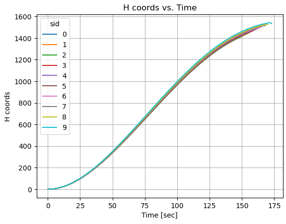

# Lunar Starship

# Overview
This Lunar Starship mission project addresses the lunar hopper challenge by optimizing the ascent, ballistic flight and landing process on the Moon's surface, aiming to minimize fuel consumption, time, or other relevant parameters. It empowers users to define both theoretical and real dynamic functions, enhancing prediction accuracy and enabling real-time corrections during lunar mission. 

Through the Lunar Starship project, researchers are paving the way for sustainable lunar exploration, as it not only optimizes missions but also conserves valuable resources for extended stays on the Moon. By allowing for the integration of real dynamic functions, it fosters adaptability and resilience in lunar operations, making it a cornerstone of future lunar exploration endeavors.


# Prerequisites

- [CITROS](https://citros.io/doc/docs_cli/overview/cli_install/)
- [numpy](https://numpy.org/)
- [casadi](https://web.casadi.org/)

```bash
python3 -m pip install citros numpy casadi
```

:::note
If you use the provided docker file (or devcontainer) all packages are preinstalled so no action is needed. 
:::


# Table of Contents
- [Installation](#installation)
- [Workspace Overview](#workspace-overview)
- [CITROS Initialization](#citros-initialization)
- [Scenario](#scenario)
- [Running the scenario using CITROS](#running-the-scenario-using-citros)
- [Results](#results)

# Installation
```bash
git clone git@github.com:citros-garden/lunar_starship.git
```

# Workspace Overview

The Lunar Starship simulation has the following ROS parameters. Variables with '_0' are initial conditions, and variables with '_f' are final conditions respectively:

|Parameter	|Package	|Description
|--|--|--
h_0	|lunar_starship	|Initial altitude above lunar surface level
lat_0	|lunar_starship	|Initial latitude
long_0	|lunar_starship	|Initial longitude
vn_0	|lunar_starship	|Initial "northing" velocity
ve_0	|lunar_starship	|Initial "east" velocity
vd_0	|lunar_starship	|Initial vertical velocity
m_fuel_0	|lunar_starship	|Initial fuel mass
lat_f	|lunar_starship	|Final latitude
long_f	|lunar_starship	|Final longitude
vn_f	|lunar_starship	|Final "northing" velocity
ve_f	|lunar_starship	|Final "east" velocity
vd_f	|lunar_starship	|Final vertical velocity
m_fuel_f	|lunar_starship	|Final fuel mass
dry_mass	|lunar_starship	|dry mass
F_thrustmax	|lunar_starship	|The maximum amount of thrust
Isp	|lunar_starship	|Specific impulse
simulation_step	|lunar_starship	|step of simulation	
publish_freq	|lunar_starship	|Frequency of publishing


This project contains only one launch file ```lunar_starship.launch.py```. This file will be used for CITROS launch. 

|Launch File	|Package	|Description
|--|--|--
lunar_starship.launch.py	|lunar_starship	|Lunar Starship simulation launch file 	


# CITROS Initialization

After all the prerequisites are met, we can start configuring our project. The starting point is the Lunar Starship devcontainer loaded and running, CITROS CLI is installed and ready.

```bash 
>>> citros init
Checking internet connection...
Checking ssh...
Updating Citros...
Waiting for repo to be ready...
Citros repo successfully cloned from remote.
Creating new citros branch `master`.
Creating an initial commit.
Default branch of remote 'origin' set to: master
Citros successfully synched with local project.
You may review your changes via `citros status` and commit them via `citros commit`.
Initialized Citros repository.
```
Now you can see ```.citros``` folder in the explorer.

Check our [Getting Started](https://citros.io/doc/docs/index.md) guide for additional information.

# Scenario
This example provides an array of time dependent values of states computed by solving non-linear optimal control problems(OCP) in the standard Bolza form using pseudo-spectral collocation methods and adjusted using an additional real dynamic function. The OCP solver used in this example is MPOPT (based on IPOPT) library modified by Lulav Space team. You can define a "real" dynamic function to test the control values computed by solving non-linear optimal control problems(OCP). This function should have the same number of outputs.

The output of the simulation comprises critical flight data, such as altitude, velocity, and other relevant parameters, recorded over time intervals. These results are published via ROS topics, allowing for real-time data visualization, analysis, and integration with other ROS-based systems.

For this example, let's check how the travelled distance will change depending on Specific impulse. To find it out, we need to set up parameters and launch CITROS simulation.


After CITROS initialization we can start configuring simulation setup. For remote launch we can set up the maximum performance available: timeout, CPU, GPU and Memory. To perform it, we need to define them in ```.citros/simulations/simulation_lunar_starship.json```. The recommended setup is minimum 600 seconds timeout, 4 CPU, 4 GPU and 4096 MB of Memory. Don't forget to save the file!

You can find the default parameter setup in ```.citros/parameter_setups/default_param_setup.json```. [CITROS CLI](https://citros.io/doc/docs_cli) provides an opportunity to use basic NumPy functions (such as distributions) and even user-defined functions. In case we want to find out how the travelled distance will change, we need to launch a batch with several simulations and a distribution for one of the ROS parameters (Specific impulse, in this case). This parameter will be different for each simulation:

```json
"Isp": {
    "function": "my_func.py:func_with_context",
    "args": [200]
},
```

The ```my_func.py``` file should contain:
```python
def func_with_context(num, citros_context):
    return num + float(citros_context['run_id'])*10
```

This function will set the ```Isp``` parameter in range from 200 to 200+10*n, where n = number of runs.

# Running the scenario using CITROS

<Tabs>

<TabItem value="local" label="Running Locally">

## Running Locally
Since all the preparations done, we can launch it locally (your project should be built and sourced before that):
```bash 
>>> citros run -n 'Lunar_Starship' -m 'local test run'
? Please choose the simulation you wish to run:
❯ lunar_starship
```
Select the launch file (should be the only one here) by pressing ```Enter``` button and wait for the output in the terminal. To plot the local run results you can use FoxGlove.

```bash
created new batch_id: <batch_run / batch name>. Running locally.
+ running batch [<batch_run / batch name>], description: local test run, repeating simulations: [1]
+ + running simulation [0]
...
```


</TabItem>
<TabItem value="cloud" label="Running in Cloud">


## Syncing Project's Setup
CITROS account is required for cloud usage. Follow the instructions on [CITROS Website](https://citros.io/auth/login) to register a new one, or check the [CLI documentation](https://citros.io/doc/docs_cli) for logging in. To complete the following steps, it is assumed that the user is registered, logged in and has met all requirements for Web Usage.
Now we can synchronize our project settings with CITROS server:
```bash 
>>> citros commit
>>> citros push
```

## Uploading Docker Image to CITROS Cloud
We need to build and push a Docker container image to the CITROS server:
```bash 
>>> citros docker-build-push
Logging in to docker...
...
```
## Running 
Finally, we can run it in the cloud! Simply add `-r` to the terminal command: 
```bash 
citros run -n 'Lunar_Starship' -m 'cloud test run' -r
? Please choose the simulation you wish to run:
❯ lunar_starship
```

Select the launch file (should be the only one here) by pressing `Enter` button. Now the simulation is running in the CITROS server, and the results will be automatically uploaded to the CITROS database.

```bash
created new batch_id: <batch_id / batch name>. Running on Citros cluster. See https://citros.io/batch/<batch_id / batch name>.
```

:::tip
The best way to use all the innovative capabilities of CITROS is through it's Web interface. Follow [this manual](https://citros.io/doc/docs/simulations/sim_overview) to easily launch a simulation on CITROS Web platform.
:::

</TabItem>

</Tabs>

# Results
CITROS Web provides a powerful data analysis package, which is a comprehensive solution for data query, analysis and visualization. With its extensive features, you can quickly and easily extract valuable insights from your data. To use it, Jupiter Notebook support is built-in. 
Navigate to our ```Code``` project page, open the Notebooks folder and click on the notebook file. Here you can see the usual Jupiter editor interface: you can add blocks of code or built-in Markdown engine, run and save notebook and control the Python kernel.

You can find all the data analysis package guides and API reference [here](https://citros.io/doc/docs_data_analysis).

Let's quickly go through the key points of using a Jupiter Notebook and fetching data from a database.

Run the ```Lunar_Starship``` simulation and copy your batch id (we will need it later).

To start with, we need to import all the necessary modules:


```python
import numpy as np
import matplotlib.pyplot as plt
from citros_data_analysis import data_access as da
from prettytable import PrettyTable, ALL
import json
from platform import python_version
```

Now we can connect to the simulation database:
```python
batch_id = '<your-batch-id-here>'
citros = da.CitrosDB(batch = batch_id)
citros.info().print()
```

The last command returns general batch info:
```python
{
 'size': '543 kB',
 'sid_count': 10,
 'sid_list': [0, 1, 2, 3, 4, 5, 6, 7, 8, 9],
 'topic_count': 2,
 'topic_list': ['/config', '/lunar_starship/state'],
 'message_count': 1646
}
```
As you can see in the output above, we've got some information about our simulation run (batch): data size, sid information and a list of topics. 

Now we are ready to do some simple research and draw some plots. All MatPlotLib capabilities available here, but the [CITROS Data Analysis](https://citros.io/doc/docs_data_analysis) package provides it's own powerful plotting functions (also based on MatPlotLib):

```python
fig1, ax1 = plt.subplots()

citros.time_plot(ax1, 
                 topic_name = '/lunar_starship/state', 
                 var_name = 'data.data[0]', 
                 time_step = 1, 
                 sids = [0,1,2,3,4,5,6,7,8,9], 
                 y_label = 'H', title_text = 'H vs. Time')
```
As you can see, the maximum altitude varies for different sids:



Let's go further:
```python
import math

# Setting Dataframe and getting initial and final coords
df = citros.topic('/lunar_starship/state').set_order({'sid':'asc'}).data('data.data[1]')
dff = citros.topic('/lunar_starship/state').set_order({'sid':'asc'}).data('data.data[2]')
sid_list = list(set(df['sid']))
lat0_list = []
latf_list = []
long0_list = []
longf_list = []
for s in sid_list:
    id_max = df[df['sid'] == s]['rid'].idxmax()
    id_min = df[df['sid'] == s]['rid'].idxmin()
    lat0_list.append((df['data.data[1]'].loc[id_min])*57.3)
    latf_list.append((df['data.data[1]'].loc[id_max])*57.3)
    long0_list.append((dff['data.data[2]'].loc[id_min])*57.3)
    longf_list.append((dff['data.data[2]'].loc[id_max])*57.3)

# Moon radius
rad = 1737400

# Calculating traveled distance for each sid
dist_list= []
for i in range(len(sid_list)):

    llat1 = lat0_list[i]
    llong1 = long0_list[i]

    llat2 = latf_list[i]
    llong2 = longf_list[i]

    lat1 = llat1*math.pi/180.
    lat2 = llat2*math.pi/180.
    long1 = llong1*math.pi/180.
    long2 = llong2*math.pi/180.

    cl1 = math.cos(lat1)
    cl2 = math.cos(lat2)
    sl1 = math.sin(lat1)
    sl2 = math.sin(lat2)
    delta = long2 - long1
    cdelta = math.cos(delta)
    sdelta = math.sin(delta)

    y = math.sqrt(math.pow(cl2*sdelta,2)+math.pow(cl1*sl2-sl1*cl2*cdelta,2))
    x = sl1*sl2+cl1*cl2*cdelta
    ad = math.atan2(y,x)
    dist_list.append(ad*rad)


# Defining the list of Isp
isp = [i for i in range(200,300, 10)]

fig, ax = plt.subplots()

c = np.random.choice(50, 10, replace=False)
scatter = ax.scatter(isp, dist_list,c=c)

# Create legend entries for each point
legend_labels = [str(i) for i in range(10)]

# Initialize a list to store legend handles
legend_handles = []

# Loop through the points and create legend entries with matching colors
for i, label in enumerate(legend_labels):
    color = scatter.to_rgba(c[i])  # Get the color of the corresponding point
    legend_handles.append(plt.Line2D([0], [0], marker='o', color='w', label=label, markerfacecolor=color, markersize=10))

# Add the legend with custom handles
legend1 = ax.legend(handles=legend_handles, loc="upper left", title="sid")
ax.add_artist(legend1)
ax.grid()

ax.set_xlabel('Specific impulse, sec')
ax.set_ylabel('Traveled distance, m')
ax.set_title('Traveled distance vs Specific impulse')
```
This graph shows us the travelled distance depending of Specific impulse:


## Extras
### Foxglove Examples


import Tabs from '@theme/Tabs';
import TabItem from '@theme/TabItem';