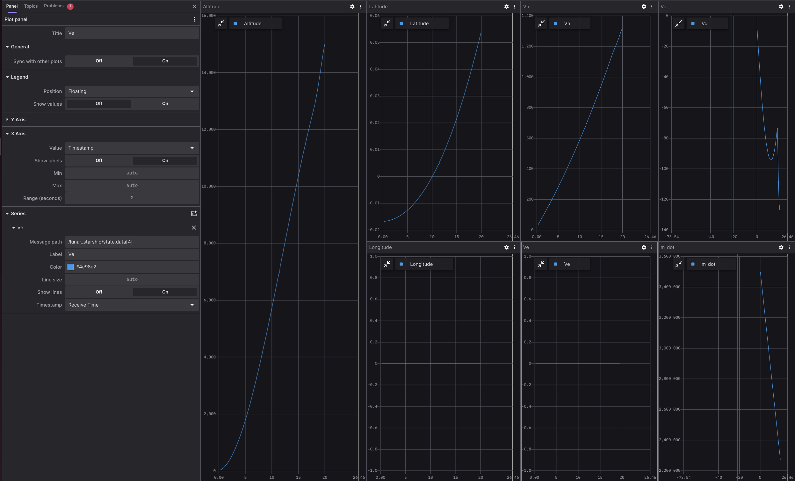
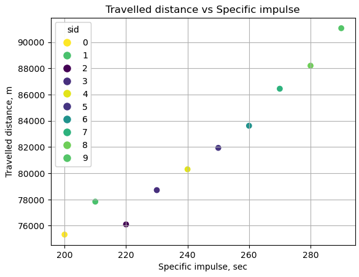

# Lunar Starship

## Overview
This Lunar Starship mission project addresses the lunar hopper challenge by optimizing the ascent, ballistic flight and landing process on the Moon's surface, aiming to minimize fuel consumption, time, etc. It empowers users to define both theoretical and real dynamic functions, enhancing prediction accuracy and enabling real-time corrections during lunar mission. 

Through the Lunar Starship project, researchers are paving the way for sustainable lunar exploration, as it not only optimizes missions but also conserves valuable resources for extended stays on the Moon. By allowing for the integration of real dynamic functions, it fosters adaptability and resilience in lunar operations, making it a cornerstone of future lunar exploration endeavors.


## Prerequisites

1. Please make sure you have all the [necessary softwares](https://citros.io/doc/docs_tutorials/getting_started/#softwares-to-work-with-citros) to work with CITROS installed on your computer.
2. Install [Visual Studio code](https://code.visualstudio.com/download).
3. We strongly recommend that you work with [dockers](https://citros.io/doc/docs_tutorials/dockerfile_overview/). However, if you wish to work without dockers, please refer to the .devcontainer [directory](https://github.com/citros-garden/lunar_starship/tree/main/.devcontainer) in project's repo, the dependencies you need are in the ```Dockerfile``` file.
4. (Optional) Install [Foxglove](https://docs.foxglove.dev/docs/introduction).

## Table of Contents
1. [Installation](#installation)
2. [Workspace Overview](#workspace-overview)
3. [CITROS Initialization](#citros-initialization)
4. [Scenario](#scenario)
5. [Running the Scenario Using CITROS](#running-the-scenario-using-citros)
6. [Results](#results)

## Installation
1. Clone the repository:
```bash
git clone git@github.com:citros-garden/lunar_starship.git
```
2. Open the repository in the [VScode Dev Container](https://citros.io/doc/docs_tutorials/getting_started/#open-project-in-vscode-dev-container).

## Workspace Overview

The Lunar Starship simulation has the following ROS 2 parameters: 

|Parameter	|Description	|Package
|--|--|--
h_0		|Initial altitude above lunar surface level |lunar_starship
lat_0		|Initial latitude |lunar_starship
long_0		|Initial longitude |lunar_starship
vn_0		|Initial "northing" velocity |lunar_starship
ve_0		|Initial "east" velocity |lunar_starship
vd_0		|Initial vertical velocity |lunar_starship
m_fuel_0		|Initial fuel mass |lunar_starship
lat_f		|Final latitude |lunar_starship
long_f		|Final longitude |lunar_starship
vn_f		|Final "northing" velocity |lunar_starship
ve_f		|Final "east" velocity |lunar_starship
vd_f		|Final vertical velocity |lunar_starship
m_fuel_f		|Final fuel mass |lunar_starship
dry_mass		|dry mass |lunar_starship
F_thrustmax		|The maximum amount of thrust |lunar_starship
Isp		|Specific impulse |lunar_starship
simulation_step		|step of simulation	|lunar_starship
publish_freq		|Frequency of publishing |lunar_starship

:::note
- Variables with '_0' are initial conditions.
- variables with '_f' are final conditions.
:::

This project contains only one launch file which will be used for CITROS launch. 

|Launch File	|Description	|Package
|--|--|--
lunar_starship.launch.py	|Lunar Starship simulation launch file |lunar_starship	


## CITROS Initialization
1. [Install CITROS](https://citros.io/doc/docs_tutorials/getting_started/#installation).
2. Follow [these steps](https://citros.io/doc/docs_tutorials/getting_started/#initialization) to Initialize CITROS.

Now you can see .citros directory in the explorer.

## Scenario
This example provides an array of time dependent values of states, which are computed by solving non-linear OCP (optimal control problems) in the standard Bolza form, by using pseudo-spectral collocation methods and adjusted by using an additional real dynamic function. <br/>
The OCP solver used in this example is [MPOPT](https://mpopt.readthedocs.io/en/latest/) (based on [IPOPT](https://en.wikipedia.org/wiki/IPOPT#:~:text=IPOPT%2C%20short%20for%20%22Interior%20Point,the%20EPL%20(formerly%20CPL).)) library modified by Lulav Space team. <br/>

The output of the simulation comprises critical flight data, such as altitude, velocity, and other relevant parameters, recorded over time intervals. These results are published via ROS 2 topics, allowing for real-time data visualization, analysis, and integration with other ROS-based systems.<br/>

In this tutorial, we will check how far the Starship can fly depending on Specific Impulse. For that, we will launch a simulation batch with a distribution of Specific impulse parameter, starting from 200 and up to 300.
The parameter setup is listed in ```.citros/parameter_setups/default_param_setup.json```.<br/>

```json
{
    "packages": {
        "lunar_starship": {
            "lunar_starship": {
                "ros__parameters": {
                    "h_0": 0.0,
                    "lat_0": 0.0,
                    "long_0": 0.0,
                    "vn_0": 0.0,
                    "ve_0": 0.0,
                    "vd_0": 0.0,
                    "m_fuel_0": 3543000.0,
                    "h_f": 1500.0,
                    "lat_f": 0.5,
                    "long_f": 0.5,
                    "vn_f": 1700.0,
                    "ve_f": 0.0,
                    "vd_f": 0.0,
                    "m_fuel_f": 3543000.0,
                    "dry_mass": 85000.0,
                    "Fthrustmax": 20295000.0,
                    "Isp": {
                        "function": "my_func.py:func_with_context",
                        "args": [200]
                    },
                    "simulation_step": 1.0,
                    "publish_freq": 1.0
                }
            }
        }
    }
}
```

The ```my_func.py``` file should contain:
```python
def func_with_context(num, context):
    return num + float(context['sid'])*10
```

This function will set the ```Isp``` parameter in range from 200 to 200+10*n, where n = number of runs.

Learn more about parameter setup and defining custom functions in [Directory parameter_setups](https://citros.io/doc/docs_cli/structure/citros_structure/#directory-parameter_setups) and [Adding Functions to Parameter Setup](https://citros.io/doc/docs_cli/configuration/config_params) pages.

In addition to parameter setup, you can configure the simulation performance setup (timeout, CPU, GPU and Memory) as well.
These parameters can be found in ```.citros/simulations/simulation_lunar_starship.json```. <br/>
Look in [Directory simulations page](https://citros.io/doc/docs_cli/structure/citros_structure#directory-simulations) for more information.

## Running the Scenario Using CITROS

### Running Locally

First, we recommended to update the simulation performance timeout to 600 seconds:

 ```json 
{
    ...
    "parameter_setup": "default_param_setup.json",
    "storage_type": "MCAP",
    "timeout": 600
}
 ```

Then, ensure that the project has been [built and sourced](https://citros.io/doc/docs_tutorials/getting_started/#build-the-project).<br/>

Now we can launch it locally:
```bash 
>>> citros run -n 'Lunar_Starship' -m 'local test run'
? Please choose the simulation you wish to run:
❯ lunar_starship
```
Select the launch file (should be the only one here) by pressing ```Enter``` button and wait for the output in the terminal. 

```bash
created new batch_id: <batch_run / batch name>. Running locally.
+ running batch [<batch_run / batch name>], description: local test run, repeating simulations: [1]
+ + running simulation [0]
...
```

All the results will be saved under `.citros/runs/[simulation_name]` folder.

To plot the local run results you can use [Foxglove](https://citros.io/doc/docs_tutorials/#visualization-with-foxglove).



### Running in Cloud

First, we recommended to update the simulation performance parameters:
- CPU: 4
- GPU: 4  
- Memory: 4096 MB
- Timeout: 600 seconds


```json
{
    "CPU": 4,
    "GPU": 4,
    "MEM": 4096,
    ...
    "timeout": 600
}
```

Then, [Upload project to CITROS Server](https://citros.io/doc/docs_tutorials/getting_started/#upload-to-citros-server). 

Finally, we can run it in the cloud! Simply add `-r` to the terminal command: 
```bash 
citros run -n 'Lunar_Starship' -m 'cloud test run' -r
? Please choose the simulation you wish to run:
❯ lunar_starship
```

Select the launch file (should be the only one here) by pressing `Enter` button. Now the simulation is running in the CITROS server, and the results will be automatically uploaded to the CITROS database.

```bash
created new batch_id: <batch_id / batch name>. Running on Citros cluster. See https://citros.io/batch/<batch_id / batch name>.
```

## Results
To get and process the simulation results, execute [built-in Jupiter Notebook](https://citros.io/lunar_starship/blob/main/notebooks/Lunar_Starship.ipynb).

The graph below shows us the traveled distance depending of Specific impulse:

