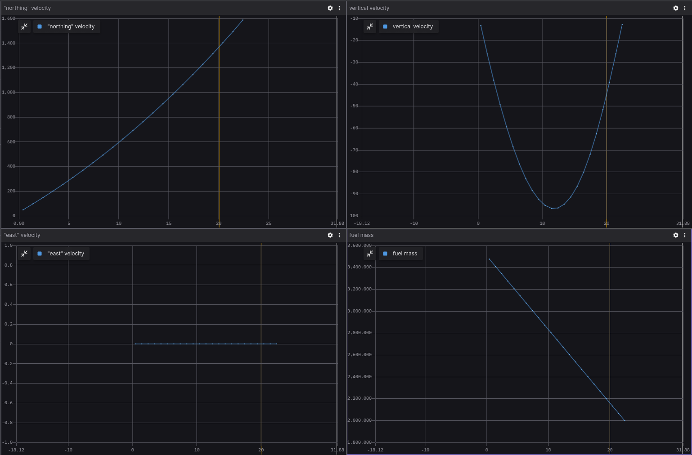
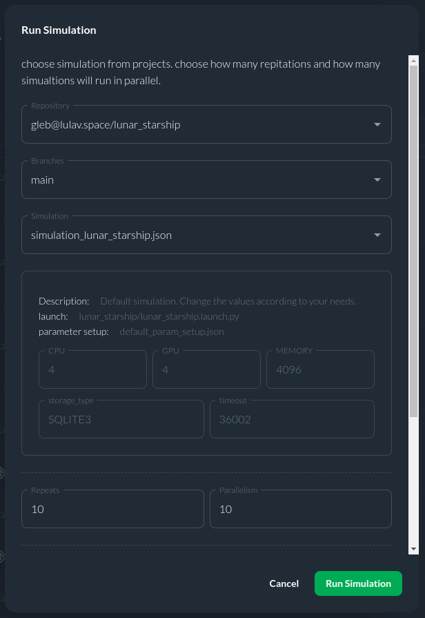

# Lunar Starship Optimal Control Example Using CITROS

This Lunar Starship mission project addresses the lunar hopper challenge by optimizing the ascent, ballistic flight and landing process on the Moon's surface, aiming to minimize fuel consumption, time, or other relevant parameters. It empowers users to define both theoretical and real dynamic functions, enhancing prediction accuracy and enabling real-time corrections during lunar mission. 

Through the Lunar Starship project, researchers are paving the way for sustainable lunar exploration, as it not only optimizes missions but also conserves valuable resources for extended stays on the Moon. By allowing for the integration of real dynamic functions, it fosters adaptability and resilience in lunar operations, making it a cornerstone of future lunar exploration endeavors.


## Table of Contents

1. [CITROS Usage](#citros-usage)
    1. [CITROS Installation](#citros-installation)
    2. [Configuring The Project](#configuring-the-project)
    3. [Running Locally](#running-locally)
    4. [Syncing Project's Setup](#syncing-projects-setup)
    5. [Uploading Docker Image To The CITROS Cloud](#uploading-docker-image-to-citros-cloud)
    6. [Running in The Cloud](#running-in-the-cloud)
    7. [CITROS Web Usage](#citros-web-usage)
2. [Extras](#extras)
    1. [Foxglove Examples](#foxglove-examples)

## CITROS Usage
The best way to work with such simulations and process the results is CITROS! With its power, it is possible to create complex data processing scenarios, including the construction of more complex graphs, mathematical analysis and other high-level processing methods.

One of the main CITROS features is an ability to launch a number of simulations in parallel. For the projects like SpiceyPy example this feature allows user to simulate many different behaviours of the model regardless of the complexity of it and without restrictions on computing power. Moreover, the amazing Data Analysis tool from CITROS allows user to process the simulation results with such useful packages as Error Analysis and Validation module!

### CITROS Installation

First of all, to use all the powerful CITROS features the CLI installation is required: follow the instructions on the CITROS CLI [documentation page](https://citros.io/doc/docs_cli).

### Configuring The Project
After all the prerequisites are met, we can start configuring our project. The starting point is the Lunar_Starship devcontainer loaded and running, CITROS CLI is installed and ready.
1. Initialize CITROS:
```bash 
>>> citros init
Checking internet connection...
Checking ssh...
Updating Citros...
Waiting for repo to be ready...
Citros repo successfully cloned from remote.
Creating new citros branch `master`.
Creating an initial commit.
Default branch of remote 'origin' set to: master
Citros successfully synched with local project.
You may review your changes via `citros status` and commit them via `citros commit`.
Initialized Citros repository.
```

Now you can see ```.citros``` folder in the explorer.

2. Configuring the setup. We need to set up the maximum performance available: timeout, CPU, GPU and Memory. To perform it, we need to define them in ```.citros/simulations/simulation_lunar_starship.json```. The recommended setup is minimum 600 seconds timeout, 4 CPU, 4 GPU and 4096 MB of Memory. Don't forget to save the file!

3. Configuring the params setup. You can find the default setup in ```.citros/parameter_setups/default_param_setup.json```. [CITROS CLI](https://citros.io/doc/docs_cli) provides an opportunity to use basic NumPy functions (such as distributions) and even user-defined functions, but let's keep it default for now. Variables with '_0' are initial conditions, and variables with '_f' are final conditions respectively. Don't forget to save the file!

    |Parameter	|Package	|Description
    |--|--|--
    h_0	|lunar_starship	|Initial altitude above lunar surface level
    lat_0	|lunar_starship	|Initial latitude
    long_0	|lunar_starship	|Initial longitude
    vn_0	|lunar_starship	|Initial "northing" velocity
    ve_0	|lunar_starship	|Initial "east" velocity
    vd_0	|lunar_starship	|Initial vertical velocity
    m_fuel_0	|lunar_starship	|Initial fuel mass
    lat_f	|lunar_starship	|Final latitude
    long_f	|lunar_starship	|Final longitude
    vn_f	|lunar_starship	|Final "northing" velocity
    ve_f	|lunar_starship	|Final "east" velocity
    vd_f	|lunar_starship	|Final vertical velocity
    m_fuel_f	|lunar_starship	|Final fuel mass
    dry_mass	|lunar_starship	|dry mass
    F_thrustmax	|lunar_starship	|The maximum amount of thrust
    Isp	|lunar_starship	|Specific impulse
    simulation_step	|lunar_starship	|step of simulation	
    publish_freq	|lunar_starship	|Frequency of publishing


4. Launch files. This project contains only one launch file ```lunar_starship.launch.py```. This file will be used for CITROS launch. 

    |Launch File	|Package	|Description
    |--|--|--
    lunar_starship.launch.py	|lunar_starship	|Lunar Starship simulation launch file 	

:::tip

CITROS CLI, in addition to other benefits, also provides an automatic ROS bag recording option, which allows user to use saved simulation results and export them! :)

:::

### Running Locally
Since all the preparations done, we can launch it locally (your project should be built and sourced before that):
```bash 
>>> citros run -n 'Lunar_Starship' -m 'local test run'
? Please choose the simulation you wish to run:
❯ lunar_starship
```

Select the launch file (should be the only one here) by pressing ```Enter``` button and wait for the output in the terminal. To plot the local run results you can use FoxGlove.

```bash
created new batch_id: <your-batch-id-here>. Running locally.
+ running batch [<your-batch-id-here>], description: local test run, repeating simulations: [1]
+ + running simulation [0]
...
```




### Syncing Project's Setup 
CITROS account is required for cloud usage. Follow the instructions on [CITROS Website](https://citros.io/auth/login) to register a new one, or check the [CLI documentation](https://citros.io/doc/docs_cli) for logging in. To complete the following steps, it is assumed that the user is registered, logged in and has met all requirements for Web Usage.
Now we can synchronize our project settings with CITROS server:
```bash 
>>> citros commit
>>> citros push
```

### Uploading Docker Image to CITROS Cloud
We need to build and push a Docker container image to the CITROS server:
```bash 
>>> citros docker-build-push
Logging in to docker...
...
```

### Running in The Cloud 
Finally, we can run it in the cloud! Simply add ```-r``` to the terminal command: 
```bash 
>>> citros run -n 'Lunar_Starship' -m 'local test run' -r
? Please choose the simulation you wish to run:
❯ lunar_starship
```

Select the launch file (should be the only one here) by pressing ```Enter``` button. Now the simulation is running in the CITROS server, and the results will be automatically uploaded to the CITROS database.

```bash
created new batch_id: <your-batch-id-here>. Running on Citros cluster. See https://citros.io/batch/<your-batch-id-here>.
```

### CITROS Web Usage 
#### Launching Project via CITROS Web
The best way to use all the innovative capabilities of CITROS is through it's Web interface. Follow [this manual](https://citros.io/doc/docs/simulations/sim_overview) to easily launch a simulation on CITROS Web platform.

#### Working with Integrated Jupiter Notebooks and Data Analysis

CITROS Web provides a powerful data analysis package, which is a comprehensive solution for data query, analysis and visualization. With its extensive features, you can quickly and easily extract valuable insights from your data. To use it, Jupiter Notebook support is built-in. 
Navigate to our ```Code``` project page, open the Notebooks folder and click on the notebook file. Here you can see the usual Jupiter editor interface: you can add blocks of code or built-in Markdown engine, run and save notebook and control the Python kernel.

You can find all the data analysis package guides and API reference [here](https://citros.io/doc/docs_data_analysis).

Let's quickly go through the key points of using a Jupiter Notebook and fetching data from a database. But to try some brief examples of data analysis using the built-in package, we need to launch a batch with several simulations and a distribution for one of the ROS parameters (Specific impulse, in our case). This parameter will be different for each simulation:

```json
"Isp": {
    "function": "my_func.py:func_with_context",
    "args": [200]
},
```

All necessary things are already configured (we used a NumPy distribution function, you can read more about its usage in the [CITROS CLI](https://citros.io/doc/docs_cli) manual), so you can start the simulation from [CLI](#citros-usage-🛸) with the ```-c 10``` flag: 

```bash 
>>> citros run -n 'Lunar_Starship' -m 'local test run' -r -c 10
? Please choose the simulation you wish to run:
❯ lunar_starship
```

Or from [Web](#running-in-the-cloud-🛰️):



Run the ```lunar_starship``` simulation and copy your batch id (we will need it later).

Let's return to our Notebook and check the code: to start with, we need to import all the necessary modules:

```python
import numpy as np
import matplotlib.pyplot as plt
from citros_data_analysis import data_access as da
from prettytable import PrettyTable, ALL
import json
from platform import python_version
```

Now we can connect to the simulation database:
```python
batch_id = '<your-batch-id-here>'
citros = da.CitrosDB(batch = batch_id)
citros.info().print()
```

The last command returns general batch info:
```python
{
 'size': '543 kB',
 'sid_count': 10,
 'sid_list': [0, 1, 2, 3, 4, 5, 6, 7, 8, 9],
 'topic_count': 2,
 'topic_list': ['/config', '/lunar_starship/state'],
 'message_count': 1646
}
```
As you can see in the output above, we've got some information about our simulation run (batch): data size, sid information and a list of topics. 

Now we are ready to do some simple research and draw some plots. All MatPlotLib capabilities available here, but the [CITROS Data Analysis](https://citros.io/doc/docs_data_analysis) package provides it's own powerful plotting functions (also based on MatPlotLib):

```python
fig1, ax1 = plt.subplots()

citros.time_plot(ax1, 
                 topic_name = '/lunar_starship/state', 
                 var_name = 'data.data[0]', 
                 time_step = 1, 
                 sids = [0,1,2,3,4,5,6,7,8,9], 
                 y_label = 'H', title_text = 'H vs. Time')
```
As you can see, the maximum altitude varies for different sids:


Let's go further:
```python
import math

# Setting Dataframe and getting initial and final coords
df = citros.topic('/lunar_starship/state').set_order({'sid':'asc'}).data('data.data[1]')
dff = citros.topic('/lunar_starship/state').set_order({'sid':'asc'}).data('data.data[2]')
sid_list = list(set(df['sid']))
lat0_list = []
latf_list = []
long0_list = []
longf_list = []
for s in sid_list:
    id_max = df[df['sid'] == s]['rid'].idxmax()
    id_min = df[df['sid'] == s]['rid'].idxmin()
    lat0_list.append((df['data.data[1]'].loc[id_min])*57.3)
    latf_list.append((df['data.data[1]'].loc[id_max])*57.3)
    long0_list.append((dff['data.data[2]'].loc[id_min])*57.3)
    longf_list.append((dff['data.data[2]'].loc[id_max])*57.3)

# Moon radius
rad = 1737400

# Calculating traveled distance for each sid
dist_list= []
for i in range(len(sid_list)):

    llat1 = lat0_list[i]
    llong1 = long0_list[i]

    llat2 = latf_list[i]
    llong2 = longf_list[i]

    lat1 = llat1*math.pi/180.
    lat2 = llat2*math.pi/180.
    long1 = llong1*math.pi/180.
    long2 = llong2*math.pi/180.

    cl1 = math.cos(lat1)
    cl2 = math.cos(lat2)
    sl1 = math.sin(lat1)
    sl2 = math.sin(lat2)
    delta = long2 - long1
    cdelta = math.cos(delta)
    sdelta = math.sin(delta)

    y = math.sqrt(math.pow(cl2*sdelta,2)+math.pow(cl1*sl2-sl1*cl2*cdelta,2))
    x = sl1*sl2+cl1*cl2*cdelta
    ad = math.atan2(y,x)
    dist_list.append(ad*rad)


# Defining the list of Isp
isp = [i for i in range(200,300, 10)]

fig, ax = plt.subplots()

c = np.random.choice(50, 10, replace=False)
scatter = ax.scatter(isp, dist_list,c=c)

# Create legend entries for each point
legend_labels = [str(i) for i in range(10)]

# Initialize a list to store legend handles
legend_handles = []

# Loop through the points and create legend entries with matching colors
for i, label in enumerate(legend_labels):
    color = scatter.to_rgba(c[i])  # Get the color of the corresponding point
    legend_handles.append(plt.Line2D([0], [0], marker='o', color='w', label=label, markerfacecolor=color, markersize=10))

# Add the legend with custom handles
legend1 = ax.legend(handles=legend_handles, loc="upper left", title="sid")
ax.add_artist(legend1)
ax.grid()

ax.set_xlabel('Specific impulse, sec')
ax.set_ylabel('Traveled distance, m')
ax.set_title('Traveled distance vs Specific impulse')
```
This graph shows us the travelled distance depending of Specific impulse:


## Extras
### Foxglove Examples


