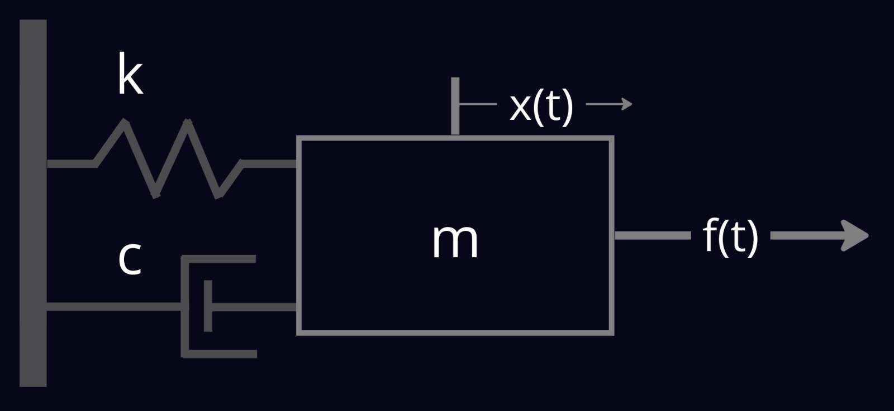
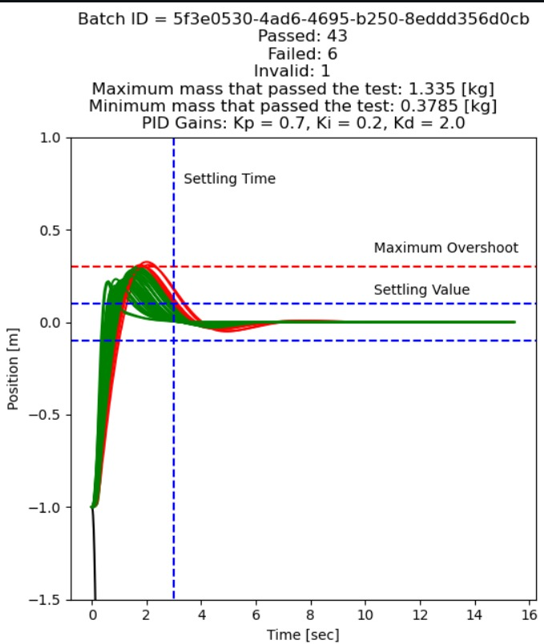

# Mass-Spring-Damper

## Overview

This is a simple ROS demonstration of a mass-spring-damper system.



The example contains two ROS 2 packages: `dynamics` and `controller`.

### System Dynamics

The system's equations of motion:

$$
        m\ddot x =  kf(t) -c\dot x -kx
$$

and after laplace transformation (with zero I.C) we get a second order system:

$$
        {X \over F} = {\omega_n^2 \over s^2 +2\omega_n\zeta s + \omega_n^2}
$$

where the natural frequency $\omega_n = \sqrt{k \over m}$

You can choose the system's parameters `m`, `k` and `c` and choose the initial condition `x0`, `v0` and `a0`, all configured as ROS 2 parameters.

### The Controller

You can write your own controller to try stabilize the system for a given setpoint.

the default controller is a simple PID controller with the following form:

$$
        f(t) = {k_pe(t) + k_i\int{e(t)dt}} + k_d {d\over dt}(e(t))
$$

you can tune the controller gains, $k_p$, $k_i$, $k_d$, configured as ROS 2 parameters.

## Prerequisites

1. Please make sure you have all the [necessary softwares](../getting_started/getting_started.md#softwares-to-work-with-citros) to work with CITROS installed on your computer.
2. Install [Visual Studio code](https://code.visualstudio.com/download).
3. [Install CITROS](../getting_started/getting_started.md#installation).
4. We strongly recommend that you work with [dockers](..//dockerfile_overview/dockerfile_overview.md). However, if you wish to work without dockers, please refer to the [.devcontainer](https://github.com/citros-garden/mass-spring-damper/tree/main/.devcontainer) directory in project's repo, the dependencies you need are in the `Dockerfile` and `install.sh` files.

## Table of Contents
1. [Installation](#installation)
2. [Workspace Overview](#workspace-overview)
3. [CITROS Initialization](#citros-initialization)
4. [Scenario](#scenario)
5. [Running the Scenario using CITROS](#running-the-scenario-using-citros)
6. [Results](#results)

## Installation

1. Clone the repository from Github:
 ```sh
 git clone git@github.com:citros-garden/mass_spring_damper.git
   ```
2. Open the repository in the VScode:
 ```sh
 cd ~/mass_spring_damper
 code .
 ```
3. Open the repository in the container from VScode with `reopen in container` [option](../getting_started/getting_started.md#reopen-in-container).<br />
*The Dockerfile contains all the necessary dependencies for the project.*

4. Build the project:
 ```bash
 $ colcon build
 $ source install/local_setup.bash
 ```

## Workspace Overview

### Parameters

| Parameter | Description | Package
| --------|  --------|  --------|
|kp | p gain of the PID controller |  controller
|ki | i gain of the PID controller |  controller
|kd | d gain of the PID controller |  controller
|setpoint | Setpoint position for the controller |  controller
|m | The mass of the system |  dynamics
|k | The spring coefficient |  dynamics
|c | The damper coefficient |  dynamics
|x | The mass initial position |  dynamics
|v | The mass initial velocity |  dynamics
|a | The mass initial acceleration |  dynamics

### Launch Files

|Launch file| Description
| --------|  --------|
|dynamics.launch.py | Launch the uncontrolled system
|dynamics_controller.launch.py | Launch the controlled system with PID controller

## CITROS Initialization

Follow [these steps](/docs_tutorials/getting_started/getting_started.md#initialization) to Initialize CITROS.

## Scenario

Supposed we tune the PID gains of the controller for the nominal mass, and we reached a satisfying results.

Now we want to know how robust was the tuning for a normal distributed mass:

$$ 
m = N(\mu, \sigma)
$$

where:

$$ 
\mu = 1.0,    
\sigma = 0.3 
$$

All the parameters can be set following the CITROS [parameter guide](https://citros.io/doc/docs_cli/structure/citros_structure#directory-parameter_setups).


The initial condition are:

$$
r_0 = -1.0[m]\\
v_0 = 0.0 [m/s]\\
a_0 = 0.0 [m/s^2]\\
$$

With $setpoint = 0.0 [m]$.

We will define the following requirements:

* Maximum overshoot of `30%`.
* Settling time is `2.0` [sec].
* Settling to `10%` of the steady-state value.

## Running the Scenario using CITROS
```bash
citros run -n "default" -m "default simulation"
```
After running the command, choose the launch file you wish to run. The simulation will start and you could see the mass position and the control signal in the terminal's logs.

For more CLI running options check the [Introduction to CITROS](https://citros.io/doc/docs_tutorials/) tutorial.

## Results
Lets run `50` simulations in the server and analyze the results:




We can see that `43` tests were passed the requirements, `6` failed and `1` was generated invalid mass $(<0)$.

The maximum mass that still meeting the requirements is equal to $1.335 [kg]$

Can you do better?