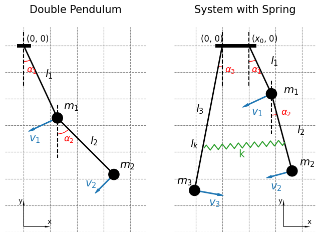
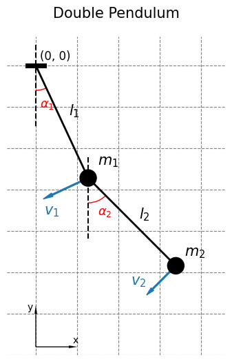
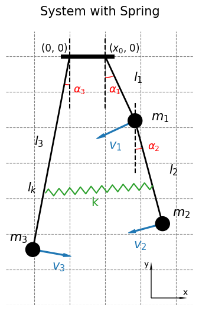
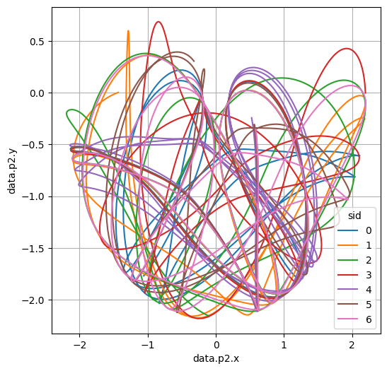

# Pendulum
## Overview

Pendulum systems, encompassing setups from simple single pendulums to complex multi-pendulum arrangements, are governed by the principles of classical mechanics.
The double pendulum, a classic example of a chaotic system, exhibits intricate and unpredictable behavior that is highly sensitive to its initial conditions. This system consists of two pendulums attached end to end, where the motion of the second pendulum depends on the first. One of the most fascinating aspects of a double pendulum is its sensitivity to initial parameters, including the starting angles and velocities of the pendulums. Small changes in these initial parameters can lead to vastly different trajectories. That means, if one double pendulum starts at a slightly different angle than an identical pendulum, their motions will diverge significantly over time.

Setting a range of simulations with various initial parameters and exploring the behavior of the systems is convenient with CITROS: 

- you can easily set new parameters for the simulations using [command line](https://citros.io/doc/docs_cli) or [web interface](https://citros.io/doc/docs/) and immediately send the scenario to be executed in the cloud;
- have access to all your simulated data from the different devices;
- set the analysis of the results to a pipeline by preparing notebooks using [**citros_data_analysis**](https://citros.io/doc/docs_data_analysis/) package.

In the current project we suggest to explore two systems: double pendulum and system with spring, where the second component of the double pendulum is connected to an ordinary pendulum by a spring. In both models, all rods are considered weightless and inextensible, the weights are point masses, and air resistance is neglected (thus, no energy losses).



## Prerequisites

If you are working inside the docker development container, everything is already installed. Otherwise, please check the dependencies in Dockerfile in [.devcontainer](https://github.com/citros-garden/pendulum/tree/main/.devcontainer) folder.

## Table of Contents
1. [Installation](#installation)
2. [Workspace Overview](#workspace-overview)
    1. [Input Parameters](#input-parameters)
    2. [Source Code and Launch File](#source-code-and-launch-file)
    3. [Output of the Simulation](#output-of-the-simulation)
3. [CITROS Initialization](#citros-initialization)
4. [Scenario](#scenario)
    1. [Parameter Setup](#parameter-setup)
    2. [Simulation Setup](#simulation-setup)
5. [Running the Scenario Using CITROS](#running-the-scenario-using-citros)
6. [Results](#results)

## Installation

Clone the repository:

```bash
git clone git@github.com:citros-garden/pendulum.git
```

If you are working with devcontainer, make sure you installed [Visual Studio code](https://code.visualstudio.com/download) and then open the repository in the [VScode Dev Container](https://citros.io/doc/docs_tutorials/getting_started/#open-project-in-vscode-dev-container).

## Workspace Overview
### Input Parameters

#### Double Pendulum



Parameters of the simulation with their default values are listed in `src/double_pendulum/config/params.yaml` file:

Parameter | Default | Description
|--|--|--
publish_freq | 10| frequency of publishing
l1 | 0.08 | Length of the first pendulum, m
l2 | 0.2 | Length of the second pendulum, m
m1 | 5.0 | Mass of the first pendulum, kg
m2 | 3.0 | Mass of the second pendulum, kg
a1_0 | 30.0| Initial angle of the first pendulum, counted counterclockwise, degrees
a2_0 | 10.0| Initial angle of the second pendulum, counted counterclockwise, degrees
v1_0 | 0.0| Initial angular velocity of the first pendulum, counted counterclockwise, degrees per second
v2_0 | 0.0| Initial angular velocity of the second pendulum, counted counterclockwise, degrees per second 
T | 10.0 | Time of the simulation, seconds
h | 0.01 | Step of the simulation, seconds

#### System with Spring



Parameters of the simulation with their default values are listed in `src/system_with_spring/config/params.yaml` file:

Parameter| Default | Description 
|--|--|--
publish_freq | 10| frequency of publishing
l1 | 0.08 | Length of the first pendulum, m
l2 | 0.2 | Length of the second pendulum, m
l3| 0.32 | Length of the third pendulum, m 
lk | 0.14 | Spring attachment point, m. The spring is attached at a point lk meters from the beginning of the rod of the third pendulum at one end and at a point (lk - l1) meters from the beginning of the rod of the second pendulum at the other end. lk > l1, (l1+l2) > lk and l3 > lk
m1 | 5.0 | Mass of the first pendulum, kg
m2 | 3.0 | Mass of the second pendulum, kg
m3 | 1.0 | Mass of the second pendulum, kg
a1_0 | 30.0| Initial angle of the first pendulum, counted counterclockwise, degrees
a2_0 | 10.0| Initial angle of the second pendulum, counted counterclockwise, degrees
a2_0 | -30.0| Initial angle of the third pendulum, counted counterclockwise, degrees
v1_0 | 0.0| Initial angular velocity of the first pendulum, counted counterclockwise, degrees per second
v2_0 | 0.0| Initial angular velocity of the second pendulum, counted counterclockwise, degrees per second
v3_0 | 0.0| Initial angular velocity of the third pendulum, counted counterclockwise, degrees per second
x0 | 0.1 | Horizontal distance between attachment points of the first and third pendulums, m
k | 100.0 | Spring constant, kg/s^2
l0 | 0.05 | Unstretched spring length, m
T | 10.0 | Time of the simulation, seconds
h | 0.01 | Step of the simulation, seconds

### Source Code and Launch File

In the `src/double_pendulum/double_pendulum/` folder the source files for the double pendulum system are located:
- `system_model.py` - Python code of the double pendulum model,
- `double_pendulum.py` - Python script that publish the results.

The source files for the system of pendulum and double pendulum connected by spring are located in the `src/system_with_spring/system_with_spring/` folder:
- `system_model.py` - Python code of the system model,
- `double_pendulum.py` - Python script that publish the results.
  
Two other folders - `src/double_pendulum_interfaces` and `src/system_with_spring_interfaces/` - contain definitions of the custom messages.

The launch files are located in `src/double_pendulum/launch/double_pendulum.launch.py` and `src/system_with_spring/launch/system_with_spring.launch.py`.

### Output of the Simulation

#### Double Pendulum
The simulated data is published to a topic `'/coordinates'`. Each message has the custom message type that is defined in `src/double_pendulum_interfaces/`:

```js
{
    't': 'float',
    'p1': {
        'x': 'float',
        'y': 'float'
    },
    'p2': {
        'x': 'float',
        'y': 'float'
    }
},
```
where:

Parameter | Description
--|--
t | time, s
p1.x|x coordinate of the first pendulum, m
p1.y|y coordinate of the first pendulum, m
p2.x|x coordinate of the second pendulum, m
p2.y|y coordinate of the second pendulum, m

#### System with Spring

The simulated data is published to a topic named `'/coordinates'` too. Each message has the custom message type that is defined in `src/system_with_spring_interfaces/`:

```js
{
    't': 'float',
    'p1': {
        'x': 'float',
        'y': 'float'
    },
    'p2': {
        'x': 'float',
        'y': 'float'
    },
    'p3': {
        'x': 'float',
        'y': 'float'
    },
    'spr': {
        'x0': 'float',
        'x1': 'float',
        'y0': 'float',
        'y1': 'float'
 }
},
```

where:

Parameter | Description
--|--
t | time, s
p1.x|x coordinate of the first pendulum, m
p1.y|y coordinate of the first pendulum, m
p2.x|x coordinate of the second pendulum, m
p2.y|y coordinate of the second pendulum, m
p3.x|x coordinate of the third pendulum, m
p3.y|y coordinate of the third pendulum, m
spr.x0|x coordinate of the spring attachment to the third pendulum, m
spr.x1|x coordinate of the spring attachment to the second pendulum, m
spr.y0|y coordinate of the spring attachment to the third pendulum, m
spr.y1|x coordinate of the spring attachment to the second pendulum, m

## CITROS Initialization

To start working with CITROS you need to install CITROS CLI package, log in, set ssh key and initialize the `.citros` repository. To do this please follow:
1. [Install CITROS](https://citros.io/doc/docs_tutorials/getting_started/#installation)
2. [Initialize CITROS](https://citros.io/doc/docs_tutorials/getting_started/#initialization)

## Scenario

Let's investigate whether minor changes in initial parameters have a significant impact on the motion of the pendulum.

### Parameter Setup

Parameters are listed in file `.citros/parameter_setups/default_param_setup.json`. We can randomize, for example, the initial angles and try the system simulations with the following parameters:

```js
{
    "packages": {
        "double_pendulum": {
            "double_pendulum": {
                "ros__parameters": {
                    "publish_freq": 10.0,
                    "l1": 1.2,
                    "l2": 1.0,
                    "m1": 1.0,
                    "m2": 1.0,
                    "a1_0": {
                        "function": "numpy.random.normal",
                        "args": [120.0, 5.0]
                    },
                    "a2_0": -30.0,
                    "v1_0": 0.0,
                    "v2_0": 0.0,
                    "T": 5.0,
                    "h": 0.01
                }
            }
        },
        "system_with_spring": {
            "system_with_spring": {
                "ros__parameters": {
                    "publish_freq": 10.0,
                    "l1": 0.08,
                    "l2": 0.2,
                    "l3": 0.32,
                    "lk": 0.2,
                    "m1": 5.0,
                    "m2": 2.0,
                    "m3": 3.0,
                    "a1_0": 30.0,
                    "a2_0": {
                        "function": "numpy.random.normal",
                        "args": [10.0, 5.0]
                    },
                    "a3_0": -30.0,
                    "v1_0": 0.0,
                    "v2_0": 0.0,
                    "v3_0": 0.0,
                    "x0": 0.1,
                    "k": 100.0,
                    "l0": 0.05,
                    "T": 5.0,
                    "h": 0.05
                }
            }
        }
    }
}
```
For double pendulum system we randomize the initial angle of the first pendulum using normal distribution with mean equals 120 degrees and standard deviation equals 5 degrees. For the system with spring the angle of the second pendulum (the bottom component of the double pendulum) is randomly chosen from the normal distribution where mean = 20 degrees and standard deviation = 5 degrees.

Learn more about parameter setup in [Directory parameter_setups](https://citros.io/doc/docs_cli/structure/citros_structure/#directory-parameter_setups)

### Simulation Setup

Check the `.citros/simulations/simulation_double_pendulum.json` and `.citros/simulations/simulation_system_with_spring.json` files. They are used to set the parameter setup files, launch files, memory to use and so on, please look in [Directory simulations page](https://citros.io/doc/docs_cli/structure/citros_structure#directory-simulations) for more information.

## Running the Scenario Using CITROS

Next step is to [Upload project to CITROS Server](https://citros.io/doc/docs_tutorials/getting_started/#upload-to-citros-server).

After the following steps everything is ready to run the simulations in the cloud. Let's run two scenarios - one for the system of the double pendulum and one for the system with spring, the names of the resulting batches are set by `-n` key. Let's set 7 simulation runs for each of them by `-c` key. `-r` defines that the runs will be processed remotely. After typing the following command you will be asked to select the corresponding simulation scenario:

```bash
citros run -n "double_pendulum_angles" -m "first run" -c 7 -r
```

```bash
citros run -n "spring_system_angles" -m "first run" -c 7 -r
```

## Results

Check the results of the simulations using [`notebooks`](https://citros.io/pendulum/tree/main/notebooks) and [citros_data_analysis package](https://citros.io/doc/docs_data_analysis) which allows you to query, visualize and analyze the results.

Let's query data from the batch `double_pendulum_angles` that we have just [created](#running-the-scenario-using-citros) and plot the trajectory of the second component of the double pendulum. As we mentioned in [Output of the Simulation](#output-of-the-simulation) section, the data is published to a topic `'/coordinates'`.

```python
from citros_data_analysis import data_access as da
citros = da.CitrosDB()

F = citros.batch('double_pendulum_angles').topic('/coordinates').data()
citros.plot_graph(F, 'data.p2.x', 'data.p2.y')
```



Let's print the initial angles of the second pendulum that were set randomly. The initial parameters are written in topic `'/config'`:

```python
col_name = 'data.double_pendulum.ros__parameters.a1_0'

a1_0 = citros.batch('double_pendulum_angles').topic('/config').data(col_name, additional_columns='sid').rename({col_name: 'a1_0'}, axis = 1)
a1_0 = a1_0 [a1_0 ['a1_0'].notna()].set_index('sid')
a1_0
```
sid	|a1_0
--|--
0|	117.642381
1|	115.928387
2|	115.404127
3|	117.184502
4|	121.258164
5|	117.592449
6|	115.255676

As we can see, the trajectories differ significantly and unpredictably although the initial parameters have quite close values.

Refer to the notebook [notebooks/double_pendulum.ipynb](https://citros.io/pendulum/blob/main/notebooks/double_pendulum.ipynb) for more detailed information about batches and additional ideas on visualization, such as plotting the animation of the pendulum's motion.<br/>
Additionally, examine [notebooks/system_with_spring.ipynb](https://citros.io/pendulum/blob/main/notebooks/system_with_spring.ipynb) for a detailed view of the spring system behavior.

Feel free to set up your own simulations varying different parameters, create your own notebooks and explore pendulum systems with CITROS!