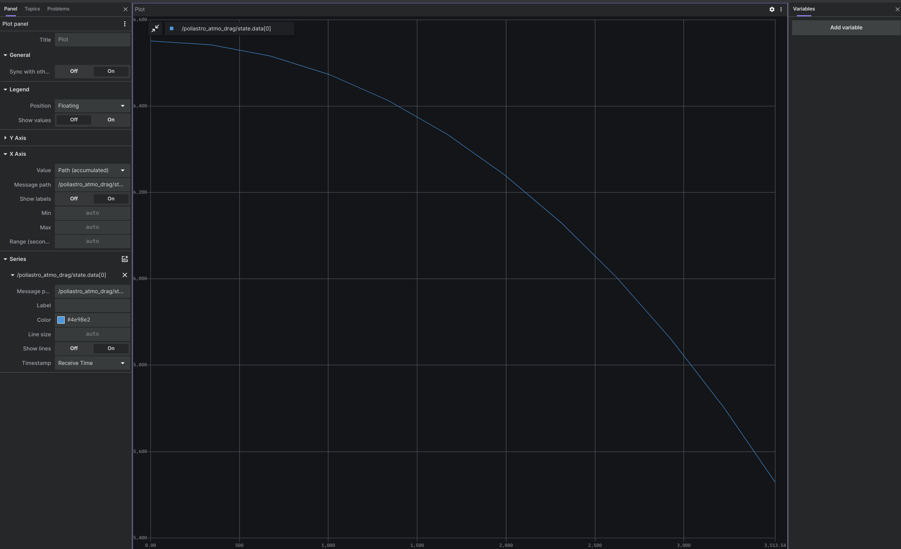
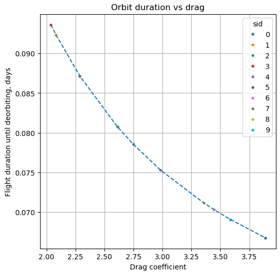

# Poliastro

## Overview
This project contains three simple examples using Poliastro lib for Python 3: 
1. Simple orbit example
2. Orbital maneuver example 
3. Atmospheric drag simulation.  

You can find all the information about the used functions and the mathematical explanation on the [Poliastro Website](https://docs.poliastro.space/en/stable/). <br/>
All project installation, code overview and usage details are also available on the project's [GitHub page](https://github.com/citros-garden/poliastro).


## Prerequisites

1. Please make sure you have all the [necessary softwares](https://citros.io/doc/docs_tutorials/getting_started/#softwares-to-work-with-citros) to work with CITROS installed on your computer.
2. Install [Visual Studio code](https://code.visualstudio.com/download).
3. We strongly recommend that you work with [dockers](https://citros.io/doc/docs_tutorials/dockerfile_overview/). However, if you wish to work without dockers, please refer to the .devcontainer [directory](https://github.com/citros-garden/poliastro/tree/main/.devcontainer) in project's repo, the dependencies you need are in the ```Dockerfile``` file.
4. (Optional) Install [Foxglove](https://docs.Foxglove.dev/docs/introduction).

## Table of Contents
1. [Installation](#installation)
2. [Workspace Overview](#workspace-overview)
3. [CITROS Initialization](#citros-initialization)
4. [Scenario](#scenario)
5. [Running the Scenario Using CITROS](#running-the-scenario-using-citros)
6. [Results](#results)

## Installation
1. Clone the repository:
```bash
git clone git@github.com:citros-garden/poliastro.git
```
2. Open the repository in the [VScode Dev Container](https://citros.io/doc/docs_tutorials/getting_started/#open-project-in-vscode-dev-container).

## Workspace Overview

The examples have the following parameters:

* Poliastro Atmospheric Drag simulation parameters:

    |Parameter	|Description	|Package
    |--|--|--
    earth_r		|Earth radius	|poliastro_atmo_drag
    a		|Semi-Major axis	|poliastro_atmo_drag
    ecc		|Eccentricity	|poliastro_atmo_drag
    inc		|Inclination	|poliastro_atmo_drag
    raan		|Right Ascension of the Ascending Node	|poliastro_atmo_drag
    argp		|Argument of periapsis	|poliastro_atmo_drag
    nu		|True anomaly	|poliastro_atmo_drag
    c_d		|Drag coefficient	|poliastro_atmo_drag
    t_limit		|Maximum simulation duration	|poliastro_atmo_drag
    publish_freq		|Frequency of publishing |poliastro_atmo_drag 

* Poliastro Simple Orbit simulation parameters:

    |Parameter	|Description	|Package
    |--|--|--
    apo_r		|Apoapsis altitude	|poliastro_simple_orbit
    peri_r		|Periapsis altitude	 |poliastro_simple_orbit
    start_t		|Start date and time	|poliastro_simple_orbit
    finish_t		|Final date and time	|poliastro_simple_orbit
    publish_freq		|Frequency of publishing |poliastro_simple_orbit

* Poliastro Maneuver simulation parameters:

    |Parameter	|Description	|Package
    |--|--|--
    r_init		|Initial orbital altitude	|poliastro_maneuver
    r_final		|Final orbital altitude	|poliastro_maneuver
    publish_freq		|Frequency of publishing |poliastro_maneuver


There are three launch files in this project, these files will be used for CITROS launch:

|Launch File	|Description	|Package
|--|--|--
poliastro_atmo_drag.launch.py		|Poliastro Atmospheric Drag simulation launch file |poliastro_atmo_drag
poliastro_maneuver.launch.py		|Poliastro Simple Orbit simulation launch file |poliastro_maneuver
poliastro_simple_orbit.launch.py		|Poliastro Maneuver simulation launch file |poliastro_simple_orbit


## CITROS Initialization
1. [Install CITROS](https://citros.io/doc/docs_tutorials/getting_started/#installation).
2. Follow [these steps](https://citros.io/doc/docs_tutorials/getting_started/#initialization) to Initialize CITROS.

Now you can see .citros directory in the explorer.

## Scenario
The Poliastro project consists of three packages suitable for orbital mechanics calculations:
* `Poliastro_simple_orbit`.<br/>
This package is used to calculate vessel orbital coordinates around the Earth between time bounds from given apoapsis and periapsis altitudes. <br/>
The result is an ephemerides of orbit (actually a part of it between given time bounds) with zero right ascension of the ascending node, argument of the pericenter and true anomaly for simplicity. <br/>
* `Poliastro_maneuver`.<br/>
This package calculates three orbits for the Hohmann transition: an initial orbit, an intermediate orbit, and a final orbit. <br/>
The simulation takes the radius of the initial orbit and the radius of the final orbit as input. <br/>
The result is the ephemerides of these orbits, not the trajectory! <br/>
* `Poliastro_atmo_drag`. <br/>
This package shows the effect of aerodynamic drag forces on an artificial satellite in low Earth orbit. <br/>
The simulation takes Earth diameter, drag coefficient, Keppler orbit parameters and maximum simulation time as inputs. <br/>
The result is a plot of altitude versus time and flight time before hitting the surface.<br/>


In this tutorial we will use the Atmospheric Drag simulation scenario (as one of the most interesting :).<br/>
Let's check how the exact orbit duration reduces depending on Drag coefficient. <br/>
To find it out, we need to set up Drag Coefficient (```c_d```) parameter and launch CITROS simulation. <br/>
The parameter setup is listed in ```.citros/parameter_setups/default_param_setup.json```. <br/>
To find out how the exact orbit duration will reduce, we need to launch a batch with several simulations and a distribution Drag Coefficient parameter, it will be set by a NumPy random function:

```json
    "packages": {
        "poliastro_atmo_drag": {
            "poliastro_atmo_drag": {
                "ros__parameters": {
                    "earth_r": 6378.1366,
                    "a": 6550.85876692,
                    "ecc": 0.0,
                    "inc": 0.0,
                    "raan": 0.0,
                    "argp": 0.0,
                    "nu": 0.0,
                    "c_d": {
                        "function": "numpy.random.uniform",
                        "args": [2, 4]
                    },
                    "t_limit": 1.0,
                    "publish_freq": 10.0
                }
            }
        },
```

This function will set the ```c_d``` parameter randomly in range from 2 to 4.

Learn more about parameter setup and defining custom functions in [Directory parameter_setups](https://citros.io/doc/docs_cli/structure/citros_structure/#directory-parameter_setups) and [Adding Functions to Parameter Setup](https://citros.io/doc/docs_cli/configuration/config_params) pages.

In addition to parameter setup, you can configure the simulation perfomance setup (timeout, CPU, GPU and Memory) as well.
This parameters can be found in ```.citros/simulations/simulation_poliastro.json```. <br/>
The default setup is 180 seconds timeout, 2 CPU, 2 GPU and 2048 MB of Memory.

Look in [Directory simulations page](https://citros.io/doc/docs_cli/structure/citros_structure#directory-simulations) for more information.

## Running the Scenario Using CITROS

### Running Locally
First ensure that the project has been [built and sourced](https://citros.io/doc/docs_tutorials/getting_started/#build-the-project).
Now we can launch the project locally:
```bash 
>>> citros run -n 'poliastro' -m 'local test run'
? Please choose the simulation you wish to run:
❯ poliastro_atmo_drag
poliastro_maneuver
poliastro_simple_orbit
```
Select the ```poliastro_atmo_drag``` launch file by pressing ```Enter``` button and wait for the output in the terminal.

```bash
created new batch_id: <batch_run / batch name>. Running locally.
+ running batch [<batch_run / batch name>], description: local test run, repeating simulations: [1]
+ + running simulation [0]
...
```

All the results will be saved under `.citros/runs/[simulation_name]` folder.

To plot the local run results you can use [Foxglove](https://citros.io/doc/docs_tutorials/#visualization-with-Foxglove) with the ```atmo_drag_layout.json``` layout that exists in the ```Foxglove_layouts``` directory.



### Running in Cloud

[Upload project to CITROS Server](https://citros.io/doc/docs_tutorials/getting_started/#upload-to-citros-server). <br/>
Finally, we can run the simulation in the cloud! Simply add `-r` to the terminal command: 
```bash 
citros run -n 'poliastro' -m 'cloud test run' -c 10 -r
? Please choose the simulation you wish to run:
❯ poliastro_atmo_drag
poliastro_maneuver
poliastro_simple_orbit
```

Select the ```poliastro_atmo_drag``` launch file by pressing `Enter` button.  <br/>
Now the simulation is running in the CITROS server, and the results will be automatically uploaded to the CITROS database.

```bash
created new batch_id: <batch_id / batch name>. Running on Citros cluster. See https://citros.io/batch/<batch_id / batch name>.
```

## Results
To get and process the simulation results, execute [built-in Jupiter Notebook](https://citros.io/poliastro/blob/updates/notebooks/poliastro_notebook_example.ipynb).

This graph shows us the exact orbit duration depending of Drag coefficient:

