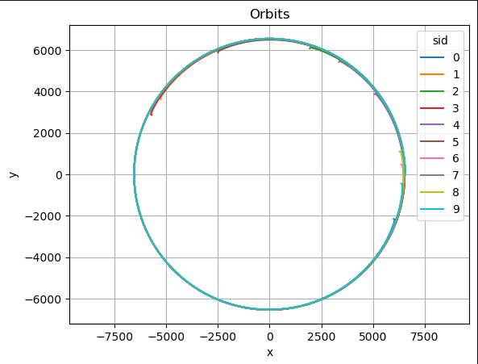
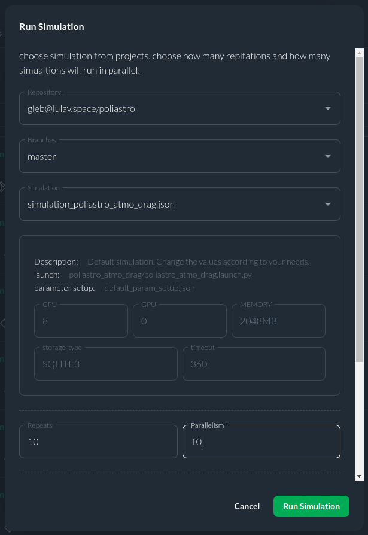
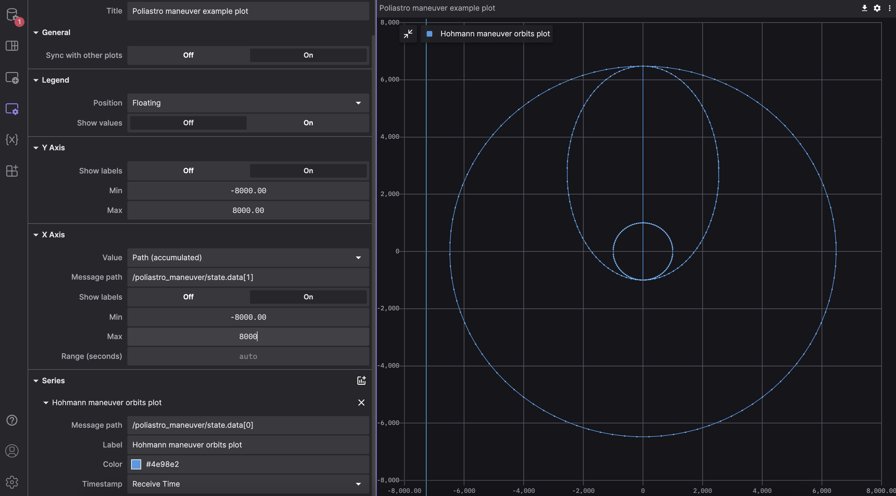

# Poliastro

This project contains three simple examples using Poliastro lib for Python 3:
1. `Poliastro_simple_orbit`. It returns vessel orbital coordinates around the Earth between time bounds from given apoapsis and periapsis altitudes. The result is an ephemerides of orbit (actually a part of it between given time bounds) with zero right ascension of the ascending node, argument of the pericenter and true anomaly for simplicity. 
2. `Poliastro_maneuver`. This package provides three orbits for the Hohmann transition: an initial orbit, an intermediate orbit, and a final orbit. Takes the radius of the initial orbit and the radius of the final orbit as input. You will get the ephemerides of these orbits, not the trajectory! 
3. `Poliastro_atmo_drag`. A simple example showing the effect of aerodynamic drag forces on an artificial satellite in low Earth orbit. Takes Earth diameter, drag coefficient, Keppler orbit parameters and maximum simulation time as inputs. The result is a plot of altitude versus time and flight time before hitting the surface.

You can find all information about used functions and mathematical explanation on the [Poliastro Website](https://docs.poliastro.space/en/stable/). All project installation, code overview and usage details are also available on the project's [GitHub page](https://github.com/citros-garden/poliastro).


## Table of Contents

1. [CITROS Usage](#citros-usage)
    1. [CITROS installation](#citros-installation)
    2. [Configuring the project](#configuring-the-project)
    3. [Running locally](#running-locally)
    4. [Synchronizing project's setup](#synchronizing-the-projects-setup)
    5. [Uploading Docker image to CITROS database](#uploading-docker-image-to-citros-database)
    6. [Running in the cloud](#running-in-the-cloud)
    7. [CITROS web usage](#citros-web-usage)
2. [Extras](#extras)
    1. [Foxglove examples](#foxglove-examples)

## CITROS Usage
Although you can get simulation results using FoxGlove, the best way to work with such simulations and process the results is CITROS! With its power, it is possible to create complex data processing scenarios, including the construction of more complex graphs, mathematical analysis and other high-level processing methods.

### CITROS installation

First of all, to use all the powerfull CITROS features the CLI installation is required: follow the instructions on the CITROS CLI [documentation page](https://citros.io/doc/docs_cli).

### Configuring the project
After all the prerequisites are met, we can start configuring our project. The starting point is the Poliastro devcontainer loaded and running, CITROS CLI is installed and ready.
1. Initialize CITROS:
```bash 
>>> citros init
Checking internet connection...
Checking ssh...
Updating Citros...
Waiting for repo to be ready...
Citros repo successfully cloned from remote.
Creating new citros branch `master`.
Creating an initial commit.
Default branch of remote 'origin' set to: master
Citros successfully synched with local project.
You may review your changes via `citros status` and commit them via `citros commit`.
Intialized Citros repository.
```
Now you can see ```.citros``` folder in the explorer.

2. Configuring the setup. We need to set up the maximum performance available: timeout, CPU, GPU and Memory. To perform it, we need to define them in ```.citros/simulations/simulation_poliastro.json```. The recommended setup is minimum 180 seconds timeout, 2 CPU, and 2048 MB of Memory. Don't forget to save the file!

3. Configuring the params setup. You can find the default setup in ```.citros/parameter_setups/default_param_setup.json```. [CITROS CLI](https://citros.io/doc/docs_cli) provides an opportunity to use basic NumPy functions (such as distributions) and even user-defined functions, but let's keep it default for now. The examples have the following parameters:

    Poliastro Atmospheric Drag simulation:

    |Parameter	|Package	|Description
    |--|--|--
    earth_r	|poliastro_atmo_drag	|Earth radius	
    a	|poliastro_atmo_drag	|Semi-Major axis	
    ecc	|poliastro_atmo_drag	|Eccentricity	
    inc	|poliastro_atmo_drag	|Inclination	
    raan	|poliastro_atmo_drag	|Right Ascension of the Ascending Node	
    argp	|poliastro_atmo_drag	|Argument of periapsis	
    nu	|poliastro_atmo_drag	|True anomaly	
    c_d	|poliastro_atmo_drag	|Drag coefficient	
    t_limit	|poliastro_atmo_drag	|Maximum simulation duration	
    publish_freq	|poliastro_atmo_drag	|Frequency of publishing

     
    Poliastro Simple Orbit simulation:

    |Parameter	|Package	|Description
    |--|--|--
    apo_r	|poliastro_simple_orbit	|Apoapsis alitude	
    peri_r	|poliastro_simple_orbit	|Periapsis alitude	
    start_t	|poliastro_simple_orbit	|Start date and time	
    finish_t	|poliastro_simple_orbit	|Final date and time	
    publish_freq	|poliastro_simple_orbit	|Frequency of publishing

    Poliastro Maneuver simulation has only 3 ROS parameters:
    
    |Parameter	|Package	|Description
    |--|--|--
    r_init	|poliastro_maneuver	|Initial orbital altitude	
    r_final	|poliastro_maneuver	|Final orbital altitude	
    publish_freq	|poliastro_maneuver	|Frequency of publishing

:::note
Don't forget to save the file!
:::
4. Launch files. There are three launch files in this project:

    |Launch File	|Package	|Description
    |--|--|--
    poliastro_atmo_drag.launch.py	|poliastro_atmo_drag	|Poliastro Atmospheric Drag simulation launch file 
    poliastro_maneuver.launch.py	|poliastro_maneuver	|Poliastro Simple Orbit simulation launch file 
    poliastro_simple_orbit.launch.py	|poliastro_simple_orbit	|Poliastro Maneuver simulation launch file 

     

:::tip

CITROS CLI, in addition to other benefits, also provides an automatic ROS bag recording option, which allows user to use saved simulation results and export them! :)

:::

### Running locally
Since all the preparations done, we can launch it locally (your project should be built and sourced before that):
```bash 
>>> citros run -n 'poliastro' -m 'local test run'
? Please choose the simulation you wish to run:
❯ poliastro_atmo_drag
poliastro_maneuver
poliastro_simple_orbit
```

Select the launch file by pressing ```Enter``` button and wait for the output in the terminal. To plot the local run results you can use FoxGlove.

```bash
created new batch_id: <your-batch-id-here>. Running locally.
+ running batch [<your-batch-id-here>], description: local test run, repeating simulations: [1]
+ + running simulation [0]
...
```


### Synchronizing the Project's Setup 
CITROS account is required for cloud usage. Follow the instructions on [CITROS Website](https://citros.io/auth/login) to register a new one, or check the [CLI documentation](https://citros.io/doc/docs_cli) for logging in. To complete the following steps, it is assumed that the user is registered, logged in and has met all requirements for Web Usage.
Now we can synchronize our project settings with CITROS server:
```bash 
>>> citros commit
>>> citros push
```

### Uploading Docker image to CITROS database
We need to build and push a Docker container image to the CITROS server:
```bash 
>>> citros docker-build-push
Logging in to docker...
...
```

### Running in the cloud
Finally, we can run it in the cloud! Simply add ```-r``` to the terminal command: 
```bash 
>>> citros run -n 'poliastro' -m 'cloud test run' -r
? Please choose the simulation you wish to run:
❯ poliastro_atmo_drag
poliastro_maneuver
poliastro_simple_orbit
```
Select the launch file by pressing ```Enter``` button. Now the simulation is running in the CITROS server, and the results will be automatically uploaded to the CITROS database.

```bash
created new batch_id: <your-batch-id-here>. Running on Citros cluster. See https://citros.io/batch/<your-batch-id-here>.
```

### CITROS web usage
#### Launching project via CITROS web
The best way to use all the innovative capabilities of CITROS is through it's Web interface. Follow [this manual](https://citros.io/doc/docs_citros_web/simulations/sim_overview) to easily launch a simulation on CITROS Web platform.



#### Working with integrated Jupiter notebooks and data analysis
CITROS Web provides a powerfull data analysis package, which is a comprehensive solution for data query, analysis and visualization. With its extensive features, you can quickly and easily extract valuable insights from your data. To use it, Jupiter Notebook support is built-in. 
Navigate to our ```Code``` project page, open the Notebooks folder and click on the notebook file. Here you can see the usual Jupiter editor interface: you can add blocks of code or built-in Markdown engine, run and save notebook and control the Python kernel.

You can find all the data analisys package guides and API reference [here](https://citros.io/doc/docs_data_analysis).

Let's quickly go through the key points of using a Jupiter Notebook and fetching data from a database. But to try some brief examples of data analysis using the built-in package, we need to launch a batch with several simulations and a distribution for one of the ROS parameters (Drag coefficient, in our case). This parameter will be different for each simulation:

```json
"c_d": {
    "function": "numpy.random.uniform",
    "args": [2, 4]
},
```

All necessary things are already configured (we used a NumPy distribution function, you can read more about its usage in the [CITROS CLI](https://citros.io/doc/docs_cli) manual), so you can start the simulation from [CLI](#citros-usage-🛸) with the ```-c 10``` flag: 

```
>>> citros run -n 'poliastro' -m 'cloud test run' -r -c 10
? Please choose the simulation you wish to run:
❯ poliastro_atmo_drag
poliastro_maneuver
poliastro_simple_orbit
```

Or from [Web](#running-in-the-cloud-🛰️):



Run the ```poliastro_atmo_drag``` simulation and copy your batch id (we will need it later).

Let's return to our Notebook and check the code: to start with, we need to import all the necessary modules:

```python
import numpy as np
import matplotlib.pyplot as plt
from citros_data_analysis import data_access as da
from prettytable import PrettyTable, ALL
import json
from platform import python_version
```

Now we can connect to the simulation database:
```python
batch_id = '<your-batch-id-here>'
citros = da.CitrosDB(batch = batch_id)
citros.info().print()
```

The last command returns general batch info:
```python
{
 'size': '396 kB',
 'sid_count': 10,
 'sid_list': [0, 1, 2, 3, 4, 5, 6, 7, 8, 9],
 'topic_count': 3,
 'topic_list': ['/config', '/poliastro_atmo_drag/res', '/poliastro_atmo_drag/state'],
 'message_count': 1616
}
```
As you can see in the output above, we've got some information about our simulation run (batch): data size, sid information and a list of topics. 

Now we are ready to do some simple research and draw some plots. All MatPlotLib capabilities available here, but the [CITROS Data Analisys](https://citros.io/doc/docs_data_analysis) package provides it's own powerful plotting functions (also based on MatPlotLib):

```python
citros.xy_plot(ax2, 
               topic_name = '/poliastro_atmo_drag/state', 
               var_x_name = 'data.data[0]',
               var_y_name = 'data.data[1]',
               sids = [0,1,2,3,4,5,6,7,8,9], 
               x_label = 'x', y_label = 'y', title_text = 'Orbits')

ax2.set_aspect(1,'datalim')
```
As you can see, the orbit duration varies for different sids:


Let's go further:
```python
# Setting Dataframe
df = citros.topic('/poliastro_atmo_drag/res').set_order({'sid':'asc'}).data('data.data[0]')

# Defining the list of drag coefficients (from simulations' logs)
c_d_list = [3.8878, 2.0820, 2.6130, 2.0375, 2.9814, 2.2868, 3.4474, 2.7485, 3.3561, 3.5870]
df['drag'] = c_d_list 

#Plotting figure
fig3, ax3 = citros.plot_graph(df, 'drag', 'data.data[0]', '.', title = 'Orbit duration vs drag', set_x_label='Drag coefficient', set_y_label = 'Flight duration until deorbiting, days')
ax3.plot(df.sort_values(by = 'drag')['drag'], df.sort_values(by = 'drag')['data.data[0]'], linestyle='--')
```
This graph shows us the exact orbit duration depending of Drag coefficient:


## Extras
### FoxGlove examples

