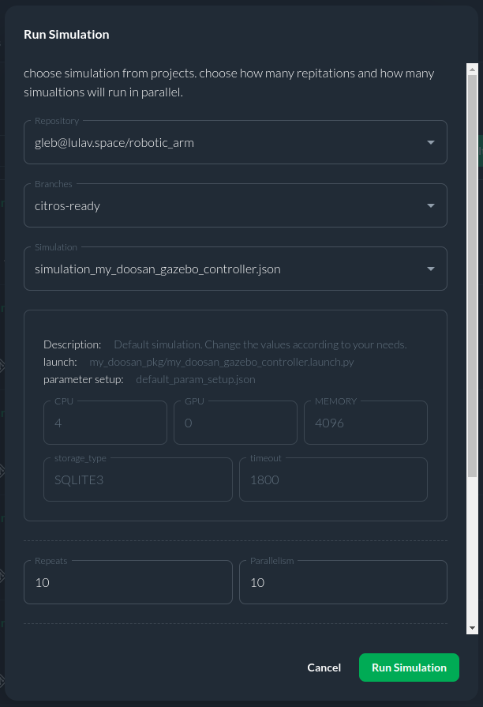
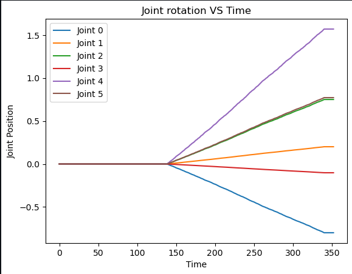
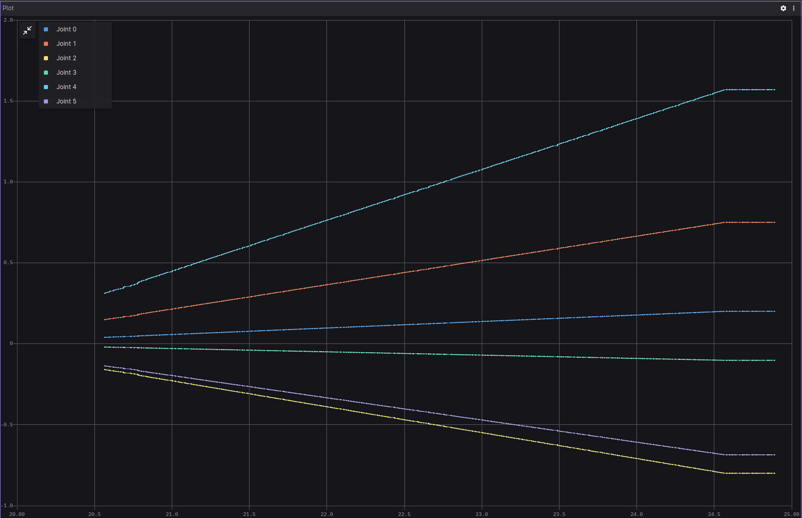

# Robotic Arm

This project is designed to wrap the [Robotic Arm Simulation project](https://github.com/dvalenciar/robotic_arm_environment) and integrate it with CITROS platform. The node provides ROS parameters that allow users to adjust target arm joints position. In addition, the Inverse Kinematic ROS node was added.


## Table of Contents

1. [CITROS Usage](#citros-usage)
    1. [CITROS Installation](#citros-installation)
    2. [Configuring The Project](#configuring-the-project)
    3. [Running Locally](#running-locally)
    4. [Syncing Project's Setup](#syncing-projects-setup)
    5. [Uploading Docker Image to CITROS Database](#uploading-docker-image-to-citros-database)
    6. [Running in The Cloud](#running-in-the-cloud)
    7. [CITROS Web Usage](#citros-web-usage)
2. [Extras](#extras)
    1. [Foxglove Examples](#foxglove-examples)

## CITROS Usage
The best way to work with such simulations and process the results is CITROS! With its power, it is possible to create complex data processing scenarios, including the construction of more complex graphs, mathematical analysis and other high-level processing methods.

CITROS is renowned for its ability to perform parallel simulations. This capability is especially beneficial for projects like Robotic Arm, where it enables the simulation of various model behaviors without being hampered by complexity or computational resource limitations. The sophisticated Data Analysis tool provided by CITROS further enhances this with comprehensive packages for Error Analysis and Validation, ensuring thorough processing of the simulations' data.

### CITROS Installation

First of all, to use all the powerful CITROS features the CLI installation is required: follow the instructions on the CITROS CLI [documentation page](https://citros.io/doc/docs_cli).

### Configuring The Project
After all the prerequisites are met, we can start configuring our project. The starting point is the Robotic Arm devcontainer loaded and running, CITROS CLI is installed and ready.
1. Initialize CITROS:
```bash 
>>> citros init
Checking internet connection...
Checking ssh...
Updating Citros...
Waiting for repo to be ready...
Citros repo successfully cloned from remote.
Creating new citros branch `master`.
Creating an initial commit.
Default branch of remote 'origin' set to: master
Citros successfully synched with local project.
You may review your changes via `citros status` and commit them via `citros commit`.
Initialized Citros repository.
```
Now you can see ```.citros``` folder in the explorer.

2. Configuring the setup. We need to set up the maximum performance available: timeout, CPU, GPU and Memory. To perform it, we need to define them in ```.citros/simulations/simulation_my_doosan_gazebo_controller.json```. The recommended setup is minimum 600 seconds timeout, 4 CPU, 4 GPU and 4096 MB of Memory. Don't forget to save the file!

3. Configuring the params setup. You can find the default setup in the ```.citros/simulations/simulation_my_doosan_gazebo_controller.json``` (for Forward Kinematic) or ```.citros/simulations/simulation_inverse_kinematic_pkg.json``` (for Inverse Kinematic). [CITROS CLI](https://citros.io/doc/docs_cli) provides an opportunity to use basic NumPy functions (such as distributions) and even user-defined functions, but let's keep it default for now. Don't forget to save the file! The example has the following parameters:

For Forward Kinematic:

    |Parameter	|Package	|Description
    |--|--|--
    j0	|my_doosan_pkg	|First joint target position 	
    j1	|my_doosan_pkg	|Second joint target position  	
    j2	|my_doosan_pkg	|Third joint target position  
    j3	|my_doosan_pkg	|Fourth joint target position  
    j4	|my_doosan_pkg	|Fifth joint target position  
    j5	|my_doosan_pkg	|Sixth joint target position  

For Inverse Kinematic:

    |Parameter	|Package	|Description
    |--|--|--
    pos0	|inverse_kinematic_pkg	|Arm target position by first axis	
    pos1	|inverse_kinematic_pkg	|Arm target position by second axis
    pos2	|inverse_kinematic_pkg	|Arm target position by third axis
    ori0	|inverse_kinematic_pkg	|Arm target orientation by first axis
    ori1	|inverse_kinematic_pkg	|Arm target orientation by second axis 
    ori3	|inverse_kinematic_pkg	|Arm target orientation by third axis 

4. Launch files. This project contains two launch files: ```simulation_my_doosan_gazebo_controller``` for Forward Kinematic or ```simulation_inverse_kinematic_pkg``` for Inverse Kinematic. These files will be used for CITROS launch. 

    |Launch File	|Package	|Description
    |--|--|--
    my_doosan_gazebo_controller.launch.py	|my_doosan_pkg	|Gazebo Robotic Arm launch file for Forward Kinematic
    simulation_inverse_kinematic_pkg.launch.py	|simulation_inverse_kinematic_pkg	|Gazebo Robotic Arm launch file for Inverse Kinematic

:::tip

CITROS CLI, in addition to other benefits, also provides an automatic ROS bag recording option, which allows user to use saved simulation results and export them! :)

:::

### Running Locally
Since all the preparations done, we can launch it locally (your project should be built and sourced before that):
```bash 
>>> citros run -n 'robotic_arm' -m 'local test run'
? Please choose the simulation you wish to run: 
❯ simulation_my_doosan_gazebo_controller
  simulation_inverse_kinematic_pkg
```
Select the necessary launch file by pressing ```Enter``` button and wait for the output in the terminal. To plot the local run results you can use FoxGlove.
```bash
created new batch_id: <your-batch-id-here>. Running locally.
+ running batch [<your-batch-id-here>], description: local test run, repeating simulations: [1]
+ + running simulation [0]
...
```


### Syncing Project's Setup
CITROS account is required for cloud usage. Follow the instructions on [CITROS Website](https://citros.io/auth/login) to register a new one, or check the [CLI documentation](https://citros.io/doc/docs_cli) for logging in. To complete the following steps, it is assumed that the user is registered, logged in and has met all requirements for Web Usage.
Now we can synchronize our project settings with CITROS server:
```bash 
>>> citros commit
>>> citros push
```

### Uploading Docker Image to CITROS Database
We need to build and push a Docker container image to the CITROS server:
```bash 
>>> citros docker-build-push
Logging in to docker...
...
```

### Running in The Cloud
Finally, we can run it in the cloud! Simply add ```-r``` to the terminal command: 
```bash 
>>> citros run -n 'robotic_arm' -m 'cloud test run' -r
? Please choose the simulation you wish to run: 
❯ simulation_my_doosan_gazebo_controller
  simulation_inverse_kinematic_pkg
```
Select the necessary launch file by pressing ```Enter``` button. Now the simulation is running in the CITROS server, and the results will be automatically uploaded to the CITROS database.
```bash
created new batch_id: <your-batch-id-here>. Running on Citros cluster. See https://citros.io/batch/<your-batch-id-here>.
```


### CITROS Web Usage
#### Launching Project via CITROS Web
The best way to use all the innovative capabilities of CITROS is through it's Web interface. Follow [this manual](https://citros.io/doc/docs/simulations/sim_overview) to easily launch a simulation on CITROS Web platform.

#### Working with Integrated Jupiter Notebooks And Data Analysis

CITROS Web provides a powerful data analysis package, which is a comprehensive solution for data query, analysis and visualization. With its extensive features, you can quickly and easily extract valuable insights from your data. To use it, Jupiter Notebook support is built-in. 
Navigate to our ```Code``` project page, open the Notebooks folder and click on the notebook file. Here you can see the usual Jupiter editor interface: you can add blocks of code or built-in Markdown engine, run and save notebook and control the Python kernel.

:::note
You can find all the data analysis package guides and API reference [here](https://citros.io/doc/docs_data_analysis).
:::


Let's quickly go through the key points of using a Jupiter Notebook and fetching data from a database. All necessary things are already configured (we used a NumPy distribution function, you can read more about its usage in the [CITROS CLI](https://citros.io/doc/docs_cli), so you can start the simulation from [CLI](#citros-usage-🛸) with the ```-c 10``` flag, which will launch 10 simulations in parallel: 

```bash 
>>> citros run -n 'robotic_arm' -m 'cloud test run' -r -c 10
? Please choose the simulation you wish to run: 
❯ simulation_my_doosan_gazebo_controller
  simulation_inverse_kinematic_pkg
```

Or from [Web](#running-in-the-cloud-🛰️):



Run the ```simulation_my_doosan_gazebo_controller``` simulation and copy your batch id (we will need it later).

Let's return to our Notebook and check the code: to start with, we need to import all the necessary modules:

```python
import numpy as np
import matplotlib.pyplot as plt
from citros_data_analysis import data_access as da
from prettytable import PrettyTable, ALL
import json
from platform import python_version
```

Now we can connect to the simulation database:
```python
batch_id = '<your-batch-id-here>'
citros = da.CitrosDB(batch = batch_id)
citros.info().print()
```

The last command returns general batch info:
```python
{
 'size': '15 MB',
 'sid_count': 10,
 'sid_list': [0, 1, 2, 3, 4, 5, 6, 7, 8, 9],
 'topic_count': 6,
 'topic_list': ['/config', '/joint_states', '/joint_trajectory_controller/state', '/robot_description', '/tf', '/tf_static'],
 'message_count': 16286
}
```
As you can see in the output above, we've got some information about our simulation run (batch): data size, sid information and a list of topics. 

Now we are ready to do some simple research and draw some plots. All MatPlotLib capabilities available here, but the [CITROS Data Analysis](https://citros.io/doc/docs_data_analysis) package provides it's own powerful plotting functions (also based on MatPlotLib):

```python
df=citros.topic('/joint_trajectory_controller/state').sid(0).data(["data.actual.positions"])
list0=[df['data.actual.positions'].loc[n] for n in range(len(df))]

labels = ['Joint 0', 'Joint 1','Joint 2','Joint 3','Joint 4','Joint 5']
plt.plot(list0, label=labels)
plt.xlabel("Time")
plt.ylabel("Joint Position")
plt.title("Joint rotation VS Time")
plt.legend()
```
As you can see, the traveled trajectory varies for different sids:



Let's go further:
```python
# Creating a figure and a grid of subplots
fig, ax = plt.subplots(nrows=4, ncols=3, figsize=(15, 10))  # Adjust grid size and figure size as needed
fig.suptitle("Joint rotation VS Time for different sIds", fontsize=16)

# Flattening the ax array to loop through it
ax = ax.flatten()

# Plotting in loop
for i in range(10):

    # Getting data from dataframe for each sId
    df=citros.topic('/joint_trajectory_controller/state').sid(i).data(["data.actual.positions"])
    list0=[df['data.actual.positions'].loc[n] for n in range(len(df))]

    # Defining lists separately to highlight the changing value
    list04 = [sublist[0:5] for sublist in list0]
    list5 =[sublist[5] for sublist in list0]

    # Plotting with different linestyles
    ax[i].plot(list04, label=labels[0:5])
    ax[i].plot(list5, label=labels[5], linestyle='--')

    ax[i].set_xlabel("Time")
    ax[i].set_ylabel("Joint Position")
    ax[i].set_title("sId=" + str(i))
    ax[i].legend(loc = 'upper left')

# Adjusting layout to prevent overlap
plt.tight_layout()

# Displaying the plot
plt.show()
```
You can see the different behavior of the last joint on these plots:


## Extras
### Foxglove Examples


