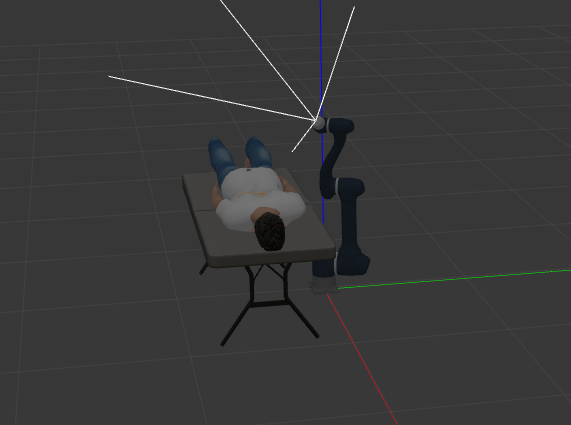
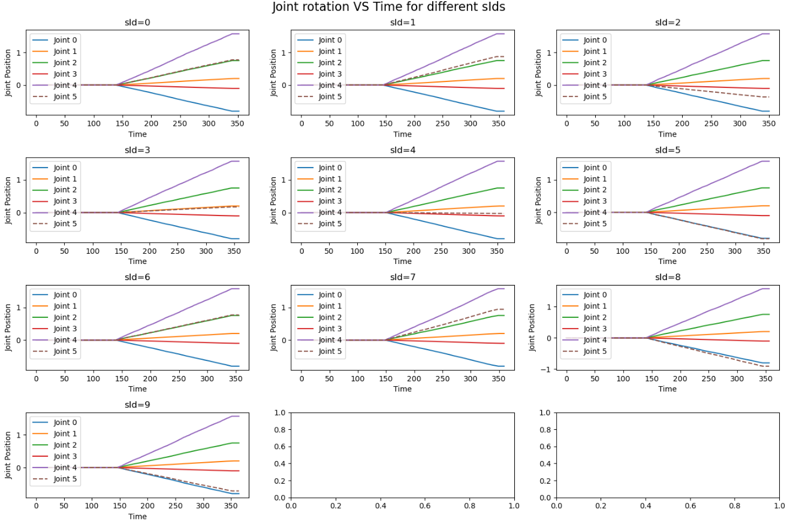

# Robotic Arm

## Overview
This project is designed to wrap the [Robotic Arm Simulation project](https://github.com/dvalenciar/robotic_arm_environment) and integrate it with CITROS platform. The node provides ROS 2 parameters that allow users to adjust target arm joints position. In addition, the Inverse Kinematic ROS 2 node was added.



## Prerequisites

1. Please make sure you have all the [necessary softwares](https://citros.io/doc/docs_tutorials/getting_started/#softwares-to-work-with-citros) to work with CITROS installed on your computer.
2. Install [Visual Studio code](https://code.visualstudio.com/download).
3. We strongly recommend that you work with [dockers](https://citros.io/doc/docs_tutorials/dockerfile_overview/). However, if you wish to work without dockers, please refer to the .devcontainer [directory](https://github.com/citros-garden/robotic_arm/tree/main/.devcontainer) in project's repo, the dependencies you need are in the ```Dockerfile``` file.
4. (Optional) Install [FoxGlove](https://docs.foxglove.dev/docs/introduction).

## Table of Contents
1. [Installation](#installation)
2. [Workspace Overview](#workspace-overview)
3. [CITROS Initialization](#citros-initialization)
4. [Scenario](#scenario)
5. [Running the Scenario Using CITROS](#running-the-scenario-using-citros)
6. [Results](#results)

## Installation
1. Clone the repository:
```bash
git clone git@github.com:citros-garden/robotic_arm.git
```
2. Open the repository in the [VScode Dev Container](https://citros.io/doc/docs_tutorials/getting_started/#open-project-in-vscode-dev-container).

## Workspace Overview

The Robotic Arm simulation has the following ROS 2 parameters:

For Forward Kinematic:

|Parameter	|Description |Package
|--|--|--
j0		|First joint target position 	|my_doosan_pkg
j1		|Second joint target position  	|my_doosan_pkg
j2		|Third joint target position  |my_doosan_pkg
j3		|Fourth joint target position  |my_doosan_pkg
j4		|Fifth joint target position  |my_doosan_pkg
j5		|Sixth joint target position  |my_doosan_pkg

For Inverse Kinematic:

|Parameter	|Description |Package
|--|--|--
pos0		|Arm target position by first axis	|inverse_kinematic_pkg
pos1		|Arm target position by second axis |inverse_kinematic_pkg
pos2		|Arm target position by third axis |inverse_kinematic_pkg
ori0		|Arm target orientation by first axis |inverse_kinematic_pkg
ori1		|Arm target orientation by second axis  |inverse_kinematic_pkg
ori3		|Arm target orientation by third axis |inverse_kinematic_pkg


This project contains two launch files: ```simulation_my_doosan_gazebo_controller``` for Forward Kinematic or ```simulation_inverse_kinematic_pkg``` for Inverse Kinematic. These files will be used for CITROS launch. 

|Launch File	|Description |Package
|--|--|--
my_doosan_gazebo_controller.launch.py		|Gazebo Robotic Arm launch file for Forward Kinematic |my_doosan_pkg
simulation_inverse_kinematic_pkg.launch.py	|Gazebo Robotic Arm launch file for Inverse Kinematic |inverse_kinematic_pkg


## CITROS Initialization

1. [Install CITROS](https://citros.io/doc/docs_tutorials/getting_started/#installation).
2. Follow [these steps](https://citros.io/doc/docs_tutorials/getting_started/#initialization) to Initialize CITROS.

Now you can see .citros directory in the explorer.

## Scenario
### Inverse kinematics
The Inverse Kinematic calculations are used to show more useful way to interract with robotic arm.  <br/>
User provides target position and target rotation of arm by three axes as input parameters to configure the simulation. The robotic arm will change its position trying to meet the target conditions. <br/>

### Forward kinematics
For this example, let's check how the robotic arm's behavior changes depending on target position. To find it out, we need to set up parameters and launch CITROS simulation.<br/>
In this example user provides joints target positions as input parameters to configure the simulation. The robotic arm will change its position trying to meet the target conditions. <br/>
The parameter setup is listed in ```.citros/parameter_setups/default_param_setup.json```. <br/>
To find out how the robotic arm's behavior changes, we need to launch a batch with several simulations and a distribution for the last joint position parameter, it will be set by a NumPy random function:

```json
{
    "packages": {
        "my_doosan_pkg": {
            "trajectory_points_act_server": {
                "ros__parameters": {
                    "j0": -0.8,
                    "j1": 0.2,
                    "j2": 0.75,
                    "j3": -0.102,
                    "j4": 1.57,
                    "j5": {
                        "function": "numpy.random.random",
                        "args": [0.0, 0.5]
                    }
                }
            }
        }
    }
}
```

This function will set the ```j5``` parameter in random range from 0.0 to 0.5.

Learn more about parameter setup and defining custom functions in [Directory parameter_setups](https://citros.io/doc/docs_cli/structure/citros_structure/#directory-parameter_setups) and [Adding Functions to Parameter Setup](https://citros.io/doc/docs_cli/configuration/config_params) pages.

In addition to parameter setup, you can configure the simulation perfomance setup (timeout, CPU, GPU and Memory) as well.
This parameters can be found in ```.citros/simulations/simulation_my_doosan_gazebo_controller.json``` (for Forward Kinematic) or ```.citros/simulations/simulation_inverse_kinematic_pkg.json``` (for Inverse Kinematic). <br/>
The default setup is 600 seconds timeout, 4 CPU, 4 GPU and 4096 MB of Memory.

Look in [Directory simulations page](https://citros.io/doc/docs_cli/structure/citros_structure#directory-simulations) for more information.

## Running the Scenario Using CITROS

### Running Locally
First ensure that the project has been [built and sourced](https://citros.io/doc/docs_tutorials/getting_started/#build-the-project).
Now we can launch it locally:
```bash 
>>> citros run -n 'robotic_arm' -m 'local test run'
? Please choose the simulation you wish to run:
❯ simulation_my_doosan_gazebo_controller
  simulation_inverse_kinematic_pkg
```
Select the launch file by pressing ```Enter``` button and wait for the output in the terminal. To plot the local run results you can use FoxGlove.

```bash
created new batch_id: <batch_run / batch name>. Running locally.
+ running batch [<batch_run / batch name>], description: local test run, repeating simulations: [1]
+ + running simulation [0]
...
```

All the results will be saved under .citros/runs/[simulation_name] [folder].

To plot the local run results you can use [FoxGlove](https://citros.io/doc/docs_tutorials/#visualization-with-foxglove).


### Running in Cloud

[Upload project to CITROS Server](https://citros.io/doc/docs_tutorials/getting_started/#upload-to-citros-server).

Finally, we can run it in the cloud! Simply add `-r` to the terminal command: 
```bash 
citros run -n 'robotic_arm' -m 'cloud test run' -r
? Please choose the simulation you wish to run:
❯ simulation_my_doosan_gazebo_controller
  simulation_inverse_kinematic_pkg
```

Select the launch file by pressing `Enter` button. Now the simulation is running in the CITROS server, and the results will be automatically uploaded to the CITROS database.

```bash
created new batch_id: <batch_id / batch name>. Running on Citros cluster. See https://citros.io/batch/<batch_id / batch name>.
```

## Results
To get and process the simulation results, execute [built-in Jupiter Notebook](https://citros.io/robotic_arm/blob/citros-ready/notebooks/Robotic%20arm%20analysis%20example.ipynb).
You can see the different behavior of the last joint on these plots:

