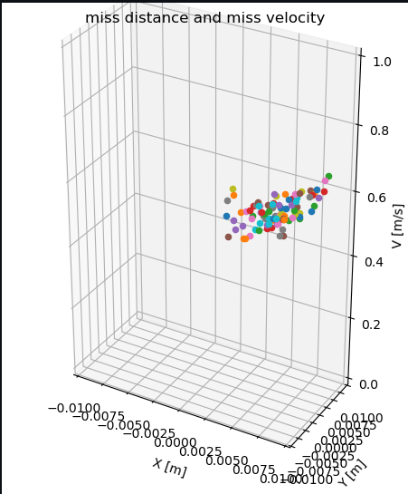

# Soft Landing Tutorial
## Overview

This is a ROS 2 simulation of soft landing of an object.  
In the ROS 2 system we have two nodes: the first represents the `dynamics` and the second one is the `controller`.
- **System dynamics** - The system's equation of motion is the kinematic equation of a free body fall.  
for more information see [Soft Landing](https://github.com/CITROS-garden/soft_landing)  

- **The controller** - The controller is based on this paper:
*S. Gutman, "Rendezvous and Soft Landing in Closed Form via LQ Optimization," 2019 27th Mediterranean Conference on Control and Automation (MED), Akko, Israel, 2019, pp. 536-540, doi: 10.1109/MED.2019.8798572.*


With CITROS, you can easily run multiple simulations and compare the results to find the optimal solution. It's a powerful tool that saves time and effort, allowing you to focus on improving your designs and achieving your goals.  


## Prerequisites

Make sure you complete the [Getting Started Tutorial](https://citros.io/doc/docs_tutorials/getting_started/).  
For working without dockers **(not recommended)**, please check the [.devcontainer](https://github.com/citros-garden/soft_landing/tree/main/.devcontainer) folder in the project's repo for dependencies (in the `Dockerfile` and `install.sh`).


## Table of Contents
1. [Installation](#installation)
2. [Workspace Overview](#workspace-overview)
3. [CITROS Initialization](#citros-initialization)
4. [Scenario](#scenario)
5. [Running the Scenario Using CITROS](#running-the-scenario-using-citros)
6. [Results](#results)

## Installation
   
1. Clone the repository:
   ```sh
    git clone git@github.com:citros-garden/soft_landing.git
   ```

2. Open the repository in the VScode:
	```sh
	cd ~/soft_landing
	code .
	```
3. Open the repository in the container from VScode with `reopen in container` option.

## Workspace Overview
After all the prerequisites done, we can start configuring our project.  
This is a list of all the ROS 2 parameters that can be control by the user wish:


|     Parameter | Description | Package |
| -------- |    ------- |  ------- | 
| r_x0 , r_y0, r_z0 | initial position| dynamics |
| v_x0 ,v_y0,v_z0 | initial velocity |  dynamics |
| g_x , g_y , g_z | gravity vector | dynamics |
| dt | time interval | dynamics |
|  setpoint_r_x , setpoint_r_y , setpoint_r_z , |  ending position |controller |  
|  setpoint_v_x , setpoint_v_y , setpoint_v_z , |  ending velocity |controller |
|  g  | gravity parameter | controller |
| um |  acceleration limit | controller |
| e | stoping condition value | controller |
| dt | time interval | controller |

[citros_cli](/docs_cli/configuration/config_params) provides more information about how to change the parameters by the user.

The launch files:  
 `dynamics_controller.launch.py` launch the dynamics with the controller and `dynamics.launch.py` launch only the dynamics.  
 You can view the launch files [here](https://github.com/citros-garden/soft_landing/tree/main/src/dynamics/launch).

## CITROS Initialization
Initialize CITROS:
```bash 
citros init
```
Now you can see ```.CITROS``` folder in the explorer.  
Make sure to install and initialize CITROS by following the [Getting Started](https://citros.io/doc/docs_tutorials/getting_started/#initialization) tutorial.

## Scenario
Let's say we wish to land safely at some point on the moon's surface. To do that, we need a controller that can manage our velocity and guide us to the landing point while minimizing our speed.  
There are many controller ideas but we need to determine their effectiveness and limitations.  
Here we will try to find the limitations of the controller that based on the paper above by using CITROS.

The control guidance is a time-to-go dependent affine function. Time-to-go is obtained by solving a quartic polynomial equation for the initial conditions.  
So by giving the initial velocity value, we could check the validation of that controller.
Instead of giving some random values to the initial velocity of the simulation until we can find the limits, CITROS allows us to run multiple simulations parallel at a short time and also provide random values of the initial velocity.  
In this scenario,let's say that each initial velocity parameter (v_x0, v_y0, v_z0) will be distributed normally: N($\mu$, $\sigma$).  

By configuring the velocity parameters using $\mu$ and $\sigma$, we can identify the conditions under which the controller is most likely to fail.


## Running the Scenario Using CITROS
After completing the CITROS integration setup we can check CITROS by running a test simulation.  
First, set up the parameter of the simulation in the file   `default_param_setup.json` in `.CITROS/parameter_setups` folder.  

To configure the scenario described [above](#scenario), I created a [param_setup.json](https://citros.io/soft_landing/blob/main/parameter_setups/default_param_setup.json) file and a [function](https://citros.io/soft_landing/blob/main/parameter_setups/functions/my_func.py) to randomize the initial velocity with $\mu$ and $\sigma$ for each parameter.  
For the initial validation of the controller, I chose random values of $\mu$ and $\sigma$.

When everything is set you can do a test run locally by the following command:  
```
citros run -n 'test' -m 'testytest'
```
Then you will ask to choose the launch file you want to run.  
There are two option:


The `simulation_dynamics_controller` launches the `dynamics_controller.launch.py` file and `simulation_dynamics` launches the `dynamics.launch.py` file.  
To execute, select the launch file and press the `Enter` button.  
Wait for the output in the terminal.  
If the simulation ran perfectly you can run the simulation in the cloud.


Before uploading the simulation to the cloud check that the parameter file, `default_param_setup.json`  in the `.CITROS/parameter_setups` folder is set as you wish.  
Then, follow [these steps](https://citros.io/doc/docs_tutorials/getting_started/#building-and-pushing-a-docker-image) to sync your project settings with the CITROS server.

 Finally, we can run it in the cloud, simply add ```-r``` to the terminal command: 
```bash 
citros run -n 'test' -m 'testytest' -r
```
To select the launch file you want, simply press the ```Enter``` button. The simulation will now commence on the CITROS server, and the results will be uploaded automatically to the CITROS database. With this setup, we can now run simulations straight from the web with ease. 

Go to [Runs tab](https://citros.io/soft_landing/batch) in your soft landing repo.  
Open a new simulation configuration window by clicking the green `Run simulation`  button.  
Here you can choose the parameter file you want to test, how many times CITROS will do the iterations, and how many will run in parallel.  

  


As you can see, the dynamic controller simulation will run on the main branch of the `soft_landing` repository with the parameter file I created.  
To validate the controller initially, I directed CITROS to execute the simulation 100 times. Although I could have performed more simulations, I chose to limit them for the first validation.  
To expedite the process, I directed CITROS to run 10 simulations in parallel.


## Results
The results were:  


And by getting the miss distance and miss velocity we could show a figure of all the runs.  

  




The full report with the data access and error analysis was generated using the data analysis package, can be found [here](https://CITROS.io/soft_landing/blob/main/notebooks/Soft_landing_analysis.ipynb).


After obtaining the results from CITROS and analyzing the data through visual graphs, we can confirm that the controller has met our demands. Most of the runs indicate that the miss distance and miss velocity are within our desired range.  


However, it's important to note that this is just the initial validation of the controller. We will need to conduct additional simulations to further validate our findings. Additionally, we can experiment with different values of $\mu$ and $\sigma$ for each parameter.   


