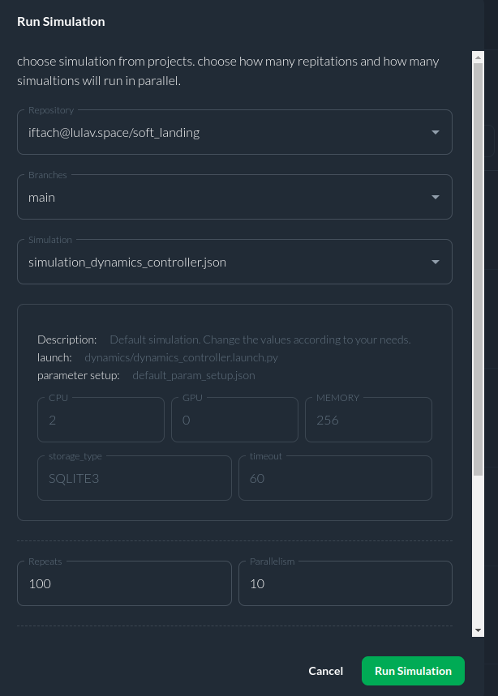

# Soft Landing Tutorial
## Overview

This is a ROS 2 simulation of soft landing of an object.  
In the ROS 2 system we have two nodes: the first represents the `dynamics` and the second one is the `controller`.
- **System dynamics** - The system's equation of motion is the kinematic equation of a free body fall.  
for more information see [Soft Landing](https://github.com/CITROS-garden/soft_landing)  

- **The controller** - The controller is based on this paper:
*S. Gutman, "Rendezvous and Soft Landing in Closed Form via LQ Optimization," 2019 27th Mediterranean Conference on Control and Automation (MED), Akko, Israel, 2019, pp. 536-540, doi: 10.1109/MED.2019.8798572.*


With CITROS, you can easily run multiple simulations and compare the results to find the optimal solution. It's a powerful tool that saves time and effort, allowing you to focus on improving your designs and achieving your goals.  


## Prerequisites

Make sure you complete the [Getting Started Tutorial](https://citros.io/doc/docs_tutorials/getting_started/).  
For working without dockers **(not recommended)**, please check the [.devcontainer](https://github.com/citros-garden/soft_landing/tree/main/.devcontainer) folder in the project's repo for dependencies (in the `Dockerfile` and `install.sh`).


## Table of Contents
1. [Installation](#installation)
2. [Workspace Overview](#workspace-overview)
3. [CITROS Initialization](#citros-initialization)
4. [Scenario](#scenario)
5. [Running the Scenario Using CITROS](#running-the-scenario-using-citros)
6. [Results](#results)

## Installation
   
1. Clone the repository:
   ```sh
    git clone git@github.com:citros-garden/soft_landing.git
   ```

2. Open the repository in the VScode:
	```sh
	cd ~/soft_landing
	code .
	```
3. Open the repository in the container from VScode with `reopen in container` option.

## Workspace Overview
After all the prerequisites done, we can start configuring our project.  
This is a list of all the ROS 2 parameters that can be control by the user wish:


|     Parameter | Description | Package |
| -------- |    ------- |  ------- | 
| r_x0 , r_y0, r_z0 | initial position| dynamics |
| v_x0 ,v_y0,v_z0 | initial velocity |  dynamics |
| g_x , g_y , g_z | gravity vector | dynamics |
| dt | time interval | dynamics |
|  setpoint_r_x , setpoint_r_y , setpoint_r_z , |  ending position |controller |  
|  setpoint_v_x , setpoint_v_y , setpoint_v_z , |  ending velocity |controller |
|  g  | gravity parameter | controller |
| um |  acceleration limit | controller |
| e | stoping condition value | controller |
| dt | time interval | controller |

**[citros_cli](/docs_cli/configuration/config_params) provides more information about how to change the parameters by the user.**  

The launch files:  
 `dynamics_controller.launch.py` launch the dynamics with the controller and `dynamics.launch.py` launch only the dynamics.  
 You can view the launch files [here](https://github.com/citros-garden/soft_landing/tree/main/src/dynamics/launch).

## CITROS Initialization
Initialize CITROS:
```bash 
citros init
```
Now you can see ```.CITROS``` folder in the explorer.  
Make sure to install and initialize CITROS by following the [Getting Started](https://citros.io/doc/docs_tutorials/getting_started/#initialization) tutorial.

## Scenario
We want to validate the controller using different scenarios of initial velocity.  
Each initial velocity parameter (v_x0, v_y0, v_z0) will be distributed normally: N ($\mu$, $\sigma$).


## Running the Scenario Using CITROS
After completing the CITROS integration setup we can check CITROS by running a test simulation.  
First, set up the parameter of the simulation in the file   `default_param_setup.json` in `.CITROS/parameter_setups` folder.  
Don't forget to save the file!

When everything is set you can do a test run locally by the following command:  
```
citros run -n 'test' -m 'testytest'
```
Then you will ask to choose the launch file you want to run.  
There are two option:


The `simulation_dynamics_controller` launches the `dynamics_controller.launch.py` file and `simulation_dynamics` launches the `dynamics.launch.py` file.  
To execute, select the launch file and press the `Enter` button.  
Wait for the output in the terminal.  
If the simulation ran perfectly you can run the simulation in the cloud.


Before uploading the simulation to the cloud check that the parameter file, `default_param_setup.json`  in the `.CITROS/parameter_setups` folder is set as you wish and that you have build and sourced the project.  
Then, follow [these steps](https://citros.io/doc/docs_tutorials/getting_started/#building-and-pushing-a-docker-image) to sync your project settings with the CITROS server.

 Finally, we can run it in the cloud! Simply add ```-r``` to the terminal command: 
```bash 
citros run -n 'test' -m 'testytest' -r
```
Select the launch file you want by pressing ```Enter``` button. Now the simulation is running in the CITROS server, and it will upload results to the CITROS database automatically.

Now we all set to run simulations from the web itself.  
At the web, go to the [Runs tab](https://citros.io/soft_landing/batch) in the soft landing repo.  
Start a new simulation by clicking the `Run simulation` green button, and then a window will pop:

  

As you can see I chose to fill the soft landing repository, the main branch, and run the simulations with the controller.  
Then I chose to repeat 100 times such that CITROS run 10 simulations in parallel, that way I could get results much fester.


## Results
The results were:  


And by getting the miss distance and miss velocity i could show a figure of all the runs.  
  
The full report with the data access and error analysis using the data analysis package you can watch it [here](https://CITROS.io/soft_landing/blob/main/notebooks/Soft_landing_analysis.ipynb).


