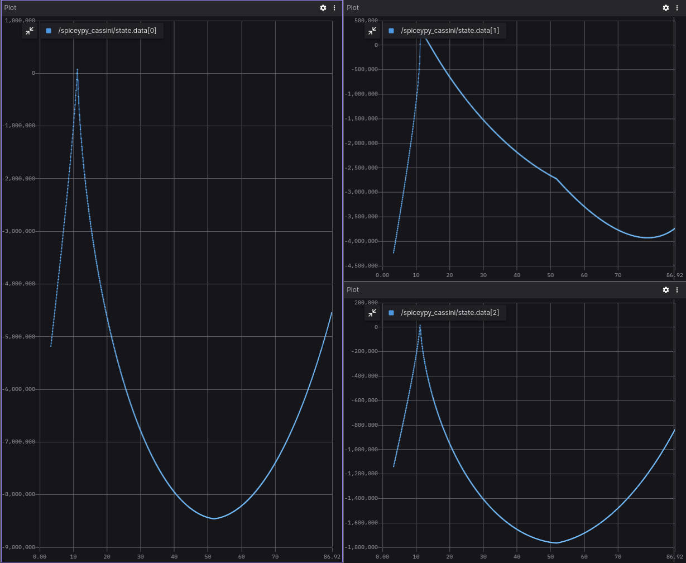

# SpiceyPy

## Overview
This project is developed using ROS 2 nodes and leverages the SpiceyPy library - a Python implementation of [NASA's NAIF Spice](https://naif.jpl.nasa.gov/naif/) toolkit. Its primary purpose is to provide the orbital trajectory information of the Cassini spacecraft relative to Saturn's barycenter within specified time intervals.

You can find more information about SpiceyPy library on [SpiceyPy official website](https://spiceypy.readthedocs.io/en/v2.0.0/index.html). <br />
All project installation, code overview and usage details are also available on the project's [GitHub page](https://github.com/citros-garden/spiceypy).


## Prerequisites

1. Please make sure you have all the [necessary softwares](https://citros.io/doc/docs_tutorials/getting_started/#softwares-to-work-with-citros) to work with CITROS installed on your computer.
2. Install [Visual Studio code](https://code.visualstudio.com/download).
3. We strongly recommend that you work with [dockers](https://citros.io/doc/docs_tutorials/dockerfile_overview/). However, if you wish to work without dockers, please refer to the .devcontainer [directory](https://github.com/citros-garden/spiceypy/tree/main/.devcontainer) in project's repo, the dependencies you need are in the ```Dockerfile``` file.
4. (Optional) Install [Foxglove](https://docs.foxglove.dev/docs/introduction).

## Table of Contents
1. [Installation](#installation)
2. [Workspace Overview](#workspace-overview)
3. [CITROS Initialization](#citros-initialization)
4. [Scenario](#scenario)
5. [Running the Scenario Using CITROS](#running-the-scenario-using-citros)
6. [Results](#results)

## Installation
1. Clone the repository:
```bash
git clone git@github.com:citros-garden/spiceypy.git
```

2. Open the repository in the [VScode Dev Container](https://citros.io/doc/docs_tutorials/getting_started/#open-project-in-vscode-dev-container).

## Workspace Overview

The SpiceyPy simulation has the following ROS 2 parameters:

|Parameter	|Description	|Package
|--|--|--
start_t		|Initial date	|spiceypy_cassini
finish_t		|Final date	 |spiceypy_cassini
publish_freq		|Frequency of publishing |spiceypy_cassini


This project contains only one launch file which will be used for CITROS launch. 

|Launch File	|Description	|Package
|--|--|--
spiceypy_cassini.launch.py		|SpiceyPy Cassini simulation launch file 	|spiceypy_cassini

## CITROS Initialization

1. [Install CITROS](https://citros.io/doc/docs_tutorials/getting_started/#installation).
2. Follow [these steps](https://citros.io/doc/docs_tutorials/getting_started/#initialization) to Initialize CITROS.

Now you can see .citros directory in the explorer.

## Scenario
This simple scenario can be used to find the Cassini Spacecraft trajectory relative to Saturn's barycenter within specified time intervals. <br/>
Users can input the desired time bounds, and the project utilizes SpiceyPy's powerful capabilities to retrieve accurate and precise orbital data for the Cassini spacecraft during the specified period.<br/>
The output of the simulation comprises critical flight data, such as altitude, velocity, and other relevant parameters, recorded over time intervals. These results are published via ROS 2 topics, allowing for real-time data visualization, analysis, and integration with other ROS-based systems.<br/>
This example is used to show the CITROS ability to implement any useful library, such as popular SpiceyPy NASA lib for spacecraft tracking. The project's setup is also showing how user can save all the simulation results in one place for any number of simulations, and share these results with coworkers. <br/>
The parameter setup is listed in ```.citros/parameter_setups/default_param_setup.json```:
```json
{
    "packages": {
        "spiceypy_cassini": {
            "spiceypy_cassini": {
                "ros__parameters": {
                    "start_t": "Jun 20, 2004",
                    "finish_t": "Dec 1, 2006",
                    "num_steps": 4000,
                    "publish_freq": 100.0
                }
            }
        }
    }
}
```

Learn more about parameter setup and defining custom functions in [Directory parameter_setups](https://citros.io/doc/docs_cli/structure/citros_structure/#directory-parameter_setups) and [Adding Functions to Parameter Setup](https://citros.io/doc/docs_cli/configuration/config_params) pages.

In addition to parameter setup, you can configure the simulation performance setup (timeout, CPU, GPU and Memory) as well.
This parameters can be found in ```.citros/simulations/simulation_spiceypy_cassini.json```. <br/>
The default setup is 180 seconds timeout, 2 CPU, 2 GPU and 1024 MB of Memory.

Check [Directory simulations page](https://citros.io/doc/docs_cli/structure/citros_structure#directory-simulations) for more information.

## Running the Scenario Using CITROS

### Running Locally
First ensure that the project has been [built and sourced](https://citros.io/doc/docs_tutorials/getting_started/#build-the-project).
Now we can launch it locally:
```bash 
>>> citros run -n 'spiceypy_cassini' -m 'local test run'
? Please choose the simulation you wish to run:
❯ spiceypy_cassini
```
Select the launch file (should be the only one here) by pressing ```Enter``` button and wait for the output in the terminal. 

```bash
created new batch_id: <batch_run / batch name>. Running locally.
+ running batch [<batch_run / batch name>], description: local test run, repeating simulations: [1]
+ + running simulation [0]
...
```

All the results will be saved under `.citros/runs/[simulation_name]` folder.

To plot the local run results you can use [Foxglove](https://citros.io/doc/docs_tutorials/#visualization-with-foxglove).



### Running in Cloud

[Upload project to CITROS Server](https://citros.io/doc/docs_tutorials/getting_started/#upload-to-citros-server).

Finally, we can run it in the cloud! Simply add `-r` to the terminal command: 
```bash 
citros run -n 'spiceypy_cassini' -m 'cloud test run' -r
? Please choose the simulation you wish to run:
❯ spiceypy_cassini
```

Select the launch file (should be the only one here) by pressing `Enter` button. Now the simulation is running in the CITROS server, and the results will be automatically uploaded to the CITROS database.

```bash
created new batch_id: <batch_id / batch name>. Running on Citros cluster. See https://citros.io/batch/<batch_id / batch name>.
```

## Results
To get and process the simulation results, execute [built-in Jupiter Notebook](https://citros.io/aerosandbox_cessna/blob/main/notebooks/aerosandbox_notebook_example.ipynb).<br />
The graph below shows us the Cassini altitude:

