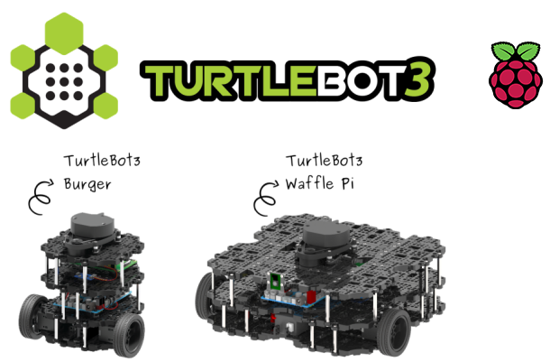
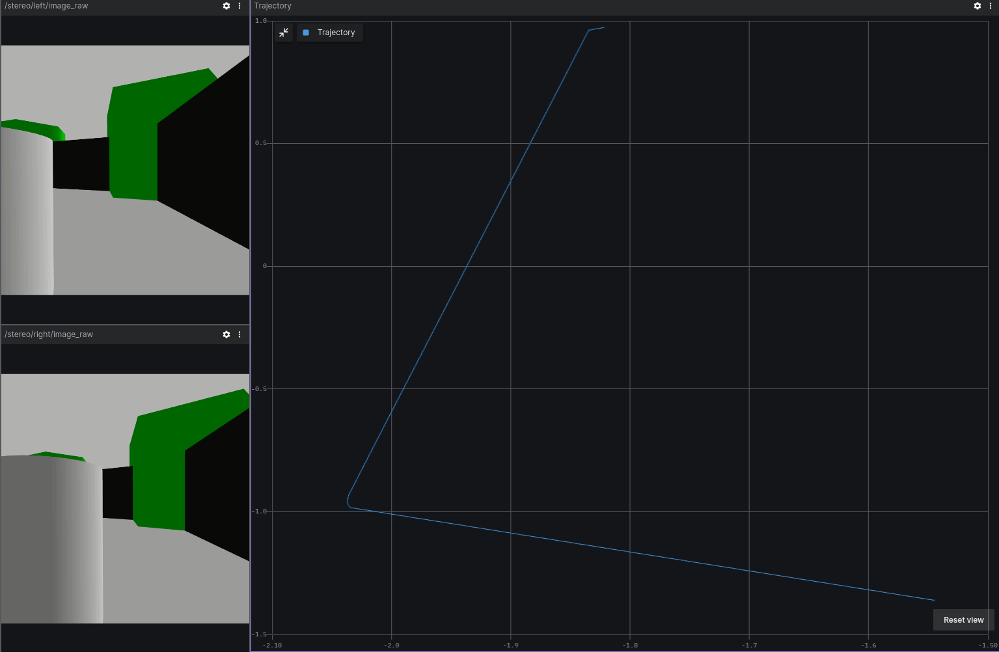
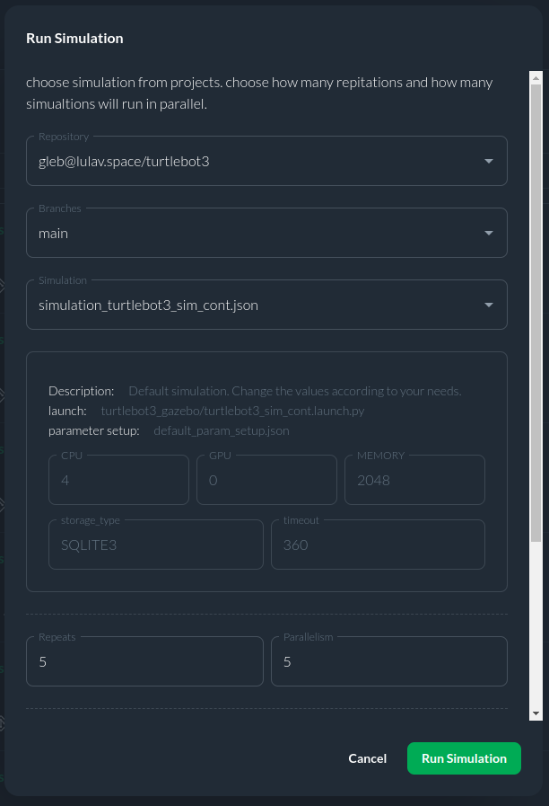

# TurtleBot3 example using CITROS

This project is designed to wrap the official TurtleBot3 simulation [example](https://emanual.robotis.com/docs/en/platform/turtlebot3/simulation/#gazebo-simulation) and integrate it with a simple Autonomous Collision Avoidance node. The node provides ROS parameters that allow users to adjust various TurtleBot3 specifications, enabling the analysis of how these changes affect collision avoidance behavior. 
The primary functionalities of this node are as follows:

* **Integration with TurtleBot3 Simulation**: The ROS node interfaces with the official TurtleBot3 simulation example, leveraging the TurtleBot3 robot model and simulated environment. This integration allows users to observe how the robot behaves in a controlled environment.

* **Autonomous Collision Avoidance**: The node includes a simple Autonomous Collision Avoidance module. This module is responsible for ensuring that the TurtleBot3 avoids collisions with obstacles in its path. It utilizes sensor data, such as simulated lidar readings, to detect obstacles and adjust the robot's trajectory accordingly.

* **User-Adjustable Parameters**: The ROS parameters provided by this node give users the flexibility to modify various TurtleBot3 specifications. These parameters may include attributes like the robot's size, speed, sensor range, or collision avoidance algorithms. Users can experiment with different parameter values to observe their impact on collision avoidance behavior.

* **Orientation and Navigation**: The TurtleBot3 robot is capable of orienting itself effectively within a prepared TurtleBot3 world. It utilizes the simulated lidar module to gather environmental data, allowing it to make informed decisions about its navigation path.

All project installation, code overview and usage details are also available on the project's[GitHub page](https://github.com/citros-garden/turtlebot3).



## Table of contents
1. [CITROS Usage](#citros-usage)
    1. [CITROS Installation](#citros-installation)
    2. [Configuring the project](#configuring-the-project)
    3. [Syncing project's setup](#syncing-projects-setup)
    4. [Running locally](#running-locally)
    5. [Uploading Docker image to the CITROS database and running in the cloud](#uploading-docker-image-to-the-citros-database-and-running-in-the-cloud)
    6. [Running in the cloud](#running-in-the-cloud)
    6. [CITROS Web usage](#citros-web-usage)
2. [Extras](#extras)
    1. [Foxglove examples](#foxglove-examples)


## CITROS usage
Although you can get simulation results using FoxGlove, the best way to work with such simulations and process the results is CITROS! With its power, it is possible to create complex data processing scenarios, including the construction of more complex graphs, mathematical analysis and other high-level processing methods.

### CITROS installation

First of all, to use all the powerfull CITROS features usage requires CITROS installation: follow the instructions on the CITROS CLI [GitHub page](https://github.com/lulav/citros_cli).

### Configuring the project
After all the prerequisites are met, we can start configuring our project. The starting point is the TurtleBot3 devcontainer loaded and running, CITROS CLI is installed and ready.
1. Initialize CITROS:
```bash 
>>> citros init
Checking internet connection...
Checking ssh...
Updating Citros...
Waiting for repo to be ready...
Citros repo successfully cloned from remote.
Creating new citros branch `master`.
Creating an initial commit.
Default branch of remote 'origin' set to: master
Citros successfully synched with local project.
You may review your changes via `citros status` and commit them via `citros commit`.
Intialized Citros repository.
```
Now you can see ```.citros``` folder in the explorer.

2. Configuring the setup. We need to set up the maximum performance available: timeout, CPU, GPU and Memory. To perform it, we need to define them in ```.citros/simulations/simulation_turtlebot3.json```. The recommended setup is minimum 600 seconds timeout, 4 CPU, 4 GPU and 4096 MB of Memory. Don't forget to save the file!

3. Configuring the params setup. You can find the default setup in ```.citros/parameter_setups/default_param_setup.json```. [CITROS CLI](https://github.com/lulav/citros_cli) provides an opportunity to use basic NumPy functions (such as distributions) and even user-defined functions, but let's keep it default for now. Don't forget to save the file!

    |Parameter	|Package	|Description
    |--|--|--
    separation	|turtlebot3_gazebo	|wheel separation	
    radius	|turtlebot3_gazebo	|wheel radius	
    check_forward_dist_param	|turtlebot3_gazebo	|forward checking distance for Autonomous Collision Avoidance	
    check_side_dist_param	|turtlebot3_gazebo	|side checking distance for Autonomous Collision Avoidance	

4. Launch files. This project contains two launch files, but we will use only ```turtlebot3_sim_cont.launch.py```, and the second one launches automaticly (it's neccessary for publishing states).

    |Launch File	|Package	|Description
    |--|--|--
    turtlebot3_sim_cont.launch.py	|turtlebot3_gazebo	|Gazebo headless TurtleBot world launch file 	
    robot_state_publisher.launch.py	|turtlebot3_gazebo	|Utility launch file for state publishing

### Syncing project's setup
Now we can synchronize our project settings with CITROS server:
```bash 
>>> citros commit
>>> citros push
```
:::tip

CITROS CLI, in addition to other benefits, also provides an automatic ROS bag recording option, which allows user to use saved simulation results and export them! :)

:::
### Running locally
Since all the preparations done, we can launch it locally (your project should be built and sourced before that):
```bash 
>>> citros run -n 'turtlebot3' -m 'local test run'
? Please choose the simulation you wish to run: 
  simulation_robot_state_publisher
❯ simulation_turtlebot3_sim_cont
```
Select the launch file by pressing ```Enter``` button and wait for the output in the terminal. To plot the local run results you can use FoxGlove.
```bash
created new batch_id: <your-batch-id-here>. Running locally.
+ running batch [<your-batch-id-here>], description: local test run, repeating simulations: [1]
+ + running simulation [0]
...
```



### Uploading Docker image to the CITROS database and running in the cloud
We need to build and push a Docker container image to the CITROS server:
```bash 
>>> citros docker-build-push
Logging in to docker...
...
```

### Running in the cloud
Finally, we can run it in the cloud! Simply add ```-r``` to the terminal command: 
```bash 
>>> citros run -n 'turtlebot3' -m 'cloud test run' -r
? Please choose the simulation you wish to run: 
  simulation_robot_state_publisher
❯ simulation_turtlebot3_sim_cont
```
Select the launch file (should be the only one here) by pressing ```Enter``` button. Now the simulation is running in the CITROS server, and the results will be automatically uploaded to the CITROS database.
```bash
created new batch_id: <your-batch-id-here>. Running on Citros cluster. See https://citros.io/batch/<your-batch-id-here>.
```

### CITROS Web usage
#### Launching project via CITROS Web
The best way to use all the innovative capabilities of CITROS is through it's Web interface. The following manual explains how to run this project in the cloud and how to process the simualtion results.
The starting point is CITROS main page, user is logged in and the project Docker image is built and pushed to the cloud (see the [manual](#uploading-docker-image-to-citros-cloud) above).
1. Go to the ```Repositories``` page clicking on the tab on the top;
2. Find your project and open it;
3. Navigate to the ```Runs``` tab;
4. Click on the ```Run Simulation``` button on the right;
5. Now you can select the project and the simulation setup from the drop-down lists, set the number of repeats and how many simulations should run in parallel, type the Name of the run and the additional message. This window also shows the perfomance preset.
6. We are ready to go! Start the Batch with the button below.

The simualtion launched! Open the Run you just started in the list on ```Runs``` page to check how it is going. On this page you can find all the runs of this batch. The number of runs here equals to the number of runs you've set before.
Navigate to the Run by clicking on it in the table:
* The main part of this page is a simulation's log. Here you can find all the logging information from all levels: from your code logs up to the CITROS system information.
* The right part of the page provides additional information about Events: the main stages of the simulation run.

#### Working with Integrated Jupiter notebooks and data analysis
CITROS Web provides a powerfull data analysis package, which is a comprehensive solution for data query, analysis and visualization. With its extensive features, you can quickly and easily extract valuable insights from your data. To use it, Jupiter Notebook support is built-in. 
Navigate to our ```Code``` project page, open the Notebooks folder and click on the notebook file. Here you can see the usual Jupiter editor interface: you can add blocks of code or built-in Markdown engine, run and save notebook and control the Python kernel.

:::note
You can find all the data analisys package guides and API reference [here](https://citros.io/doc/docs_data_analysis).
:::


Let's quickly go through the key points of using a Jupiter Notebook and fetching data from a database. All necessary things are already configured (we used a NumPy distribution function, you can read more about its usage in the [CITROS CLI](https://github.com/lulav/citros_cli#examples---user-defined) manual), so you can start the simulation from [CLI](#citros-usage-🛸) with the ```-c 5``` flag, which will launch 5 simulations in parallel: 

```
>>> citros run -n 'turtlebot3' -m 'cloud test run' -r -c 5
? Please choose the simulation you wish to run: 
  simulation_robot_state_publisher
❯ simulation_turtlebot3_sim_cont
```

Or from [Web](#running-in-the-cloud-🛰️):



Run the ```simulation_turtlebot3_sim_cont``` simulation and copy your batch id (we will need it later).

Let's return to our Notebook and check the code: to start with, we need to import all the necessary modules:

```python
import numpy as np
import matplotlib.pyplot as plt
from citros_data_analysis import data_access as da
from prettytable import PrettyTable, ALL
import json
from platform import python_version
```

Now we can connect to the simulation database:
```python
batch_id = '<your-batch-id-here>'
citros = da.CitrosDB(batch = batch_id)
citros.info().print()
```

The last command returns general database info:
```python
{
 'size': '138 MB',
 'sid_count': 1,
 'sid_list': [0],
 'topic_count': 10,
 'topic_list': ['/clock', '/cmd_vel', '/config', '/imu', '/joint_states', '/odom', '/robot_description', '/scan', '/tf', '/tf_static'],
 'message_count': 139250
}
```
As you can see in the output above, we've got some information about our simulation run (batch): data size, sid information and a list of topics. 

Now we are ready to do some simple research and draw some plots. All MatPlotLib capabilities available here, but the [CITROS Data Analisys](https://citros.io/doc/docs_data_analysis) package provides it's own powerful plotting functions (also based on MatPlotLib):

```python
citros.xy_plot(ax1, 
               topic_name = '/odom', 
               var_x_name = 'data.pose.pose.position.x',
               var_y_name = 'data.pose.pose.position.y',
               sids = [0,1,2], 
               x_label = 'x, m', y_label = 'y, m', title_text = 'XY path plot for sids ##0-2')
```
As you can see, the travelled trajectory varies for different sids:


Let's perform some error analisys!

To analyze data of multiple simulations it is necessary to establish a correspondence between the values of the data from these different simulations. One approach is to select an independent variable, define a scale that is common to all simulations and assign indexes on this scale. Then, the values of variables from different simulations will be connected by this independent variable.

To visualize statistics show_statistics() function is used:
```python
from citros_data_analysis import error_analysis as analysis

# Getting data and setting dataframe
df = citros.topic('/cmd_vel').set_order({'sid': 'asc', 'rid': 'asc'}).data(['data.linear.x', 'data.linear.y','data.linear.z'])
df['vel'] = np.sqrt(df['data.linear.x']**2 + df['data.linear.y']**2 + df['data.linear.z']**2)
df['clock'] = df['rid'] * 0.1

# Setting dataset
dataset = analysis.CitrosData(df, data_label = 'vel', units = 'm')

# Creating bins
db = dataset.bin_data(n_bins = 50, param_label = 'clock')

db.show_statistics()
```
This graph shows values from data attribute vs. independent parameter for each of the sid, the mean value over all sids and 3 σ interval.


## Extras
### Foxglove examples


