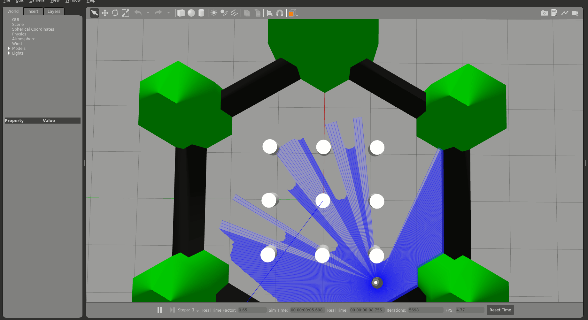

# TurtleBot3

## Overview
This project is designed to wrap the official [TurtleBot3 simulation example](https://emanual.robotis.com/docs/en/platform/turtlebot3/simulation/#gazebo-simulation) and integrate it with a simple Autonomous Collision Avoidance node. The node provides ROS 2 parameters that allow users to adjust various TurtleBot3 specifications, enabling the analysis of how these changes affect collision avoidance behavior. <br />
All project installation, code overview and usage details are also available on the project's [GitHub page](https://github.com/citros-garden/turtlebot3).


## Prerequisites

1. Please make sure you have all the [necessary softwares](https://citros.io/doc/docs_tutorials/getting_started/#softwares-to-work-with-citros) to work with CITROS installed on your computer.
2. Install [Visual Studio code](https://code.visualstudio.com/download).
3. We strongly recommend that you work with [dockers](https://citros.io/doc/docs_tutorials/dockerfile_overview/). However, if you wish to work without dockers, please refer to the .devcontainer [directory](https://github.com/citros-garden/turtlebot3/tree/main/.devcontainer) in project's repo, the dependencies you need are in the ```Dockerfile``` file.
4. (Optional) Install [Foxglove](https://docs.foxglove.dev/docs/introduction).

## Table of Contents
1. [Installation](#installation)
2. [Workspace Overview](#workspace-overview)
3. [CITROS Initialization](#citros-initialization)
4. [Scenario](#scenario)
5. [Running the Scenario Using CITROS](#running-the-scenario-using-citros)
6. [Results](#results)

## Installation
1. Clone the repository:
```bash
git clone git@github.com:citros-garden/turtlebot3.git
```
2. Open the repository in the [VScode Dev Container](https://citros.io/doc/docs_tutorials/getting_started/#open-project-in-vscode-dev-container).

## Workspace Overview

The Turtlebot simulation has the following ROS 2 parameters:

|Parameter	|Description	|Package
|--|--|--
separation		|wheel separation	|turtlebot3_gazebo
radius		|wheel radius	|turtlebot3_gazebo
check_forward_dist_param		|forward checking distance for Autonomous Collision Avoidance	|turtlebot3_gazebo
check_side_dist_param		|side checking distance for Autonomous Collision Avoidance	|turtlebot3_gazebo


This project contains two launch files, but we will use only ```turtlebot3_sim_cont.launch.py```, and the second one launches automatically (it's necessary for publishing states).

|Launch File	|Description	|Package
|--|--|--
turtlebot3_sim_cont.launch.py		|Gazebo headless TurtleBot world launch file 	|turtlebot3_gazebo
robot_state_publisher.launch.py		|Utility launch file for state publishing
 |turtlebot3_gazebo


## CITROS Initialization
1. [Install CITROS](https://citros.io/doc/docs_tutorials/getting_started/#installation).
2. Follow [these steps](https://citros.io/doc/docs_tutorials/getting_started/#initialization) to Initialize CITROS.

Now you can see .citros directory in the explorer.

## Scenario
The ROS 2 node interfaces with the official TurtleBot3 simulation example, leveraging the TurtleBot3 robot model and simulated environment. This integration allows users to observe how the robot behaves in a controlled environment. The node includes a simple Autonomous Collision Avoidance module. This module is responsible for ensuring that the TurtleBot3 avoids collisions with obstacles in its path. It utilizes sensor data, such as simulated lidar readings, to detect obstacles and adjust the robot's trajectory accordingly.<br/>
The ROS 2 parameters provided by this node give users the flexibility to modify various TurtleBot3 specifications. These parameters may include attributes like the robot's size, speed, sensor range, or collision avoidance algorithms. Users can experiment with different parameter values to observe their impact on collision avoidance behavior. The TurtleBot3 robot is capable of orienting itself effectively within a prepared TurtleBot3 world. It utilizes the simulated lidar module to gather environmental data, allowing it to make informed decisions about its navigation path.<br/>
For this example, let's check how the powerful CITROS Error Analysis (a part of Data Analysis) package works. To do it out, we need to set up parameters and launch CITROS simulation.<br/>
The parameter setup is listed in ```.citros/parameter_setups/default_param_setup.json```:
```json
{
    "packages": {
        "turtlebot3_gazebo": {
            "turtlebot3_gazebo": {
                "ros__parameters": {
                    "wheels": {
                        "radius": 0.05,
                        "separation": 0.16
                    },
                    "check_forward_dist_param": 0.7,
                    "check_side_dist_param": 0.6,
                    "joint_states_frame": "base_footprint",
                    "odom_frame": "odom",
                    "base_frame": "base_footprint"
                }
            }
        }
    }
}
```

Learn more about parameter setup and defining custom functions in [Directory parameter_setups](https://citros.io/doc/docs_cli/structure/citros_structure/#directory-parameter_setups) and [Adding Functions to Parameter Setup](https://citros.io/doc/docs_cli/configuration/config_params) pages.

In addition to parameter setup, you can configure the simulation performance setup (timeout, CPU, GPU and Memory) as well.
This parameters can be found in ```.citros/simulations/simulation_turtlebot3.json```. <br/>
The default setup is 600 seconds timeout, 4 CPU, 4 GPU and 4096 MB of Memory. <br/>
Check [Directory simulations page](https://citros.io/doc/docs_cli/structure/citros_structure#directory-simulations) for more information.

## Running the Scenario Using CITROS

### Running Locally
First ensure that the project has been [built and sourced](https://citros.io/doc/docs_tutorials/getting_started/#build-the-project).
Now we can launch it locally:
```bash 
>>> citros run -n 'turtlebot3' -m 'local test run'
? Please choose the simulation you wish to run:
  simulation_robot_state_publisher
❯ simulation_turtlebot3_sim_cont
```
Select the launch file `simulation_turtlebot3_sim_cont` and press `Enter` button and wait for the output in the terminal. 

```bash
created new batch_id: <batch_run / batch name>. Running locally.
+ running batch [<batch_run / batch name>], description: local test run, repeating simulations: [1]
+ + running simulation [0]
...
```

All the results will be saved under `.citros/runs/[simulation_name]` folder.

To plot the local run results you can use [Foxglove](https://citros.io/doc/docs_tutorials/#visualization-with-foxglove) with the ```layout.json``` layout that exists in the ```Foxglove_layouts``` directory.




### Running in Cloud

[Upload project to CITROS Server](https://citros.io/doc/docs_tutorials/getting_started/#upload-to-citros-server).

Finally, we can run it in the cloud! Simply add `-r` to the terminal command: 
```bash 
citros run -n 'turtlebot3' -m 'cloud test run' -r
? Please choose the simulation you wish to run:
  simulation_robot_state_publisher
❯ simulation_turtlebot3_sim_cont
```

Select the launch file ```simulation_turtlebot3_sim_cont``` by pressing `Enter` button. Now the simulation is running in the CITROS server, and the results will be automatically uploaded to the CITROS database.

```bash
created new batch_id: <batch_id / batch name>. Running on Citros cluster. See https://citros.io/batch/<batch_id / batch name>.
```

## Results
To get and process the simulation results, execute [built-in Jupiter Notebook](https://citros.io/aerosandbox_cessna/blob/main/notebooks/aerosandbox_notebook_example.ipynb).

As you can see, the traveled trajectory varies for different simulations:


This graph shows values from data attribute vs. independent parameter for each of the simulation, the mean value over all the simulations and 3 σ interval.

